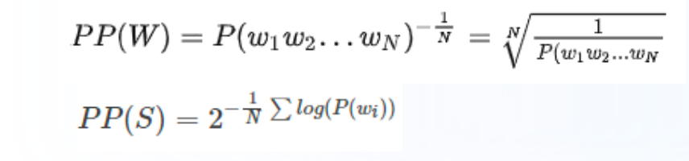

# Day01 笔记

## 1 大模型介绍

- 定义：

  ```properties
  参数量一般超过百亿参数的模型，称之为大模型
  ```

- 语言模型发展历程：
  - 基于Transformer架构，做基础的预训练过程，典型的模型：BERT、GPT
  - 更大的数据集、更复杂的模型结构，典型的模型：T5
  - AIGC时代，超过百亿参数的模型，功能更加强大，更加的智能，代表模型：ChatGPT、Llama

## 2 语言模型

- 定义：

  ```properties
  简单理解: 判断一句话发生的概率，（也可以理解成，判断一句话是不是人话）
  标准定义: 假如一个句子为s=[w1, w2,...,wn],语言模型是计算当前句子发生的概率，即：p(s)=p(w1,w2,..2n).如果当前句子符合人类日常用语表达习惯，概率值就大，否则，就小
  ```

- 分类
  - 基于规则和统计的语言模型：N-gram
  - 神经网络语言模型
  - 基于Transformer的预训练语言模型
  - 大语言模型

### 2.1 N-Gram语言模型

- 定义：

  ```properties
  在计算p(s)=p(w1,w2,..2n),引入马尔可夫性假设，当前词发生的概率只依赖于它前面的有限的词
  ```

- bigram语言模型

  - 当前词发生的概率只依赖于它前面的一个单词

- trigram语言模型

  - 当前词发生的概率只依赖于它前面的两个单词

- 特点：

  - 容易理解，但是泛化性能较差

### 2.2 神经网络语言模型

- 定义：

  ```properties
  基于Linear实现神经网络的搭建，由上文来预测下一个单词
  ```

- 特点：

  - 相比较N-gram, 更好的泛化性能

### 2.3 基于Transformer的预训练语言模型

- 定义：

  ```properties
  基于Transfomer架构衍生出各种类型的模型，比如：bert、gpt等模型，实现由上文预测下文的任务
  ```

- 特点：

  - 模型特征更加丰富，性能更好

### 2.4 大语言模型

- 定义：

  ```properties
  基于Transfomer架构衍生出各种类型的模型，比如：ChatGPT、Llama等模型，实现由上文预测下文的任务
  ```

- 特点：

  - 像"人类"一样的智能，可以完成对话形式的任务

## 3 大模型评估指标

除了常见的：精确率、召回率、F1值

### 3.1 BLEU指标

- 定义：

  ```properties
  评估文本翻译的质量；bleu值范围【0-1】，值越大，翻译质量越好，否则，越差
  ```

- 基本步骤：

  - 一般基于N-gram指标来计算，所以首先分别去计算生成文本的N-Gram，再计算真实文本的N-Gram,最后统计匹配的个数
  - 基于匹配的N-gram个数/生成文本的N-Gram总个数

- 代码实现：

  ```python
  # # 第一步安装nltk的包-->pip install nltk
  import torch
  from nltk.translate.bleu_score import sentence_bleu
  import math
  def cumulative_bleu(reference, candidate):
      # 指标计算：p1^w1*p2^w2 =0.6^0.5*0.25^0.5 = 0.387
      # math.exp(0.5 * math.log(0.6) + 0.5 * math.log(0.25)) =
      # math.exp(0.5*math.log(0.15)) = math.exp(math.log(0.15)^0.5) = 0.15^0.5 = 0.387
      # # 0.3872983346207417
      bleu_1_gram = sentence_bleu(reference, candidate, weights=(1, 0, 0, 0))
      # exp ** (0.5*log(0.6)=-0.22+0.5*log(0.25)=-0.6)
      bleu_2_gram = sentence_bleu(reference, candidate, weights=(0.5, 0.5, 0, 0))
      bleu_3_gram = sentence_bleu(reference, candidate, weights=(0.33, 0.33, 0.33, 0))
      bleu_4_gram = sentence_bleu(reference, candidate, weights=(0.25, 0.25, 0.25, 0.25))
  
      return bleu_1_gram, bleu_2_gram, bleu_3_gram, bleu_4_gram
      # return bleu_1_gram, bleu_2_gram
  
  # 生成文本
  candidate_text = ["This", "is",  "some",  "generated", "text"]
  
  # 参考文本列表
  reference_texts = [["This", "is",  "a",  "reference", "text"]]
  
  # 计算 Bleu 指标
  c_bleu = cumulative_bleu(reference_texts, candidate_text)
  
  # 打印结果
  print("The Bleu score is:", c_bleu)
  ```

### 3.2 ROUGE指标

- 定义：

  ```properties
  均可用来衡量生成结果和标准结果的匹配程度，不同的是ROUGE基于召回率，BLEU更看重准确率。
  ```

- 基本步骤：

  - Rouge-N实际上是将模型生成的结果和真实结果按N-gram拆分后，计算召回率.

- 代码实现：

  ```python
  # 第一步：安装rouge-->pip install rouge
  from rouge import Rouge
  
  # 生成文本
  generated_text = "This is some generated text."
  
  # 参考文本列表
  reference_texts = ["This is another generated reference text."]
  
  # 计算 ROUGE 指标
  rouge = Rouge()
  scores = rouge.get_scores(generated_text, reference_texts[0])
  print(f'scores-->{scores}')
  
  # 打印结果
  print("ROUGE-1 precision:", scores[0]["rouge-1"]["p"])
  print("ROUGE-1 recall:", scores[0]["rouge-1"]["r"])
  print("ROUGE-1 F1 score:", scores[0]["rouge-1"]["f"])
  # ROUGE-1 precision: 0.8
  # ROUGE-1 recall: 0.6666666666666666
  # ROUGE-1 F1 score: 0.7272727223140496
  ```

### 3.3 困惑度PPL(perplexity)

- 含义：

  ```properties
  PPL用来度量一个概率分布或概率模型预测样本的好坏程度
  ```

- 基本公式：

  

- 代码实现：

  ```python
  import math
  # 定义语料库
  sentences = [
  ['I', 'have', 'a', 'pen'],
  ['He', 'has', 'a', 'book'],
  ['She', 'has', 'a', 'cat']
  ]
  # 定义语言模型
  unigram = {'I': 1/12, 'have': 1/12, 'a': 3/12, 'pen': 1/12,
             'He': 1/12, 'has': 2/12,'book': 1/12,'She': 1/12, 'cat': 1/12}
  
  
  perplexity = 0
  for sentence in sentences:
      sentence_prob = 1
      for word in sentence:
          sentence_prob *= unigram[word]
      temp = -math.log(sentence_prob, 2)/len(sentence)
      perplexity+=2**temp
  perplexity = perplexity/len(sentences)
  print('困惑度为：', perplexity)
  # 困惑度为： 8.15
  ```

## 4 LLM主要类别架构

- Transformer架构：

  

- LLM一般分为三种类型：
  - Encoder-Only
  - Decoder-Only
  - Encoder-Decoder

### 4.1 自编码模型

- 基本原理：

  ```properties
  对于输入的文本随机进行MASK，利用上下文来预测MASK
  ```

- 代表模型：

  - BERT

### 4.2 自回归模型

- 基本原理：

  ```properties
  一般从左到右，由上文生成下文
  ```

- 代表模型：

  - GPT

### 4.3 Encoder-Decoder模型

- 基本原理：

  ```properties
  将所有的NLP任务，转换为统一架构格式(文本生成任务)：text2text
  ```

- 代表模型：

  - T5

### 4.4 LLM主流架构

- Decoder-Only