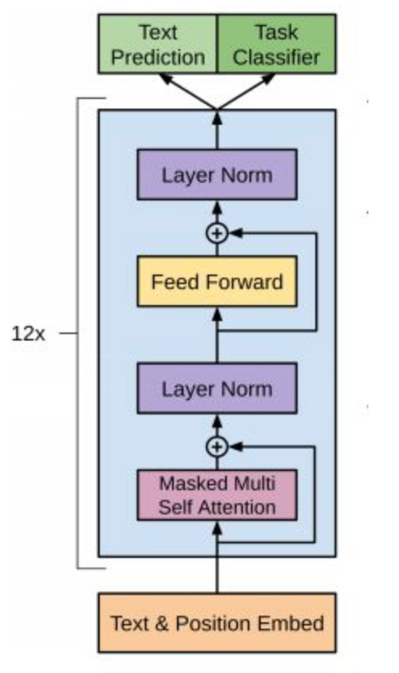
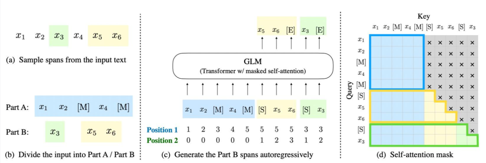

# Day02 笔记

## 1 GPT-1 模型

- 定义：

  ```properties
  2018年6月发表，OpenAI公司发表了论文“Improving Language Understanding by Generative Pre-training”《用生成式预训练提高模型的语言理解力》, 推出了具有1.17亿个参数的GPT-1（Generative Pre-training , 生成式预训练）模型. 
  ```

- 模型架构

  <div align=center></div>

- GPT-1的训练包括两阶段过程: **预训练 + 微调**

  - 第一阶段: 无监督的预训练语言模型.
  - 第二阶段: 有监督的下游任务fine-tunning.

- GPT-1 模型的关键参数：

  | 参数                | 取值    |
  | ------------------- | ------- |
  | transformer 层数    | 12      |
  | 特征维度            | 768     |
  | transformer head 数 | 12      |
  | 总参数量            | 1.17 亿 |

## 2 GPT-2 模型

- 定义：

  ```properties
  2019年2月, OpenAI推出了GPT-2, 同时, 他们发表了介绍这个模型的论文“Language Models are Unsupervised Multitask Learners” （语言模型是无监督的多任务学习者）. 
  ```

- 在模型架构方面相对于 GPT-1 来说GPT-2做了微小的改动: 
  - LN层被放置在Self-Attention层和Feed Forward层前, 而不是像原来那样后置（目的：随着模型层数不断增加，梯度消失和梯度爆炸的风险越来越大，这些调整能够**减少预训练过程中各层之间的方差变化，使梯度更加稳定**）
  - 在最后一层Tansfomer Block后增加了LN层
  - 输入序列的最大长度从 512 扩充到 1024;

- GPT-2训练核心思想

  - GPT-2的训练去掉了Fune-tuning只包括无监督的预训练过程
  - 当模型的容量非常大且数据量足够丰富时，仅仅靠语言模型的学习便可以完成其他有监督学习的任务，不需要在下游任务微调。

- 预测：

  -  GPT-2 的主要观点：**zero-shot**。通过 zero-shot，在迁移到其他任务上的时候不需要额外的标注数据，也不需要额外的模型训练。


## 3 GPT-3 模型

- 定义：

  ```properties
  2020年5月, OpenAI发布了GPT-3, 同时发表了论文“Language Models are Few-Shot Learner”《小样本学习者的语言模型》.  
  ```

- 在模型架构方面相对于 GPT-2来说做了微小的改动: 
  - 在模型结构上，GPT-3 延续使用 GPT 模型结构，但是引入了 Sparse Transformer 中的 sparse attention 模块（稀疏注意力）。

    sparse attention 与传统 self-attention（称为 dense attention） 的区别在于：

    > dense attention：每个 token 之间两两计算 attention，复杂度 O(n²)
    > sparse attention：每个 token 只与其他 token 的一个子集计算 attention，复杂度 O(n*logn)

- GPT-3训练核心思想

  - GPT-3模型训练的思想与GPT-2的方法相似, 去除了fine-tune过程, 只包括预训练过程, 不同只在于采用了参数更多的模型、更丰富的数据集和更长的训练的过程. 

- 预测：

  -  情境学习(in-context learning，也可称之为提示学习). 情境学习理解: 在被给定的几个任务示例或一个任务说明的情况下, 模型应该能通过简单预测以补全任务中其他的实例. 即情境学习要求预训练模型要对任务本身进行理解. 
  -  分别是: Few-shot、One-shot、Zero-shot. 
- 传统Fine-Tuning VS ICL:
  - Fine-Tuning微调需要对每一个任务有一个任务相关的数据集(需要标注)以及和任务相关的微调. 
  - zero-shot learning
    - 定义: 给出任务的描述, 然后提供测试数据对其进行预测, 直接让预训练好的模型去进行任务测试. 
  - one-shot learning
    - 定义: 在预训练和真正翻译的样本之间, 插入一个样本做指导. 相当于在预训练好的结果和所要执行的任务之间, 给一个例子, 告诉模型英语翻译为法语, 应该这么翻译. 
  - few-shot learning
    - 定义: 在预训练和真正翻译的样本之间, 插入多个样本做指导. 相当于在预训练好的结果和所要执行的任务之间, 给多个例子, 告诉模型应该如何工作. 

## 4 ChatGPT 模型

- 定义：

  ```properties
  ChatGPT是一种基于GPT-3的聊天机器人模型. 它旨在使用 GPT-3 的语言生成能力来与用户进行自然语言对话. 例如, 用户可以向 ChatGPT 发送消息, 然后 ChatGPT 会根据消息生成一条回复. 
  ```

- 三大训练原理：

  - 步骤1: 监督学习： 通过在有标注数据上进行有监督训练，从而使模型适应特定任务和场景。）；
  - 步骤2: 训练奖励模型（reward）: 刻画SFT模型的输出是否在人类看来表现不错。即，输入 [提示(prompt)，模型生成的文本] ，输出一个刻画文本质量的标量数字（奖励值）
  - 步骤3: 强化学习（PPO算法）: 利用PPO强化学习算法，基于reward模型将奖励最大化，从而进一步调优SFT模型。

## 5 ChatGLM模型

- 概述：

  ```properties
  ChatGLM-6B 是清华大学提出的一个开源、支持中英双语的对话语言模型，基于 General Language Model (GLM) 架构，具有 62 亿参数。
  ```

- 训练目标

  - GLM是一种基于自回归空白填充目标的通用预训练框架。GLM 将 NLU 任务转化为包含任务描述的完形填空问题，可以通过自回归生成的方式来回答。

 <div align=center></div>

------

- 上图说明了GLM的实现思想（训练目标）：
  - 原始文本 $x=[x_1, x_2,...,x_6]$随机进行连续 mask，这里假设 mask 掉$[x_3]$和 $[x_5,x_6]$ （GLM-130B中，mask两种类型：短语和长短落或文章）.
  - 将$[x_3]$和 $[x_5,x_6]$ 替换为 [M] 标志，并打乱 Part B 的顺序。为了捕捉跨度之间的内在联系，随机交换跨度的顺序。
  - GLM 自回归地生成 Part B。 每个片段在输入时前面加上 [S]，在输出时后面加上 [E]。 二维位置编码表示不同片段之间和片段内部的位置关系。
  - 自注意力掩码。 灰色区域被掩盖。Part A 的词语可以自我看到（图蓝色框），但不能看到 Part B。 Part B 的词语可以看到 Part A 和 Part B 中的前面的词语（图黄色和绿色框对应两个片段）。 [M] := [MASK]，[S] := [START]，[E] := [END]

------

- 模型结构
  - 采用transformer的decoder模块，因为无论是对于自然语言理解还是自然语言生成类任务，GLM都是看成生成任务做。但是这里只能说类deocder, 因为decoder是单向的，但是GLM某些位置可以看到双向的，因此又被称为Prefix -Decoder.
  - 相比原始Decoder模块，模型结构有如下改动点：

    - **embedding 层梯度缩减**：为了提升训练稳定性，减小了 embedding 层的梯度。梯度缩减的效果相当于把 embedding 层的梯度缩小了 10 倍，减小了梯度的范数。
    - **layer normalization**：采用了基于 Deep Norm 的 post layer norm。
    - **激活函数**：替换ReLU激活函数采用了 GeGLU 激活函数。
    - **位置编码**：去除了绝对位置编码，采用了旋转位置编码 RoPE。

- 模型配置(6B)

|    配置    |  数据  |
| :--------: | :----: |
|    参数    |  6.2B  |
| 隐藏层维度 |  4096  |
|    层数    |   28   |
| 注意力头数 |   32   |
|  训练数据  |   1T   |
|  词表大小  | 130528 |
|  最大长度  |  2048  |

------

2.7 迭代版本

- ChatGLM2-6B：ChatGLM2-6B是ChatGLM-6B的第二代版本，相比第一代，它带来了一系列显著的优势：
  - 更强大的性能：在各项对话任务中，ChatGLM2-6B相比ChatGLM-6B有了巨大的提升。例如，在数学任务上，性能提升了整整571%。
  - 更长的上下文：ChatGLM2-6B采用了FlashAttention技术，使其支持32K的上下文长度，而ChatGLM-6B只能支持2K。这使得ChatGLM2-6B能够进行更多轮次的对话，也可以读取更长的文档进行相关的提取和问答。
  - 更高效的推理：ChatGLM2-6B引入了Multi-Query Attention技术，在更低的显存资源下以更快的速度进行推理，相比第一代提升了42%。同时，INT4量化模型中，6G显存的对话长度由1K提升到了8K。
- ChatGLM3-6B：ChatGLM3-6B是ChatGLM-6B的第三代版本，相比前两代，除了继承之前优势外，相当于全面升级：
  - 多模态理解能力：在10余个国际标准图文评测集上取得SOTA
  - 代码增强模块：根据用户需求生成代码并执行，自动完成数据分析、文件处理等复杂任务
  - 网络搜索增强：能自动根据问题在互联网上查找相关资料并在回答时提供参考相关文献或者文章链接
  - 语义能力与逻辑能力大大增强。

------

## 6 LLaMA模型

- 概述：

  ```properties
  LLaMA（Large Language Model Meta AI），由 Meta AI 于2023年发布的一个开放且高效的大型基础语言模型，共有 7B、13B、33B、65B（650 亿）四种版本。
  
  LLaMA训练数据是以英语为主的拉丁语系，另外还包含了来自 GitHub 的代码数据。训练数据以英文为主，不包含中韩日文，所有训练数据都是开源的。
  ```

------

-  训练目标
  - 在**训练目标**上，LLaMA 的训练目标是语言模型，即根据已有的上文去预测下一个词。
  - 关于**tokenizer**，LLaMA 的训练语料以英文为主，使用了BPE分词算法作为 tokenizer，词表大小只有 32000。词表里的中文 token 很少，只有几百个，LLaMA tokenizer 对中文分词的编码效率比较低。

- 模型结构
  - 和 GPT 系列一样，LLaMA 模型也是 Decoder-only架构，但结合前人的工作做了一些改进，比如：
    - **Pre-normalization**：为了提高训练稳定性，没有使用传统的 post layer norm，而是使用了 pre layer Norm，同时使用 RMSNorm归一化函数（RMS Norm的主要区别在于去掉了减去均值的部分，简化了Layer Norm 的计算，可以在减少约 7%∼64% 的计算时间）。
    - **激活函数**：将 ReLU 非线性替换为 SwiGLU 激活函数。

    - **位置编码**：去除了绝对位置编码，采用了旋转位置编码 RoPE。

- 模型配置（7B）

|    配置    | 数据  |
| :--------: | :---: |
|    参数    | 6.7B  |
| 隐藏层维度 | 4096  |
|    层数    |  32   |
| 注意力头数 |  32   |
|  训练数据  |  1T   |
|  词表大小  | 32000 |
|  最大长度  | 2048  |

-  迭代版本

- LLaMA 2（Open Foundation and Fine-Tuned Chat Models）：LLaMA 2是LLaMA模型的升级迭代版本，其模型架构基本和llama一样。不同点：
  - LLama2训练语料相比LLaMA多出40%，上下文长度是由之前的2048升级到4096，可以理解和生成更长的文本。
  - 新增预预训练数据，并注重安全&隐私问题。
  - 训练出了chat版本：llama-2-chat: SFT, RLHF.

------

## 7 Qwen模型

- 概述

  ```properties
  Qwen大语言模型是由阿里巴巴训练并开源的一系列大语言模型。最早于2023年8月份开源70亿参数规模，随后几个月时间内陆续开源了4个不同规模版本的模型，最低参数18亿，最高参数720亿
  ```

------

- 训练目标

  - 在**训练目标**上，Qwen的核心训练目标是语言模型，即根据已有的上文去预测下一个词。

- 模型结构
  - 分组查询注意力: 通过减少键值（KV）缓存的使用，提升了模型的推理效率。
  - 激活函数: 使用 SwiGLU 激活函数，增强了模型的非线性表达能力。
  - 位置编码: 采用了旋转位置编码 RoPE，提升了模型对长序列的处理能力。
  - layer normalization: 采用了RMSNorm，确保了训练的稳定性.

- 模型配置（Qwen-7B-Instruct）

  | 配置       | 数据                    |
  | ---------- | ----------------------- |
  | 参数       | 7B                      |
  | 隐藏层维度 | 3584                    |
  | 层数       | 28                      |
  | 注意力头数 | 28个query、4个key-value |
  | 训练数据   | 1.2T                    |
  | 词表大小   | 151936                  |
  | 最大长度   | 32768                   |

------

## 8 Baichuan-7B模型

- 概述：

  ```properties
  Baichuan-7B由百川智能于2023年6月发布的一个开放且可商用的大型预训练语言模型，其支持中英双语，是在约 1.2万亿 (1.2T) 个 token上训练的70亿参数模型。
  ```

------

- 训练目标
  - 在**训练目标**上，Baichuan-7B 的训练目标也是语言模型，即根据已有的上文去预测下一个词。

  - 关于**tokenizer**，使用了BPE分词算法作为 tokenizer，词表大小64000。
  - 关于**数据**，原始数据包括开源的中英文数据和自行抓取的中文互联网数据，以及部分高质量知识性数据。

- 模型结构
  - 和 LLaMA 一样的模型设计，也是 Decoder-only架构，但结合前人的工作做了一些改进，比如：
    - **Pre-normalization**：为了提高训练稳定性，没有使用传统的 post layer norm，而是使用了 pre layer Norm，同时使用 RMSNorm归一化函数（RMS Norm的主要区别在于去掉了减去均值的部分，简化了Layer Norm 的计算，可以在减少约 7%∼64% 的计算时间）。
    - **激活函数**：使用 SwiGLU 激活函数。
    - **位置编码**：采用了旋转位置编码 RoPE。

- 模型配置（7B）

|    配置    | 数据  |
| :--------: | :---: |
|    参数    |  7B   |
| 隐藏层维度 | 4096  |
|    层数    |  32   |
| 注意力头数 |  32   |
|  训练数据  | 1.2T  |
|  词表大小  | 64000 |
|  最大长度  | 4096  |

