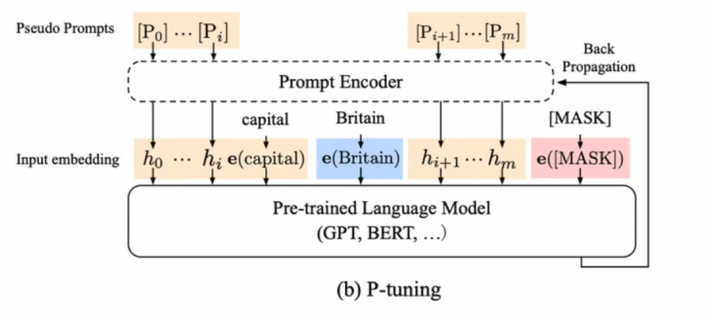

# Day03 笔记


## 1 Qwen模型

- 概述

  ```properties
  Qwen大语言模型是由阿里巴巴训练并开源的一系列大语言模型。最早于2023年8月份开源70亿参数规模，随后几个月时间内陆续开源了4个不同规模版本的模型，最低参数18亿，最高参数720亿
  ```

------

- 训练目标

  - 在**训练目标**上，Qwen的核心训练目标是语言模型，即根据已有的上文去预测下一个词。

- 模型结构
  - 分组查询注意力: 通过减少键值（KV）缓存的使用，提升了模型的推理效率。
  - 激活函数: 使用 SwiGLU 激活函数，增强了模型的非线性表达能力。
  - 位置编码: 采用了旋转位置编码 RoPE，提升了模型对长序列的处理能力。
  - layer normalization: 采用了RMSNorm，确保了训练的稳定性.

- 模型配置（Qwen-7B-Instruct）

  | 配置       | 数据                    |
  | ---------- | ----------------------- |
  | 参数       | 7B                      |
  | 隐藏层维度 | 3584                    |
  | 层数       | 28                      |
  | 注意力头数 | 28个query、4个key-value |
  | 训练数据   | 1.2T                    |
  | 词表大小   | 151936                  |
  | 最大长度   | 32768                   |

------

## 2 Baichuan-7B模型

- 概述：

  ```properties
  Baichuan-7B由百川智能于2023年6月发布的一个开放且可商用的大型预训练语言模型，其支持中英双语，是在约 1.2万亿 (1.2T) 个 token上训练的70亿参数模型。
  ```

------

- 训练目标
  - 在**训练目标**上，Baichuan-7B 的训练目标也是语言模型，即根据已有的上文去预测下一个词。

  - 关于**tokenizer**，使用了BPE分词算法作为 tokenizer，词表大小64000。
  - 关于**数据**，原始数据包括开源的中英文数据和自行抓取的中文互联网数据，以及部分高质量知识性数据。

- 模型结构
  - 和 LLaMA 一样的模型设计，也是 Decoder-only架构，但结合前人的工作做了一些改进，比如：
    - **Pre-normalization**：为了提高训练稳定性，没有使用传统的 post layer norm，而是使用了 pre layer Norm，同时使用 RMSNorm归一化函数（RMS Norm的主要区别在于去掉了减去均值的部分，简化了Layer Norm 的计算，可以在减少约 7%∼64% 的计算时间）。
    - **激活函数**：使用 SwiGLU 激活函数。
    - **位置编码**：采用了旋转位置编码 RoPE。

- 模型配置（7B）

|    配置    | 数据  |
| :--------: | :---: |
|    参数    |  7B   |
| 隐藏层维度 | 4096  |
|    层数    |  32   |
| 注意力头数 |  32   |
|  训练数据  | 1.2T  |
|  词表大小  | 64000 |
|  最大长度  | 4096  |

## 3 NLP任务四种范式

目前学术界一般将NLP任务的发展分为四个阶段，即NLP四范式：

- 第一范式：基于「传统机器学习模型」的范式
- 第二范式：基于「深度学习模型」的范式
- 第三范式：基于「预训练模型+fine-tuning」的范式
- 第四范式：基于「预训练模型+Prompt+预测」的范式

## 4 Prompt-Tuning(提示微调)

Prompt-Tuning执行步骤：

- 1.构建模板（Template Construction）:  通过人工定义、自动搜索、文本生成等方法，生成与给定句子相关的一个含有`[MASK]`标记的模板。例如`It was [MASK].`，并拼接到原始的文本中，获得Prompt-Tuning的输入：`[CLS] I like the Disney films very much. [SEP] It was [MASK]. [SEP]`。将其喂入BERT模型中，并复用预训练好的MLM分类器（在huggingface中为BertForMaskedLM），即可直接得到`[MASK]`预测的各个token的概率分布。
- 2.标签词映射（Label Word Verbalizer） ：因为`[MASK]`部分我们只对部分词感兴趣，因此需要建立一个映射关系。例如如果`[MASK]`预测的词是“great”，则认为是positive类，如果是“terrible”，则认为是negative类。
- 3.训练：根据Verbalizer，则可以获得指定label word的预测概率分布，并采用交叉信息熵进行训练。此时因为只对预训练好的MLM head进行微调，所以避免了过拟合问题。

### 4.1 PET模型

PET模型提出两个很重要的组件：

- **Pattern（Template）** ：记作T, 即上文提到的Template，其为额外添加的带有`[mask]`标记的短文本，通常一个样本只有一个Pattern（因为我们希望只有1个让模型预测的`[mask]`标记）。由于不同的任务、不同的样本可能会有其更加合适的pattern，**因此如何构建合适的pattern是Prompt-Tuning的研究点之一**；
- **Verbalizer** ：记作V, 即标签词的映射，对于具体的分类任务，需要选择指定的标签词（label word）。例如情感分析中，我们期望Verbalizer可能是 （positive和negative是类标签）。同样，不同的任务有其相应的label word，但需要注意的是，Verbalizer的构建需要取决于对应的Pattern。因此 **如何构建Verbalizer是另一个研究挑战** 。

### 4.2  Hard Prompt & Soft Prompt

Hard Prompt (离散提示)：是一种固定的提示模板，通过将特定的关键词或短语(真实的文本字符串)直接嵌入到文本中，引导模型生成符合要求的文本。这种提示方法的特点在于，提示模板是固定的，不能根据不同的任务和需求进行调整。

Soft Prompt (连续提示) ：是指通过给模型输入一个可参数化的提示模板，从而引导模型生成符合特定要求的文本。这种提示方法的特点在于，提示模板中的参数可以根据具体任务和需求进行调整，以达到最佳的生成效果。

### 4.3 P-tuning（NLU任务）

P-Tuning 是2022年清华在论文《GPT Understands, Too》中提出的微调方法，该方法提出将 Prompt 转换为可以学习的 Embedding 层，只是考虑到直接对 Embedding 参数进行优化.

<div align=center></div>

基本原理：

- P-tuning 固定 LLM 参数, 利用多层感知机 (MLP)和 LSTM 对 Prompt 进行编码，编码之后与其他向量进行拼接之后正常输入 LLM. 注意，训练之后只保留 Prompt 编码之后的向量即可，无需保留编码器.	

------

P-Tuning V2是升级版本，主要解决P-Tuning V1 在小参数量模型上表现差的问题. 

核心思想：

- 在模型的每一层都应用连续的 prompts, 并对 prompts 参数进行更新优化. 同时, 该方法也是针对 NLU 任务优化和适配的.

### 4.4 Prefix Tuning

2021年论文《Prefix-Tuning: Optimizing Continuous Prompts for Generation》中提出了 Prefix Tuning 方法，该方法是在输入 token 之前构造一段任务相关的 virtual tokens 作为 Prefix，然后训练的时候只更新 Prefix 部分的参数，而 Transformer 中的其他部分参数固定.

<div align=center></div>

相比较P-Tuning：

- Prefix-Tuning 是将额外的embedding加在开头，看起来更像模仿Instruction指令，而P-Tuning 位置不固定.
- Prefix-Tuning 通过在每个层都添加可训练参数，通过MLP初始化，而P-Tuning只在输入的时候加入embedding, 并通过LSTM+MLP初始化.

### 4.5 Adapter Tuning

不同于Prefix Tuning这类在输入前添加可训练 prompt参数，以少量参数适配下游任务，Adapter Tuning 则是在预训练模型内部的网络层之间添加新的网络层或模块来适配下游任务. 当模型训练时，固定住原来预训练模型的参数不变，只对新增的 Adapter 结构进行微调.

<div align=center></div>

- 内部Adapter构造：

  ```properties
  首先是一个 down-project 层将高维度特征映射到低维特征.
  然后过一个非线形层之后，再用一个 up-project 结构将低维特征映射回原来的高维特征
  同时也设计了 skip-connection 结构，确保了在最差的情况下能够退化为identity（类似残差结构）
  ```

### 4.6 LoRA微调

低秩适应（Low-Rank Adaptation）是一种参数高效的微调技术，其核心思想是对大型模型的权重矩阵进行隐式的低秩转换，也就是：通过一个较低维度的表示来近似表示一个高维矩阵或数据集.

LoRA产生的原因：

- Adapter Tuning 方法在 PLM 基础上添加适配器层会引入额外的计算，带来推理延迟问题；而 Prefix Tuning 方法难以优化，其性能随可训练参数规模非单调变化，更根本的是，为前缀保留部分序列长度必然会减少用于处理下游任务的序列长度. 因此微软推出了LoRA方法.

<div align=center></div>

基本原理：LoRA技术冻结预训练模型的权重，并在每个Transformer块中注入可训练层（称为低秩分解矩阵），即在模型的Linear层的旁边增加一个“旁支”A和B。其中，A将数据从d维降到r维，这个r是LoRA的秩，是一个重要的超参数；B将数据从r维升到d维，B部分的参数初始为0。模型训练结束后，需要将A+B部分的参数与原大模型的参数合并在一起使用。