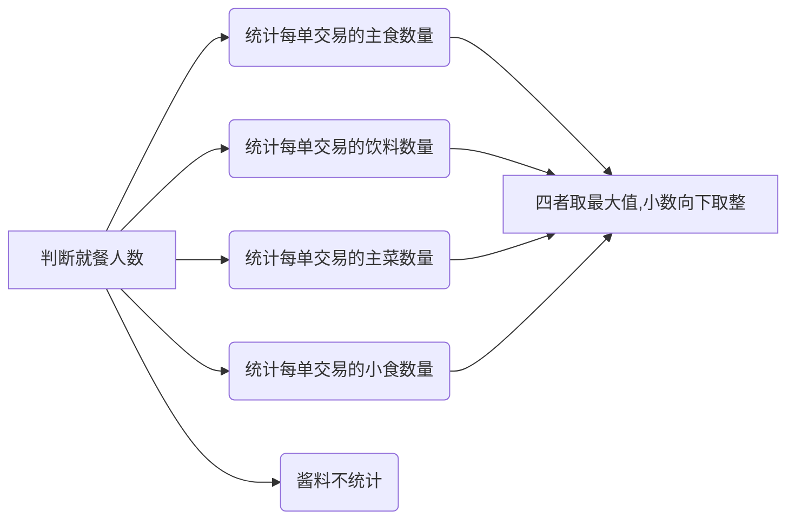

## day01问题小结

应用Pandas合并数据集

```
连接数据

- 组合数据的一种方法是使用“连接”（concatenation)
  - 连接是指把某行或某列追加到数据中
  - 数据被分成了多份可以使用连接把数据拼接起来
  - 把计算的结果追加到现有数据集，可以使用连接
  
import pandas as pd
df1 = pd.read_csv('data/concat_1.csv')
df2 = pd.read_csv('data/concat_2.csv')

# 可以使用concat函数将上面3个DataFrame连接起来，需将3个DataFrame放到同一个列表中
pd.concat([df1,df2])
    A    B    C    D
0   a0   b0   c0   d0
1   a1   b1   c1   d1
2   a2   b2   c2   d2
3   a3   b3   c3   d3
0   a4   b4   c4   d4
1   a5   b5   c5   d5
2   a6   b6   c6   d6
3   a7   b7   c7   d7


pd.concat([df1,df2],axis=1)
  A   B   C   D   A   B   C   D    
0  a0  b0  c0  d0  a4  b4  c4  d4 
1  a1  b1  c1  d1  a5  b5  c5  d5
2  a2  b2  c2  d2  a6  b6  c6  d6
3  a3  b3  c3  d3  a7  b7  c7  d7

df1.append(df2)
  A   B   C   D
0  a0  b0  c0  d0
1  a1  b1  c1  d1
2  a2  b2  c2  d2
3  a3  b3  c3  d3
0  a4  b4  c4  d4
1  a5  b5  c5  d5
2  a6  b6  c6  d6
3  a7  b7  c7  d7


genres.merge(tracks_subset, on='Id', how='left')
how参数指定连接方式
- how = ’left‘ 对应SQL中的 **left outer**  保留左侧表中的所有key
- how = ’right‘ 对应SQL中的 **right outer**  保留右侧表中的所有key
- how = 'outer' 对应SQL中的 **full outer**   保留左右两侧侧表中的所有key
- how = 'inner' 对应SQL中的 **inner**  只保留左右两侧都有的key

stocks_2016.join(stocks_2017, lsuffix='_2016', rsuffix='_2017', how='outer')
```

可视化, 这里我们需要把新老用户的购买情况都绘制到一张图表中


计算每个月的月留存率


## 一 数据推断

### 学习目标

- 知道数据推断的使用场景
- 使用SQL完成关键指标推断逻辑


### 1 业务背景：缺失关键指标【了解】

疫情期间，一家印度外卖餐厅想通过数据分析，数据挖掘提升销量，但是在历史数据中**缺少了很重要的一个维度，用餐人数**

订单表 菜单表

根据历史订单数据，推断出每个订单的用餐人数

订单表：

- `Order_Number` 订单编号
- `Order_Date` 订单日期
- `Item_Name` 商品名称
- `Quantity` 商品数量
- `Product_Price` 商品价格
- `Total_products` 订单商品数量
- `restaurant_no` 连锁店编号

菜单表：

- 商品名称
- 商品价格

### 2 业务数据介绍【了解】

- 订单表：
  - `Order_Number` 订单编号
  - `Order_Date` 订单日期
  - `Item_Name` 商品名称
  - `Quantity` 商品数量
  - `Product_Price` 商品价格
  - `Total_products` 订单商品数量
  - `restaurant_no` 连锁店编号
- 菜单表：
  - 商品名称
  - 商品价格

### 3 基本思路【掌握】

确定推断规则：

- 1份主食对应1人 （1：1）
- 1份主菜对应1人 （1：1）
- 1份饮料对应1人（1：1）
- 2份小食对应1人 （2：1）
- 酱料，佐料不做计算（n:0）

- 按照上述原则 上面一餐推断出来的人数为40人——如果专门以喝酒为目的的聚餐，上述规则推断出来的出错概率很高
- 这种极端的例子可以验证在数据中的占比，如果占比不大则无太大影响


### 4 代码实现【掌握】

使用SQL批量处理数据实现数据推断逻辑



LOCATE 函数介绍: `LOCATE(substr,str)`   返回 substr  在 str中的位置

- substr, 要查询的子串
- str  字段名字 或者 字符串

把菜单表中菜名翻译成中文

```
case 
	when xxxx END AS food_category 
```


- 首先看一下产品明细表

知道我们数据库内现有的产品划分，找到与我们推理时用到的分类之间的差异。

- 在现有的产品明细表里重新定义一列字段，作为我们就餐人数判断的产品分类

```
drop table if exists food_type;
create table food_type as
SELECT
	item_name,
	price,
	restaurant_id,
	food_category,
CASE
		WHEN food_category IN ( '鸡肉类', '羊肉类', '虾类', '咖喱菜', '鱼肉类', '主菜', '芝士菜' ) THEN
		'主菜' 
		WHEN food_category IN ( '饼', '米饭' ) THEN
		'主食' 
		WHEN food_category IN ( '饮料', '酒', '酸奶' ) THEN
		'饮料' 
		WHEN food_category IN ( '酱', '腌菜' ) THEN
		'佐料' ELSE '小食' 
	END AS food_type 
FROM
	food_category_table;
```

- 再来看一下重新定义过后产品的分类情况

```
SELECT
	count( DISTINCT item_name ) AS item_num,
	food_type,
	food_category 
FROM
	food_type 
GROUP BY
	food_type,
	food_category 
ORDER BY
	food_type,
	food_category,
	item_num DESC;
```

- 将交易明细表与我们刚定义的产品明细表进行关联，把原始订单表中每个菜名属于哪个类别确定下来，后续可以根据这类别进行推断

```
SELECT
	a.*,
	b.food_type,
	b.price 
FROM
	restaurant_orders a
	JOIN food_type b ON a.`Item_Name` = b.item_name 
	AND a.Restaurant_Id = b.restaurant_id;
```

- 目前一行记录是一笔订单的一种产品的售卖情况，如果一笔订单有若干样产品会分成若干行，我们希望把一笔订单的详情，从多行统一到一行中，同时用我们事先定义的系数计算。	

```sql
select a.`Order_Number`,a.`Order_Date`,a.restaurant_id,round(sum(a.Quantity*b.price),2) as total_amount, # 计算订单总金额
sum(case when food_type='主食' then a.Quantity*1 else 0 end) as staple_food_count, # 聚合操作，分别统计出每个菜名类别对应的人数
sum(case when food_type='主菜' then a.Quantity*1 else 0 end) as main_course_count,
sum(case when food_type='饮料' then a.Quantity*1 else 0 end) as drink_count,
sum(case when food_type='小食' then a.Quantity*0.5 else 0 end) as snack_count
from restaurant_orders a join food_type b 
on a.`Item_Name`=b.item_name and a.Restaurant_Id=b.restaurant_id # 把a表和b表合并
group by a.`Order_Number`,a.`Order_Date`,a.Restaurant_Id; # 合并后分组
```

- 比较主食,主菜，饮料，小食中的最大者

```sql
select c.*,GREATEST(c.staple_food_count,c.main_course_count,c.drink_count,c.snack_count) as max_count from 
(select a.`Order_Number`,a.`Order_Date`,a.restaurant_id,round(sum(a.Quantity*b.price),2) as total_amount,
sum(case when food_type='主食' then a.Quantity*1 else 0 end) as staple_food_count,
sum(case when food_type='主菜' then a.Quantity*1 else 0 end) as main_course_count,
sum(case when food_type='饮料' then a.Quantity*1 else 0 end) as drink_count,
sum(case when food_type='小食' then a.Quantity*0.5 else 0 end) as snack_count
from restaurant_orders a join food_type b 
on a.`Item_Name`=b.item_name and a.Restaurant_Id=b.restaurant_id
group by a.`Order_Number`,a.`Order_Date`,a.Restaurant_Id) c;

```

- 增加向下取整的逻辑，并且确保最小就餐人数为1

```
floor 向下取整
select c.*,
GREATEST(floor(GREATEST(c.staple_food_count,c.main_course_count,c.drink_count,c.snack_count)),1) as customer_count from 
(select a.`Order_Number`,a.`Order_Date`,a.restaurant_id,round(sum(a.Quantity*b.price),2) as total_amount,
sum(case when food_type='主食' then a.Quantity*1 else 0 end) as staple_food_count,
sum(case when food_type='主菜' then a.Quantity*1 else 0 end) as main_course_count,
sum(case when food_type='饮料' then a.Quantity*1 else 0 end) as drink_count,
sum(case when food_type='小食' then a.Quantity*0.5 else 0 end) as snack_count
from restaurant_orders a join food_type b 
on a.`Item_Name`=b.item_name and a.Restaurant_Id=b.restaurant_id
group by a.`Order_Number`,a.`Order_Date`,a.Restaurant_Id) c;


```

- 新建一张表格

- 检查一下之前担心的饮料过多导致的推测异常占比，异常占比很少，可以忽略，之前推断没问题

- | outlier_count | total_count | outlier_rate |
  | ------------- | ----------- | ------------ |
  | 13            | 33055       | 0.0004       |

有了就餐人数之后，我们还可以进行进一步分析


### 5 结果解读【掌握】


## 二 用户标签

**什么是精细化运营**

#### 什么是精细化运营

- 和精细化运营相对的是粗放式运营，也就是在流量红利还在的时候，采用固定几种运营方式，大家看到的东西都是一样的，根据大众最终的实验效果去反馈运营策略。

### 1、用户标签简介【掌握】

#### 1.1 什么是用户标签

每一个用户与企业的商业目的相关较强的特质提取出来，就是用户标签，也叫用户画像


#### 1.2 用户标签的作用

用户标签是精细化运营的抓手

发现兴趣，投其所好

发现用户特点，提升用户价值

为业务发展储备标签

#### 1.3 用户打标签实操流程介绍

1、明确现有数据

2、确定打标签的业务逻辑，将标签业务逻辑形成文档

3、编写打标签代码

#### 1.4 用户标签的来源

属性标签

预测标签

统计标签

### 2、项目介绍【了解】

本次项目需要做到： 

1.设计一套实时的基于明确规则的属性标签体系。

2.根据统计指标和业务判断给用户偏好定性打标，并存储。

- 本次项目需要做到： 

  1.设计一套实时的基于明确规则的属性标签体系。

  2.根据统计指标和业务判断给用户偏好定性打标，并存储。

- 数据情况

### 3、代码实战【掌握】

#### 3.1 基于时间的事实类标签

```sql
Curdate() 获取当前日期
Date_sub(date1,interval xx day) 从指定日期往前推xx天的日期
```

```sql
#利用日期函数打上实时事实类标签
drop table if exists mall_customer_realtime_tag;
create table mall_customer_realtime_tag as 
select 
a.userid,
case when a.last_visit >= DATE_SUB(Curdate(), INTERVAL 30 DAY) then "一个月活跃" else "近一个月不活跃" end as "近一个月活跃标签",
case when a.last_visit >= DATE_SUB(curdate(),INTERVAL 90 DAY) then "近三个月活跃" else "近三个月不活跃" end as "近三个月活跃标签",
case when a.last_visit >= DATE_SUB(curdate(),INTERVAL 180 DAY) then "近六个月活跃" else "近六个月不活跃" end as "近六个月活跃标签",
case when a.last_visit >= DATE_SUB(curdate(),INTERVAL 360 DAY) then "近十二个月活跃" else "近十二个月不活跃" end as "近十二个月活跃标签"
from 
(select 
userid, max(date) as last_visit
from mall_customers_tld_header
GROUP BY userid) a
```


#### 3.2 基于阈值的统计类标签

年龄标签 age_group_tag

收入标签 income_tag

消费能力标签 spend_score

访问次数标签 freq_tag

偏好标签 daypart_preference_tag weekday_preference_tag accompany_preference_tag target_preference_tag

新客老客 history_tag


#### 3.3 使用标签圈人

将实时标签，统计类标签汇总 合并两个表

找出最有消费潜力的用户

```
SELECT distinct userid as customer_base 
FROM `mall_customer_all_tags`
where income_tag='高收入人群' and spending_tag='低消费人群';
```


找出高收入人群中高消费人群的消费偏好

```
group_concat(distinct userid SEPARATOR ',') 把userid 用, 连接
select group_concat(distinct userid SEPARATOR ',') as customers,
target_preference_tag
from mall_customer_all_tags
where income_tag='高收入人群' and spending_tag='高消费人群'
group by target_preference_tag;
```


## 三 用户行为分析

### 学习目标

- 知道用户行为分析的常用方法
- 知道AARRR模型的含义
- 掌握使用Python代码进行用户行为分析

### 1、什么是用户行为分析【了解】

用户行为是指用户在产品上产生的行为，比如登陆，浏览商品，加购物车，收藏，点赞，分享，视频完播，划走视频等等

### 2、如何进行用户行为分析【掌握】

#### 2.1 事件分析

在日常工作中，运营、市场、产品、数据分析师根据实际工作情况而关注不同的事件指标、

行为事件分析的特点与价值

行为事件分析法具有强大的筛选、分组和聚合能力，逻辑清晰且使用简单，已被广泛应用

**多维度下钻分析**：最为高效的行为事件分析要支持任意下钻分析和精细化条件筛选。

#### 2.2 页面点击分析

- **作用：**点击分析被应用于显示页面区域中不同元素点击密度的图示，可以：
  - 精准评估用户与产品交互背后的深层关系
  - 实现产品的跳转路径分析，完成产品页面之间的深层次的关系需求挖掘
  - 与其他分析模型配合，全面视角探索数据价值
  - 直观的对比和分析用户在页面的聚焦度、页面浏览次数和人数以及页面内各个可点击元素的百分比。

- 应用场景：通常用于首页、活动页、产品详情页等存在复杂交互逻辑的页面分析。一般分为可视化热力图、固定埋点两种形式

#### 2.3 漏斗模型分析

漏斗分析模型是企业实现精细化运营的重要分析模型，其精细化程度影响着营销管理的成败。

- **什么是漏斗分析**
- 漏斗分析是一套流程分析，它能够科学反映用户行为状态以及从起点到终点各阶段用户转化率情况的重要分析模型
- 漏斗分析模型广泛应用于流量监控、产品目标转化等日常数据运营工作中

#### 2.4 用户行为路径分析

什么是用户行为路径

- 用户路径分析就是指用户在APP或网站中的访问行为路径，为了衡量网站优化的效果或营销推广的效果，以及了解用户行为偏好，时常要对访问路径的转换数据进行分析

用户路径分析模型的价值

可视化用户流，全面了解用户整体行为路径

**定位影响转化的主次因素**，产品设计的优化与改进有的放矢

路径分析对产品设计的优化与改进有着很大的帮助

### 3、用户行为分析案例背景【掌握】

#### 3.1 AARRR模型

- **Acquisition（获得新用户）**：PV，UV
- **Activation（用户激活）**：用户活跃，按时间维度
- **Retention（用户留存）**：留存率（次日留存，七日留存等）
- **Revenue（用户付费）**：获取收入，用户购买率
- **Referral（用户推荐）** 分享，（朋友圈，砍一刀，返现，分享满N人给优惠券）这里缺少相关数据


#### 3.2 案例数据介绍

- 数据字段介绍
  - cust_id 用户ID
  - prod_id 商品ID
  - group_id 商品类别ID
  - be_type 行为
  - day_id 行为发生时刻
  - buy_time 购买时间
- 我们利用上述数据做如下分析：
  - 用户购物行为的整体分析 (基础指标计算)
    - PV/UV
    - 平均访问量
    - 跳失率
    - 用户最活跃的日期和时间段
  - 商品购买情况分析 (用户偏好分析)
    - 商品购买次数
    - 商品点击次数
    - 商品购买次数和点击次数总体分析
    - 商品转化率
  - 用户行为转化漏斗 
    - 点击加购物车转化率
    - 点击加收藏转化率
    - 点击购买转化率

### 4、代码实现【掌握】

#### 4.1 数据加载与处理

加载数据

去掉无用数据

数据类型转换

查看数据基本情况，查看be_type字段总类 查看数据中是否有空值

提取出时间中的月份、天、时、星期等维度

#### 4.2 用户行为分析

根据用户行为对数据进行分组

流量指标分析：PV、UV、平均访问量

```
PV=behavior_count['pv']
print("PV=%d"%PV)
UV=len(data1['cust_id'].unique())
print("UV=%d"%UV)
print("平均访问量 PV/UV=%d"%(PV/UV))
```

跳失率：只有点击行为的用户数/总用户数，总用户数即uv

```
集合减法 set1-set2 得到的结果是在set1中且不在set2中的元素
pv_only=len(data_pv_only)
print('跳失率为：%.2f%%'%(pv_only/UV*100))
```


#### 4.3 商品维度分析

