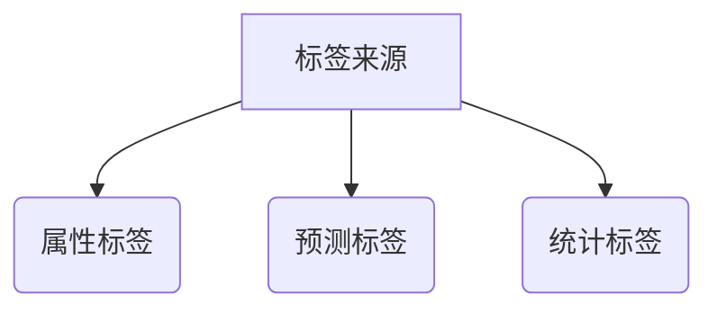

## 用户标签

### 学习目标

- 掌握用户标签的作用
- 使用SQL实现用户标签案例


### 0、精细化运营

​        随着流量红利的消失，获取流量的成本逐渐升高，企业为追求更高的 ROI（(Return On Investment 投资汇报率），企业运营重心已经被迫从拉新流量转移至存量用户——对用户进行精细的分群，并配以细分的运营策略，将合适的产品精准推送给用户。

#### 什么是精细化运营

- 和精细化运营相对的是粗放式运营，也就是在流量红利还在的时候，采用固定几种运营方式，大家看到的东西都是一样的，根据大众最终的实验效果去反馈运营策略。
- 精细化运营是指，通过不同的策略将用户划分为不同的群组，每一组用户、甚至是每一个用户采取不同的运营策略去完成最终的转化。如果说早期的运营策略是一对多的模式，那么精细化运营就是**多对多的对应关系。**
- 在精细化运营策略之下，每个用户都被打上了**N多个标签，通过标签**将用户分群/分层
  - 20%的用户创造80%的收益，识别高、中、低价值用户，通过不同运营策略维护不同用户群体

### 1、用户标签简介

#### 1.1 什么是用户标签

- 每一个用户与企业的商业目的相关较强的特质提取出来，就是用户标签，也叫用户画像

- 例如产品，渠道，时间段上的偏好。客单价的范围，来访人数的偏好，交易频次，是否带小孩儿，支付方式的偏好，注册时长，最初最后的交易内容，积分情况，是否到生日等等

  

#### 1.2 用户标签的作用

- 用户标签是精细化运营的抓手

- 发现兴趣，投其所好
  - 促进活跃：针对用户的喜好发放优惠券（最喜欢的产品，最常用的渠道，最熟悉的场景）
  - 挽回流失：高流失概率用户，针对最常消费的品类发放大折扣优惠券，将用户召回
  - 定制服务：对于高价值用户，针对其喜好设置差异化增值服务
- 发现用户特点，提升用户价值
  - 提高客单价：对于活跃度没有问题的用户提高客单价
  - 拓展消费渠道：对于活跃没问题但是渠道单一的用户进行跨渠道引导
  - 拓展消费场景：对于活跃性没有问题但场景单一的用户进行跨场景引导
- 为业务发展储备标签
  - 亲子标签，策划亲子套餐
  - 游戏爱好者标签，未来游戏合作
  - 粉丝标签，未来明星代言

#### 1.3 用户打标签实操流程介绍

1、明确现有数据

- 检查现有数据是否能满足用户标签要求
  - 如，想添加亲子标签，在原始数据中需要有与亲子相关数据
- 如果数据有缺漏需要及时添加
  - 产品设计方面，鼓励用户填写

2、确定打标签的业务逻辑

- 基于现有数据定制打标签的业务逻辑（需要与业务部门讨论）
  - 每季度退货> 5次 打上退货风险标签
  - 每月浏览母婴产品>3次 打上亲子标签
- 将标签业务逻辑形成文档

3、编写打标签代码

- 确定项目使用的工具（**SQL**，Pandas）
- 编写代码实现上一步中文档中确定下来的逻辑，进行打标
- 将该过程定时化自动化

#### 1.4 用户标签的来源



- 属性标签

  ```mermaid
  graph TD;
  	A[标签来源]-->B(属性标签)
  	A-->C(预测标签)
  	A-->D(统计标签)
  	B-->E(最近一次交易在XX天之内的用户)
  	B-->F(12个月内交易XX次的用户)
  ```

  - 属性标签对时效性要求较高
  - 逻辑简单
  - 常用于针对性非常强的人群定位

- 预测标签

  ```mermaid
  graph TD;
  	A[标签来源]-->B(属性标签)
  	A-->C(预测标签)
  	A-->D(统计标签)
  	C-->E(未来一周内流失概率高于XX%的用户)
  	C-->F(使用聚类模型分类为XX人群的用户)
  ```

  - 对时效性要求一般，通常需要模型离线计算出结果后打标并存储。
  - 逻辑一般比较复杂，无法通过编写明确的规则打标，必须要靠模型的参数预测。
  - 通常用于对不确定性进行划分（流失风险，人群聚类特征，未来潜力等）

- 统计标签

  ```mermaid
  graph TD;
  	A[标签来源]-->B(属性标签)
  	A-->C(预测标签)
  	A-->D(统计标签) 
  	D-->E(主要周末消费的用户)
  	D-->F(下单使用大额优惠券比例高的用户)
  ```

  

  - 对时效性要求一般，通常需要离线统计计算出结果后打标并存储。
  - 逻辑一般比较灵活，需要通过划分阈值才能将某一标签定性。
  - 通常附带了标签制定人的价值判断（xx爱好者，xx热衷人士，xx偏好者等）

- 用户标签指标体系

  - 用户属性维度：用户属性是刻画用户的基础
    - 常见用户属性指标包括：用户的年龄、性别、安装时间、注册状态、城市、省份、活跃登陆地、历史购买状态、历史购买金额等
    - 用户性别可以分为注册性别和购物性别
  - 用户行为维度
    - 用户订单相关行为，下单/访问行为，用户近30天行为类型指标，用户高频活跃时段、用户购买品类、点击偏好
  - 用户消费维度
    - 可以从用户浏览、加购、下单、收藏、搜索商品对应的品类入手，可以记录一级二级三级品类
    - 近七日浏览商品类别、近七日加购商品类别等
  - 风险控制维度
    - 同一账号多设备登陆，同一账号多地点登陆， 同一设备多账号登陆等
    - 经常投诉、经常差评、经常退货
  - 社交属性维度
    - 活跃时段（上午、中午、下午）
    - 年龄段（80后、90后、00后）
    - 职业（公务员、程序员...)

### 2、项目介绍

- 一家综合性购物中心，集服装，鞋帽，母婴，亲子，娱乐，早教，休闲餐饮于一身。随着集团数字化进程的推进，最近两年间商场实行了数字化会员制度。会员可以通过手机号消费积分。而集团的数据库里也可以通收集会员的基本信息，交易行为等数据分析用户的偏好和类型。数据分析师，接到了来自营销部门的一份需求：建立每一位用户的标签。

- 由于是新的领域，没有明确的标签目标，但是大致有一些方向：

  1.基于事实的标签，可以快速定位到特定人群。例如带小孩的，最近来过的，曾经活跃但一段时间没来的等。

  2.统计标签来给用户偏好打标。例如喜欢来的消费领域，喜欢什么时间段来等等。

- 本次项目需要做到： 

  1.设计一套实时的基于明确规则的属性标签体系。

  2.根据统计指标和业务判断给用户偏好定性打标，并存储。

- 数据情况

  | 字段                         | 说明                     | 示例   |
  | ---------------------------- | ------------------------ | ------ |
  | CustomerID                   | 用户ID                   | 4      |
  | Gender                       | 性别                     | Female |
  | Age                          | 年龄                     | 23     |
  | Annual_Income (k$)           | 年收入                   | 16     |
  | Spending_Score               | 消费指数（0-100）        | 77     |
  | visits_p12                   | 过去12个月访问次数       | 44     |
  | morning_visits_p12           | 过去12个月早间访问次数   | 44     |
  | afternoon_visit_p12          | 过去12个月午间访问次数   | 0      |
  | evening_visits_p12           | 过去12个月晚间访问次数   | 0      |
  | morning_spending_score       | 早间消费指数             | 77     |
  | afternoon_spending_score     | 午间消费指数             | 0      |
  | evening_spending_score       | 晚间消费指数             | 0      |
  | weekday_visits_p12           | 过去12个月工作日访问次数 | 44     |
  | weekend_visits_p12           | 过去12个月周末访问次数   | 0      |
  | weekday_spending_score       | 工作日消费指数           | 77     |
  | weekend_spending_score       | 周末消费指数             | 0      |
  | first_visit_till_today       | 注册历史长度（天）       | 269    |
  | with_kids_visits_p12         | 过去12个月带小孩次数     | 0      |
  | with_couple_visits_p12       | 过去12个月带伴侣次数     | 0      |
  | clothing_spending_score      | 服装类花费指数           | 0      |
  | food&beverage_spending_score | 饮食类花费指数           | 77     |
  | entertainment_spending_score | 娱乐类花费指数           | 0      |
  | kids_spending_score          | 儿童类花费指数           | 0      |

### 3、代码实战

- 基于时间的事实类标签

  - 一些基于交易事实，比如交易时间而定的数据。需要利用到SQL中的时间函数

    ```mysql
    Curdate()
    Date_sub(date1,interval xx day)
    ```

    例如要找出近30天内活跃的用户，近60天内活跃的用户等等，下面就让我们进入实操。

  ```mysql
  #利用日期函数打上实时事实类标签
  drop table if exists mall_customer_realtime_tag;
  create table mall_customer_realtime_tag as 
  select a.userid,
  case when a.last_visit >= DATE_SUB(curdate(),INTERVAL 30 DAY) then "一个月活跃" else "近一个月不活跃" end as "近一个月活跃标签",
  case when a.last_visit >= DATE_SUB(curdate(),INTERVAL 90 DAY) then "近三个月活跃" else "近三个月不活跃" end as "近三个月活跃标签",
  case when a.last_visit >= DATE_SUB(curdate(),INTERVAL 180 DAY) then "近六个月活跃" else "近六个月不活跃" end as "近六个月活跃标签",
  case when a.last_visit >= DATE_SUB(curdate(),INTERVAL 360 DAY) then "近十二个月活跃" else "近十二个月不活跃" end as "近十二个月活跃标签"
  from 
  (select userid,max(date) as last_visit
  from mall_customers_tld_header
  group by userid) a
  group by userid;
  ```

- 基于阈值的统计类标签

  - 一些基于阈值类的标签，例如超过50%的交易在周末的，年龄在23-30之间的等等，需要频繁地用到

    ```sql
    case when 
    then 
    else end
    ```

  - 年龄标签

    ```sql
    select customerid,
    case when age <=18 then '青少年' 
    when age between 19 and 24 then '青年'
    when age between 25 and 35 then '中青年'
    when age between 36 and 45 then '中年'
    when age between 46 and 55 then '中老年'
    else '老年' end as age_group_tag
    from mall_customers;
    ```

  - 收入标签

    ```sql
    #基于收入
    select customerid,
    case when Annual_Income>=50 then '高收入人群'
    else '普通收入人群' end as income_tag
    from mall_customers;
    ```

  - 消费能力标签

    ```sql
    select customerid,
    case when Spending_Score>= 50 then '高消费人群'
    when Spending_Score between 11 and 49 then '普通消费人群'
    when Spending_Score=0 then '无消费人群'
    else '低消费人群' end as spending_tag
    from mall_customers;
    ```

  - 访问次数标签

    ```sql
    select customerid,
    case when visits_p12>= 12 then '高频访客'
    when visits_p12 between 6 and 11 then '中频访客'
    else '低频访客' end as freq_tag
    from mall_customers;
    ```

  - 偏好标签

    ```sql
    select customerid,
    case when morning_visits_p12/visits_p12> 0.5 then '早间访客' 
    when afternoon_visit_p12/visits_p12>0.5 then '午间访客'
    when evening_visits_p12/visits_p12>0.5 then '晚间访客'
    else null end as daypart_preference_tag
    from mall_customers;
    
    select customerid,
    case when weekday_visits_p12/visits_p12> 0.5 then '周中访客' 
    when weekend_visits_p12/visits_p12>0.5 then '周末访客'
    else null end as weekday_preference_tag
    from mall_customers;
    
    select customerid,
    case when with_kids_visits_p12/visits_p12> 0.5 then '热衷带娃' 
    when with_couple_visits_p12/visits_p12>0.5 then '热衷恋爱'
    else null end as accompany_preference_tag
    from mall_customers;
    
    select customerid,
    case when clothing_spending_score/Spending_Score> 0.5 then '时尚达人' 
    when foodbeverage_spending_score/Spending_Score>0.5 then '饮食男女'
    when entertainment_spending_score/Spending_Score>0.5 then '娱乐至上'
    when kids_spending_score/Spending_Score>0.5 then '鸡娃狂魔'
    else null end as target_preference_tag
    from mall_customers;
    ```

  - 新客老客

    ```sql
    select customerid,
    case when first_visit_till_today <=30 then '新顾客'
    when first_visit_till_today>=180  then '老顾客'
    else '普通顾客' end as history_tag
    from mall_customers;
    ```

  - 所有标签汇总

    ```sql
    drop table if exists mall_customer_aggregation_tags;
    create table mall_customer_aggregation_tags as
    select customerid,
    case when age <=18 then '青少年' 
    when age between 19 and 24 then '青年'
    when age between 25 and 35 then '中青年'
    when age between 36 and 45 then '中年'
    when age between 46 and 55 then '中老年'
    else '老年' end as age_group_tag,
    case when Annual_Income>=50 then '高收入人群'
    else '普通收入人群' end as income_tag,
    case when Spending_Score>= 50 then '高消费人群'
    when Spending_Score between 11 and 49 then '普通消费人群'
    when Spending_Score=0 then '无消费人群'
    else '低消费人群' end as spending_tag,
    case when morning_visits_p12/visits_p12> 0.5 then '早间访客' 
    when afternoon_visit_p12/visits_p12>0.5 then '午间访客'
    when evening_visits_p12/visits_p12>0.5 then '晚间访客'
    else null end as daypart_preference_tag,
    case when weekday_visits_p12/visits_p12> 0.5 then '周中访客' 
    when weekend_visits_p12/visits_p12>0.5 then '周末访客'
    else null end as weekday_preference_tag,
    case when with_kids_visits_p12/visits_p12> 0.5 then '热衷带娃' 
    when with_couple_visits_p12/visits_p12>0.5 then '热衷恋爱'
    else null end as accompany_preference_tag,
    case when clothing_spending_score/Spending_Score> 0.5 then '时尚达人' 
    when foodbeverage_spending_score/Spending_Score>0.5 then '饮食男女'
    when entertainment_spending_score/Spending_Score>0.5 then '娱乐至上'
    when kids_spending_score/Spending_Score>0.5 then '鸡娃狂魔'
    else null end as target_preference_tag,
    case when first_visit_till_today <=30 then '新顾客'
    when first_visit_till_today>=180  then '老顾客'
    else '普通顾客' end as history_tag
    from mall_customers;
    ```


- 使用标签圈人

  - 将实时标签，预测类标签，统计类标签汇总

  ```sql
  drop table if exists mall_customer_all_tags;
  create table mall_customer_all_tags as
  select a.*,b.age_group_tag,b.income_tag,b.spending_tag,b.daypart_preference_tag,b.weekday_preference_tag,b.accompany_preference_tag,b.target_preference_tag,b.history_tag
  from mall_customer_realtime_tag a left join 
  mall_customer_aggregation_tags b on a.userid=b.customerid;
  ```

  - 找出最有消费潜力的用户

  ```sql
  SELECT count(distinct userid) as customer_base 
  FROM `mall_customer_overall_tag`
  where income_tag='高收入人群' and spending_tag='低消费人群';
  ```

  - 找出高收入人群中高消费人群的消费偏好

  ```sql
  select count(distinct userid) as customer_base,
  target_preference_tag
  from mall_customer_overall_tag
  where income_tag='高收入人群' and spending_tag='高消费人群'
  group by target_preference_tag;
  ```

  - 提取近一个月有过交易的普通消费人群

  ```sql
  select distinct userid
  from mall_customer_overall_tag
  where `近一个月活跃标签`='一个月活跃' and spending_tag='普通消费人群';
  ```


### 4、结果分析

- 事实类标签无需事先计算，仅需要开发一套实时查询的SQL通用语句
- 需要用到预测模型的标签必须事先在Python中完成训练并记录参数
- 将完成训练的模型参数融入SQL代码完成预测标签的编写
- 统计类标签需要制定比较合理的阈值才能将定性标签做得合情合理

