## 用户行为分析

### 学习目标

- 知道用户行为分析的常用方法
- 知道AARRR模型的含义
- 掌握使用Python代码进行用户行为分析


### 1、什么是用户行为分析

- 在产品运营中，如何及时准确的获得用户对产品的反馈十分重要，我们可以根据用户的反馈，及时改进产品，从而保持竞争优势。

- 用户行为是指用户在产品上产生的行为，比如登陆，浏览商品，加购物车，收藏，点赞，分享，视频完播，划走视频等等

  


### 2、如何进行用户行为分析

#### 2.1 事件分析

- 行为事件分析的作用：研究某行为事件的发生对产品产生的影响以及影响程度。如用户注册、浏览产品详情页等，通过研究与事件发生关联的所有因素来挖掘用户行为事件背后的原因、交互影响等。
- 在日常工作中，运营、市场、产品、数据分析师根据实际工作情况而关注不同的事件指标、
  - 如最近三个月来自哪个渠道的用户注册量最高？变化趋势如何？各时段的人均充值金额是分别多少？
  - 上周来自北京发生过购买行为的独立用户数，按照年龄段的分布情况？每天的独立 Session 数是多少？


- 行为事件分析的特点与价值

  - 行为事件分析法具有强大的筛选、分组和聚合能力，逻辑清晰且使用简单，已被广泛应用。行为事件分析法一般经过事件定义与选择、下钻分析、解释与结论等环节。

  - **事件定义与选择。**事件描述的是，一个用户在某个时间点、某个地方、以某种方式完成了某个具体的事情。Who、When、Where、What、How是定义一个事件的关键因素。其中：
    - Who 参与事件的主体，对于未登陆用户，可以是 Cookie、设备ID 等匿名 ID ；对于登录用户，可以使用实际用户ID；
    - When 是事件发生的实际时间，应该记录精确到毫秒的事件发生时间；
    - Where 即事件发生的地点，可以通过IP来解析用户所在省市；也可以根据 GPS 定位方式获取地理位置信息。
    - How 即用户从事这个事件的方式。用户使用的设备、浏览器、 App 版本、渠道来源等等；
    - What 描述用户所做的这个事件的所有具体内容。比如对于“购买”类型的事件，则可能需要记录的字段有：
      - 商品名称、商品类型、购买数量、购买金额、付款方式等。

  - **多维度下钻分析**：最为高效的行为事件分析要支持任意下钻分析和精细化条件筛选。

  - **解释与结论。**此环节要对分析结果进行合理的理论解释，判断数据分析结果是否与预期相符，如判断产品的细节优化是否提升了触发用户数。如果相悖，则应该针对不足的部分进行再分析与实证。

- 事件分析应用场景举例：运营人员发现，7月12 日来自新浪渠道的 PV 数异常标高，因此需要快速排查原因：是异常流量还是虚假流量？

  - 可以筛选广告系列来源为“新浪”的PV数据。再从其它多个维度进行细分下钻，比如“地理位置”、“时间”、“广告系列媒介”、“操作系统”、“浏览器”等

#### 2.2 页面点击分析

- **作用：**点击分析被应用于显示页面区域中不同元素点击密度的图示，可以：

  - 精准评估用户与产品交互背后的深层关系
  - 实现产品的跳转路径分析，完成产品页面之间的深层次的关系需求挖掘
  - 与其他分析模型配合，全面视角探索数据价值
  - 直观的对比和分析用户在页面的聚焦度、页面浏览次数和人数以及页面内各个可点击元素的百分比。

- 应用场景：通常用于首页、活动页、产品详情页等存在复杂交互逻辑的页面分析。一般分为可视化热力图、固定埋点两种形式

- 涉及的数据指标

  -  浏览次数(PV)：该页面被浏览的次数。
  - 浏览人数(UV)：该页面被浏览的人数。
  - 页面内点击次数：该页面内所有可点击元素的总次数。
  - 页面内点击人数：该页面内所有可点击元素的总人数。
  - 点击人数占比：页面内点击人数/浏览人数。

  

#### 2.3 漏斗模型分析

漏斗分析模型是企业实现精细化运营的重要分析模型，其精细化程度影响着营销管理的成败。

- **什么是漏斗分析**
  - 漏斗分析是一套流程分析，它能够科学反映用户行为状态以及从起点到终点各阶段用户转化率情况的重要分析模型
  - 漏斗分析模型广泛应用于流量监控、产品目标转化等日常数据运营工作中
    - 直播用户从激活APP开始到刷礼物，一般的用户购物路径为
      - 激活APP→注册账号→进入直播间→互动行为→刷礼物等五大阶段，漏斗能够展现出各个阶段的转化率
      - 通过漏斗各环节相关数据的比较,能够直观地发现和说明问题所在，从而找到优化方向。

- **漏斗分析模型的特点与价值：**
  - 对于业务流程相对规范、周期较长、环节较多的流程分析,能够直观地发现和说明问题所在

  - 值得强调的是，漏斗分析模型并非只是简单的转化率的呈现，科学的漏斗分析模型能够实现以下价值：

    - 企业可以监控用户在各个层级的转化情况，聚焦用户选购全流程中最有效转化路径；同时找到可优化的短板，提升用户体验；降低流失是运营人员的重要目标，通过不同层级的转情况，迅速定位流失环节，针对性持续分析找到可优化点，如此提升用户留存率。

      

      

    - 多维度切分与呈现用户转化情况，成单瓶颈无处遁形。科学的漏斗分析能够展现转化率趋势的曲线，能帮助企业精细地捕捉用户行为变化。提升了转化分析的精度和效率,对选购流程的异常定位和策略调整效果验证有科学指导意义。

      

    - 不同属性的用户群体漏斗比较，从差异角度窥视优化思路。漏斗对比分析是科学漏斗分析的重要一环。运营人员可以通过观察不同属性的用户群体（如新注册用户与老客户、不同渠道来源的客户）各环节转化率，各流程步骤转化率的差异对比，了解转化率最高的用户群体，分析漏斗合理性，并针对转化率异常环节进行调整。

    

#### 2.4 用户行为路径分析

- 什么是用户行为路径

  - 用户路径分析就是指用户在APP或网站中的访问行为路径，为了衡量网站优化的效果或营销推广的效果，以及了解用户行为偏好，时常要对访问路径的转换数据进行分析
    - 以电商为例：买家从登录网站／APP到支付成功要经过首页浏览、搜索商品、加入购物车、提交订单、支付订单等过程
    - 而在用户真实的选购过程是一个交缠反复的过程，例如提交订单后，用户可能会返回首页继续搜索商品，也可能去取消订单，每一个路径背后都有不同的动机。与其他分析模型配合进行深入分析后，能为找到快速用户动机，从而引领用户走向最优路径或者期望中的路径。

- 用户路径分析模型的价值

  - 用户路径的分析结果通常以桑基图形式展现，以目标事件为起点／终点，详细查看后续／前置路径，可以详细查看某个节点事件的流向，科学的用户路径分析能够带来以下价值：
    - 可视化用户流，全面了解用户整体行为路径
      - **通过用户路径分析，可以将一个事件的上下游进行可视化展示**。用户即可查看当前节点事件的相关信息，包括事件名、分组属性值、后续事件统计、流失、后续事件列表等。运营人员可通过用户整体行为路径找到不同行为间的关系，挖掘规律并找到瓶颈。
      - **定位影响转化的主次因素**，产品设计的优化与改进有的放矢
  - 路径分析对产品设计的优化与改进有着很大的帮助，了解用户从登录到购买整体行为的主路径和次路径，根据用户路径中各个环节的转化率，发现用户的行为规律和偏好，也可以用于监测和定位用户路径走向中存在的问题，判断影响转化的主要因素和次要因素，也可以发现某些冷僻的功能点。

- 用户行为分析应用场景

  - 某O2O服务平台。在一次评估客户总体转化率过程中，通过漏斗分析发现，从登录APP后，提交订单的商超客户仅有 30 %，接下来可以通过用户路径客户流失的原因所在。通过用户路径分析模型，清晰展示了商超客户的动作走向，为判断客户流失原因重要方式之一。

  

  - 运营人员选取若干事件对客户购买路径进行深度分析。图中显示
    - 用户登录APP后，约有40 %的客户会点击Banner
    - 30 %的客户会直接进行商品搜索
    - 约10%的用户会浏览商品列表
    - 约 5 %的客户直接退出APP。
  - 运营人员进一步看4类用户的提交订单的情况：
    - 直接进行“搜索商品”的用户进行提交订单比例最高，超过 90 % ；
    - 尽管“点击Banner”是更多客户登录APP后的首选动作（约占总客户的40 %）但是这部分用户群体在浏览商品列表后，仅仅30%的用户提交订单
    - 说明Banner内容布局有着比较糟糕的用户体验，则将此作为首选优化与改进的方向。

  用户真实的选购过程是一个交缠反复的过程，每一个路径背后都有不同的动机。通过用户行为路径能够清晰看到用户行为特点与背后原因。若与其他分析模型配合，会产生更佳效果，通过数据分析能够快速找到用户动机，从而引领用户走向最优路径或者期望中的路径。

### 3、用户行为分析案例背景

某电商平台希望通过用户行为分析提高销售额

#### 3.1 AARRR模型

- AARRR模型

  

  - **Acquisition（获得新用户）**：PV，UV
  - **Activation（用户激活）**：用户活跃，按时间维度
  - **Retention（用户留存）**：留存率（次日留存，七日留存等）
  - **Revenue（用户付费）**：获取收入，用户购买率
  - **Referral（用户推荐）** 分享，（朋友圈，砍一刀，返现，分享满N人给优惠券）这里缺少相关数据

- AARR相关指标
  - 获取用户：PV、UV、跳失率
  - 提高活跃度：时活跃度、日活跃度
  - 提搞留存率：一段时间窗口内的留存
  - 促进付费：有多少用户购买、购买率？用户的回购行为如何？

#### 3.2 案例数据介绍

- 数据字段介绍
  - cust_id 用户ID
  - prod_id 商品ID
  - group_id 商品
- 我们利用上述数据做如下分析：
  - 用户购物行为的整体分析 (基础指标计算)
    - PV/UV
    - 平均访问量
    - 跳失率
    - 用户最活跃的日期和时间段
  - 商品购买情况分析 (用户偏好分析)
    - 商品购买次数
    - 商品点击次数
    - 商品购买次数和点击次数总体分析
    - 商品转化率
  - 用户行为转化漏斗 
    - 点击加购物车转化率
    - 点击加收藏转化率
    - 点击购买转化率

### 4、代码实现

#### 4.1 数据加载与处理

- 加载数据

```python
import pandas as pd
import numpy as np
import matplotlib.pyplot as plt
import time
from datetime import datetime,timedelta,date
%matplotlib inline

df=pd.read_csv('data/customer_behavior.csv')
df.head()
```

- 去掉无用数据

```python
data=df[['cust_id','prod_id','group_id','be_type','day_id','buy_time']]
data.info()
```

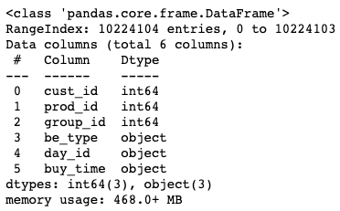

- 数据类型转换

```python
data['day_id']=pd.to_datetime(data['day_id'])
data['buy_time']=pd.to_datetime(data['buy_time'])
data1= data[(data.buy_time>='2019-11-05')&(data.buy_time<='2019-11-13')]
```

- 查看筛选后数据与筛选前数据比较，看数据集是否有变化

```python
len(data)
```

10224104

```python
len(data1)
```

10218544

- 查看数据基本情况

```python
data1.head()
```

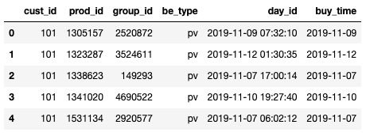

- 查看be_type字段总类

```python
data1['be_type'].drop_duplicates()
```

```
pv      9145058
cart     567531
fav      302497
buy      203458
Name: be_type, dtype: int64
```

- 查看数据中是否有空值

```python
data1.isnull().any()
```

```
cust_id     False
prod_id     False
group_id    False
be_type     False
day_id      False
buy_time    False
dtype: bool
```

- 提取出时间中的月份、天、时、星期等维度

```python
data1['month']=data1['day_id'].dt.month
data1['buy_time']=data1['day_id'].dt.date
data1['times']=data1['day_id'].dt.time
data1['hours']=data1['day_id'].dt.hour
data1['weekday']=data1['day_id'].dt.dayofweek+1
data1.head()
```

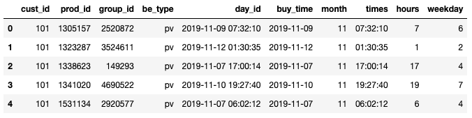

#### 4.2 用户行为分析

- 根据用户行为对数据进行分组

```python
behavior_count=data1.groupby('be_type')['cust_id'].count()
```

- 流量指标分析：PV、UV、平均访问量

```python
PV=behavior_count['pv']
print("PV=%d"%PV)
UV=len(data['cust_id'].unique())
print("UV=%d"%UV)
print("平均访问量 PV/UV=%d"%(PV/UV))
```

```
PV=9145058
UV=100000
平均访问量 PV/UV=91
```

- 跳失率：只有点击行为的用户数/总用户数，总用户数即uv

```python
data_pv=data1.loc[data1['be_type']=='pv',['cust_id']]   
data_fav=data1.loc[data1['be_type']=='fav',['cust_id']]
data_cart=data1.loc[data1['be_type']=='cart',['cust_id']]
data_buy=data1.loc[data1['be_type']=='buy',['cust_id']]
#集合相减，获取只有点击行为的用户数
data_pv_only=set(data_pv['cust_id'])-set(data_fav['cust_id'])-set(data_cart['cust_id'])-set(data_buy['cust_id'])
pv_only=len(data_pv_only)
print('跳失率为：%.2f%%'%(pv_only/UV*100))
```

```
跳失率为：5.91%
```

- 跳失率为5.91%，数值看上去较小，但跳失率一定程度上反映了商品的受欢迎程度，最好还是结合行业数据和以往数据分析是否处于正常范围。
- 影响跳失率的相关因素有：商品吸引力、商品加载时长以及流量的质量等。

- 按天进行PV统计

```python
pv_day= data1[data1.be_type=='pv'].groupby('buy_time')['be_type'].count()
pv_day
```

```
buy_time
2019-11-05     957020
2019-11-06     973800
2019-11-07     915255
2019-11-08     896779
2019-11-09     937196
2019-11-10     949846
2019-11-11     995060
2019-11-12    1265050
2019-11-13    1255052
Name: be_type, dtype: int64
```

- 按天进行UV统计

```python
uv_day=data1[data1.be_type=='pv'].drop_duplicates(['cust_id','buy_time']).groupby('buy_time')['cust_id'].count()
uv_day
```

```
buy_time
2019-11-05    69349
2019-11-06    70190
2019-11-07    69450
2019-11-08    69536
2019-11-09    70182
2019-11-10    71558
2019-11-11    72542
2019-11-12    95068
2019-11-13    94874
Name: cust_id, dtype: int64
```

- 可视化

```python
attr = pv_day.index
attr 
```

```
Index([2019-11-05, 2019-11-06, 2019-11-07, 2019-11-08, 2019-11-09, 2019-11-10,
       2019-11-11, 2019-11-12, 2019-11-13],
      dtype='object', name='buy_time')
```

```python
v1 = pv_day.values
v2 = uv_day.values
```

- 使用matplotlib画图

```python
#解决中文显示问题
plt.rcParams['font.sans-serif']=['SimHei']
plt.rcParams['axes.unicode_minus']=False
#设置线宽
plt.figure(figsize=(8, 5))
plt.plot(attr,v1,linewidth=4)
#设置图表标题，并给坐标轴添加标签
plt.title("日点击量趋势图",fontsize=20)
plt.xlabel('日期',fontsize=10)
plt.ylabel('PV',fontsize=10)
```

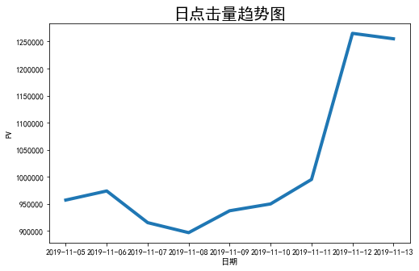

```python
#折线图绘制
fig = plt.figure(figsize=(6,6))      
plt.subplot(2,1,1)  
xlabel=attr
plt.plot(range(len(xlabel)),v1)   
plt.xticks(np.arange(9),'')  
plt.title('日点击量趋势图')
plt.ylabel('日pv')
for a,b in zip(range(len(xlabel)),v1):
    plt.text(a, b, b, ha='center', va='bottom', fontsize=10)   
plt.subplot(2,1,2)
plt.plot(range(len(xlabel)),v2) 
plt.xticks(np.arange(9),('11-05 周二','11-06 周三','11-07 周四','11-08 周五','11-09 周六','11-10 周日','12-11 周一','11-12 周二','11-13 周三'),rotation=45)
plt.title('日独立访客数趋势图')
plt.ylabel('日uv')
for a,b in zip(range(len(xlabel)),v2):
    plt.text(a, b, b, ha='center', va='bottom', fontsize=10)
plt.show()
```

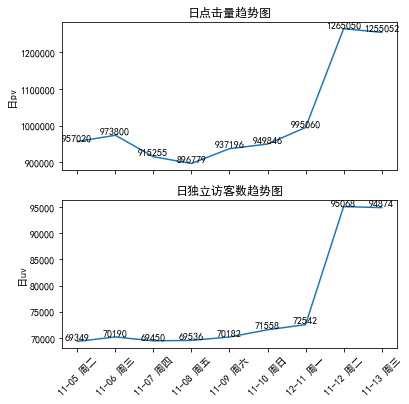

- 从上面可视化结果得出：PV、UV两者走势趋势相同，符合正常规律，在11月11号的时候，PV、UV呈上涨趋势，而上周并未出现这种情况，推测为因为双11活动而带来的流量

- 按小时进行PV、UV统计

```python
pv_hour=data1.groupby('hours')['cust_id'].count().reset_index().rename(columns={'用户ID':'pv'})
uv_hour=data1.groupby('hours')['cust_id'].apply(lambda x:x.drop_duplicates().count()).reset_index().rename(columns={'用户ID':'时uv'})
pv_hour.head()
```

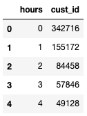

- 按小时访问流量可视化

```python
fig,axes=plt.subplots(2,1,sharex=True)
pv_hour.plot(x='hours',y='cust_id',ax=axes[0])
uv_hour.plot(x='hours',y='cust_id',ax=axes[1])
plt.xticks(range(24),np.arange(24))
axes[0].set_title('按小时点击量趋势图')
axes[1].set_title('按小时独立访客数趋势图')
```

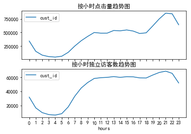

- 每天凌晨0-6点是点击量最少的时间，同时也是用户访问量最少的情况；10-22点为用户活跃高峰期

- 留存率，计算方法：
  - 识别出指定日期的新用户集合，记用户量为b
  - 得到第n天用户集合，识别、计算指定日期新用户在第n天仍使用产品的数量，记用户量为a
  - 留存率=a/b

```python
def cal_retention(data,n): #n为n日留存
    user=[]
    date=pd.Series(data.buy_time.unique()).sort_values()[:-n] #时间截取至最后一天的前n天
    retention_rates=[]
    for i in date:
        new_user=set(data[data.buy_time==i].cust_id.unique())-set(user) #识别新用户，本案例中设初始用户量为零
        user.extend(new_user)  #将新用户加入用户群中
        #第n天留存情况
        user_nday=data[data.buy_time==i+timedelta(n)].cust_id.unique() #第n天登录的用户情况
        a=0
        for cust_id in user_nday:
            if cust_id in new_user:
                a+=1
        retention_rate=a/len(new_user) #计算该天第n日留存率
        retention_rates.append(retention_rate) #汇总n日留存数据
    data_retention=pd.Series(retention_rates,index=date)
    return data_retention

data_retention=cal_retention(data1,3)  #求用户的3日留存情况
data_retention
```

```
2019-11-05    0.758306
2019-11-06    0.659058
2019-11-07    0.644157
2019-11-08    0.669378
2019-11-09    0.966176
2019-11-10    0.951292
```

- 购买人数与购买率

```python
day_buy_user_num = data1[data1.be_type == 'buy'].drop_duplicates(['cust_id', 'buy_time']).groupby('buy_time')['cust_id'].count()
day_active_user_num = data1.drop_duplicates(['cust_id', 'buy_time']).groupby('buy_time')['cust_id'].count()
day_buy_rate = day_buy_user_num / day_active_user_num
attr = day_buy_user_num.index
v1 = day_buy_user_num.values
v2 = day_buy_rate.values
```

- 可视化

```python
#设置线宽
plt.figure(figsize=(8, 5))
plt.plot(attr,v1,linewidth=4)
#设置图表标题，并给坐标轴添加标签
plt.title("日购买人数趋势图",fontsize=20)
plt.xlabel('日期',fontsize=10)
plt.ylabel('PV',fontsize=10)
```

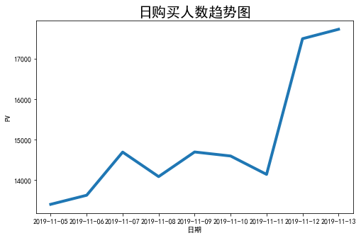

```python
#设置线宽
plt.figure(figsize=(8, 5))
plt.plot(attr,v2,linewidth=4)
#设置图表标题，并给坐标轴添加标签
plt.title("日购买率趋势图",fontsize=20)
plt.xlabel('日期',fontsize=10)
plt.ylabel('PV',fontsize=10)
```

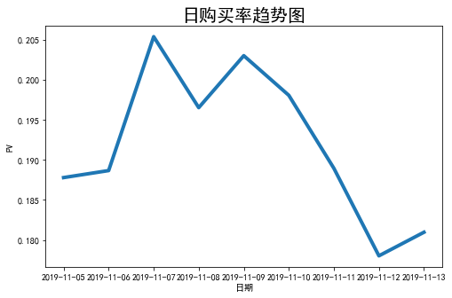

- 购买人数和购买率走势在11月10号之前大致相同，从11号开始购买人数有增加，但与之前相比购买率在下降，考虑到双十一的场景，属于正常情况
- 复购率：复购指两天以上有购买行为,一天多次购买算一次，复购率=有复购行为的用户数/有购买行为的用户总数

```python
df_rebuy = data1[data1.be_type == 'buy'].drop_duplicates(['cust_id', 'day_id']).groupby('cust_id')['day_id'].count()
df_rebuy[df_rebuy >= 2].count() / df_rebuy.count()
```

- 购物转化漏斗分析

```python
data_AARR=data1.groupby('be_type')['cust_id'].count()
#点击量
pv_value=data_AARR['pv']
#收藏量
fav_value=data_AARR['fav']
#加购量
cart_value=data_AARR['cart']
#购买量
buy_value=data_AARR['buy']
##计算转化率，此处由于实际业务中用户收藏和加购没有先后顺序，所以二者合并后计算转化率
#收藏加购转化率
f_c_value=fav_value+cart_value
f_c_ratio=f_c_value/pv_value
print('收藏加购转化率为:%.2f%%'%(f_c_ratio*100))
#购买转化率
buy_ratio=buy_value/pv_value
print('购买转化率为:%.2f%%'%(buy_ratio*100))
```

```
收藏加购转化率为:9.51%
购买转化率为:2.22%
```

- 准备漏斗数据

```python
pv_users = data1[data1.be_type == 'pv']['cust_id'].count()
fav_users = data1[data1.be_type == 'fav']['cust_id'].count()
cart_users =data1[data1.be_type == 'cart']['cust_id'].count()
buy_users = data1[data1.be_type == 'buy']['cust_id'].count()
attr = ['点击', '加入购物车', '收藏', '购买']
```

- plotly绘制漏斗图

```python
import plotly.express as px
data = dict(
    number=[pv_users, cart_users, fav_users, buy_users],
    stage=attr)
fig = px.funnel(data, x='number', y='stage')
fig.show()
```

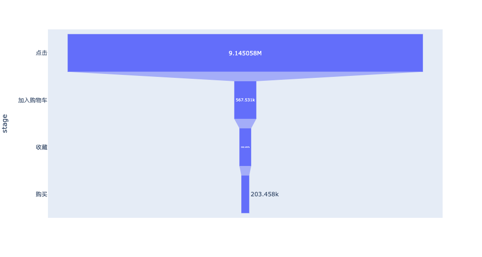

#### 4.3 商品维度分析

- 购买产品类目计数

```python
product_buy=data1.loc[data1['be_type']=='buy',['cust_id','group_id']]
product_buy_count=product_buy.groupby('group_id')['cust_id'].count().rename('销售次数')
product_buy_count=pd.DataFrame(product_buy_count) 
#按照销售次数降序排序
product_buy_count=product_buy_count.sort_values(by='销售次数',axis=0,ascending = False)
```

- 购买产品类目前10名

```python
product_buy_count=product_buy_count.iloc[:10,:]
product_buy_count
```

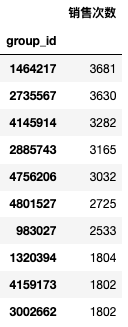

- 商品点击计数

```python
product_pv=data1.loc[data1['be_type']=='pv',['cust_id','group_id']]
product_pv_count=product_pv.groupby('group_id')['cust_id'].count().rename('点击次数')
product_pv_count=pd.DataFrame(product_pv_count)   
product_pv_count=product_pv_count.sort_values(by='点击次数',axis=0,ascending = False)
product_pv_count=product_pv_count.iloc[:10,:]
product_pv_count
```

- 商品购买次数和种类统计

```python
item_behavior=data1.groupby(['group_id','be_type'])['cust_id'].count().unstack(1).rename(columns={'pv':'点击量','fav':'收藏量','cart':'加购量','buy':'购买量'}).fillna(0)
item_behavior.head()
item_behavior['转化率']=item_behavior['购买量']/item_behavior['点击量']
item_behavior.head()
```

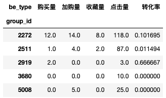

- 点击量前十和购买量前十商品类目连接

```python
top=pd.concat([product_buy_count,product_pv_count],axis=1,sort=False)
top
```

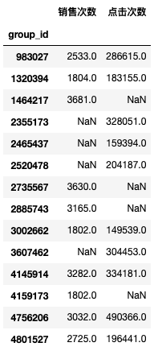

### 小结

- 用户行为分析常用方法
  - 时间分析
  - 页面点击分析
  - 漏斗模型分析
  - 用户行为路径分析
- AARRR模型
  - **Acquisition（获得新用户）**：PV，UV
  - **Activation（用户激活）**：用户活跃，按时间维度
  - **Retention（用户留存）**：留存率（次日留存，七日留存等）
  - **Revenue（用户付费）**：获取收入，用户购买率
  - **Referral（用户推荐）** 分享，（朋友圈，砍一刀，返现，分享满N人给优惠券）这里缺少相关数据
