## 用户评论文本挖掘

### 学习目标

- 知道评论文本挖掘的作用
- 掌握使用nltk和gensim来进行基本NLP处理


### 一、评论文本挖掘介绍

- 文本挖掘就是从文本信息中挖掘我们感兴趣的内容
- 数据分析师为什么要关注文本数据
  - 在我们日常的产品和运营工作中，经常接触的数据分析方法、形式绝大部分是基于对数字（值）的描述性分析。这些又被称为结构化数据
  - 除此之外，图片，文字，视频，这些统称为非结构化数据
  - 非结构化数据蕴含信息量大，特别是文本信息（用户评论）是用户对产品、服务是否满意的重要了解手段
  - 在产品和运营的实际工作中， 发掘出用户的喜好、购买/使用及流失的内在原因，对我们的工作至关重要

- 对于非自营电商类业务，文本数据显得异常重要
  - 如果是自有APP，可以通过埋点获取我们想要的数据。但作为三方卖家触，达用户手段有限，只能通过平台暴露出的数据接口
  - 我们能够通过平台获得的非结构化数据主要是指用户评论数据
  - 用户评论数据包含了用户信息，对手信息，产品信息
  - 大家都是电商品台的用户，对于用户评论的重要性都有认识，有关评论展开的营销也很多：刷好评，删除评论，红包索评等


- 通过评论文本挖掘可以实现如下目标：
  - 运营优化：挖掘用户喜好，挖掘竞品动态，提升自身产品竞争力
  - 产品更新：发掘产品更新动向，及时的从用户处发现产品问题
  - 口碑管理：识别出自家产品和竞争对手的口碑差异

### 二、项目背景

- 我们想从用户的角度了解有关竞品以及市场的信息

- Ukulele 属性简介

  - 尺寸：Soprano 21寸  Concert 23寸  Tenor26寸

  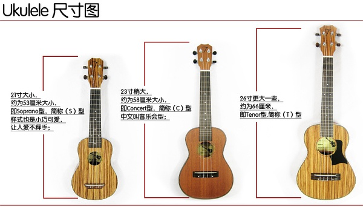

  - 材质：椴木，乌木，桃花芯，塑料
  - 颜色：原木色，红色，蓝色，黑色


- 看一下亚马逊评论的构成，我们主要的分析对象是评论正文

  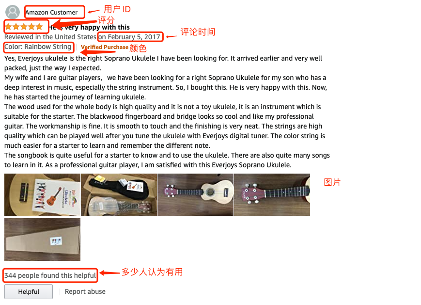

- 项目需求：
  - 竞品销售情况细化：通过对竞品评论中分型号的历史评论数量，反推竞品的主要售卖产品的情况
  - 竞品高分和低分的具体发声：高分4-5分的评论主要是说哪些，低分1-2分用户主要说什么，我们比较关注的方面又说了什么
- 技术实现：
  - 竞品细化
  - 高分、低分关键词提取

### 三、文本挖掘相关方法介绍

#### 1、如何用数值来表示文本

- 机器不懂人类的自然语言，我们要将自然语言转换为机器易于理解的“语言”，NLP（**Natural language processing**)

- NLP 里面，最细粒度的是词语，词语组成句子，句子再组成段落、篇章、文档。所以处理 NLP 的问题，首先要处理词语

- 词语处理的最终目标是用向量来表示词语

  ①获取原始文本 ： Yes, Everjoys ukulele is the right Soprano Ukulele I have been looking for. It arrived earlier and very well packed, just the way I expected.

  ② 分词：[‘Yes’,’,', 'Everjoys', 'ukulele', **'is'**, **'the'**, 'right', 'Soprano', 'Ukulele', 'I', 'have', 'been', 'looking', 'for.', 'It', 'arrived', 'earlier', 'and', 'very', 'well', 'packed,', 'just', 'the', 'way', 'I', 'expected.']

  ③ 向量化编码：[1,0,1,0,1,0,1,0……]

- 分词阶段需要处理的内容：

  - 首先将一句话拆分成一个一个单词，英文分词很简单，直接通过空格就可以，中文分词可以借助jieba这样的三方库

  - 接下来我们需要对有时态变化的单词还原成未变化的单词
  
    - **词干提取 – Stemming**
  
      词干提取是去除单词的前后缀得到词根的过程。
  
      大家常见的前后词缀有「名词的复数」、「进行式」、「过去分词」…
  
    
  
    - **词形还原 – Lemmatisation**
  
      词形还原是基于词典，将单词的复杂形态转变成最基础的形态。
  
      词形还原不是简单地将前后缀去掉，而是会根据词典将单词进行转换。比如「drove」会转换为「drive」。
  
    
  
  - 获取原始单词之后还需要去掉停用词和一些助词，虚词，连词
    - 停用词：可以手动指定那些单词经过处理之后不会保留在分词结果中
    - 一般我们只关心名词，动词和形容词 
    
  - 上述过程都有三方库帮助我们实现

### 四、 代码实现

#### 1、导包&载入数据

```python
import pandas as pd
# 
import re
import datetime
import matplotlib.pyplot as plt
import seaborn as sns
plt.style.use('fivethirtyeight')
import warnings
# 忽略不必要的warnings
warnings.filterwarnings('ignore')
%matplotlib inline

import pandas as pd
import re
# nltk：文本处理的包
from nltk.stem.wordnet import WordNetLemmatizer # 词性还原
from collections import Counter
import math
import matplotlib.pyplot as plt
from nltk.corpus import wordnet as wn

import pyecharts.options as opts
from pyecharts.charts import WordCloud
```

- 加载数据

```python
df_reviews=pd.read_csv('data/reviews.csv')
df_reviews.head()
```

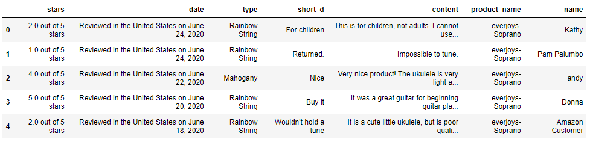

- 查看数据情况

```python
df_reviews.info()
```

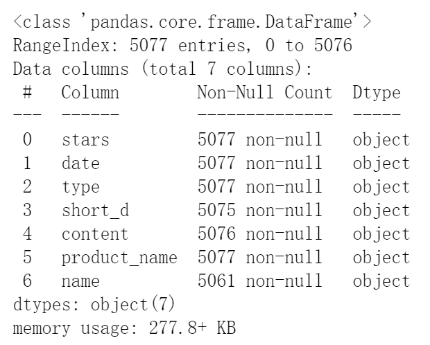

- 从上面结果中看出，short_d，content，name这三个字段有少量缺失，需要我们处理一下

#### 2、数据处理

- 由于我们分析的就是评论的文本内容，所以content字段有确实的情况，我们直接做删除处理

```python
# 对于评论内容空缺的，直接删除
df_reviews = df_reviews.dropna()

# 截取评论中的星级数据 
def get_stars(n):
    return float(n.replace(' out of 5 stars',''))

# 根据评星数量获取评价属性， 好评（4分及以上）， 中评（3分）， 差评（2分及以下）
def stars_cat(n):
    '''
    评分转换为好中差评  1分2分为差评, 3分中评, 4分5分好评
    '''
    if n<=2:
        return '差评'  
    elif n ==3:
        return '中评' 
    else:
        return '好评'

# 获取评论中的日期信息，转换成日期时间格式
def get_date(x):
    '''
    处理评论日期  Reviewed in the United States on June 24, 2020
    先用 'on ' 去拆分, 把日期文本拆分成两部分
    再用', '拆分, 把后面的部分拆分成 ['月 日','年']
    最后把前面的'月 日' 用空格拆分成 月 日
    '''
    x = x.split('on ')[1] # 把数据拆分成两部分 ['Reviewed in the United States on ','June 24, 2020']
    x = x.split(', ') 
    y= x[1]
    x = x[0].split(' ')
    m,d = x[0],x[1]
    if m=='January' or m=='Jan':
        on_date='01-'+d+'-'+y
    elif m=='February' or m=='Feb':
        on_date='02-'+d+'-'+y
    elif m=='March' or m=='Mar':
        on_date='03-'+d+'-'+y
    elif  m=='April' or m=='Apr':
        on_date='04-'+d+'-'+y
    elif  m=='May':
        on_date='05-'+d+'-'+y
    elif  m=='June' or m=='Jun':
        on_date='06-'+d+'-'+y
    elif  m=='July' or m=='Jul':
        on_date='07-'+d+'-'+y
    elif m=='August' or m=='Aug':
        on_date='08-'+d+'-'+y
    elif m=='September' or m=='Sep':
        on_date='09-'+d+'-'+y
    elif m=='October' or m=='Oct':
        on_date='10-'+d+'-'+y
    elif m=='November' or m=='Nov':
        on_date='11-'+d+'-'+y
    elif m=='December' or m=='Dec':
        on_date='12-'+d+'-'+y    
    on_date=datetime.datetime.strptime(on_date, '%m-%d-%Y').strftime('%Y-%m-%d')
    return on_date

# 字数统计
df_reviews['stars_num']=df_reviews['stars'].apply(get_stars)
df_reviews['content_cat']=df_reviews['stars_num'].apply(stars_cat)
df_reviews['date_d']=df_reviews['date'].apply(get_date)
```

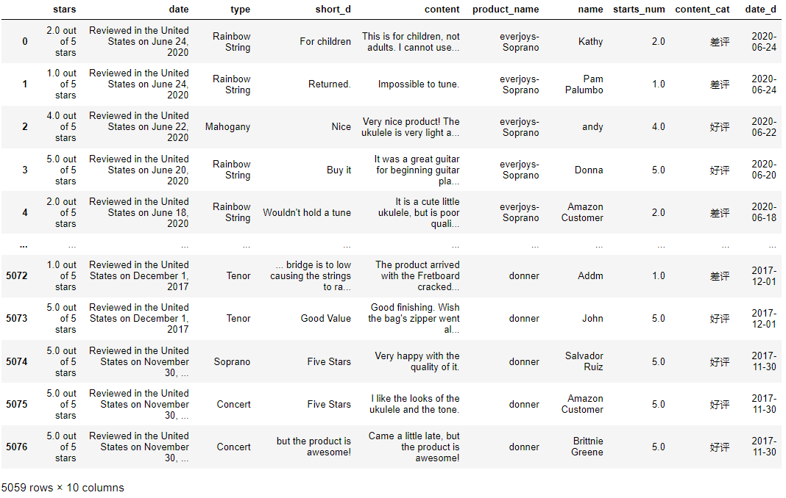

#### 3、非文本数据的分析

- 统计产品的评论数量
- 统计不同类型的产品数量
- 统计产品评论星级分布

```python
# 查看不同商品的总数
sns.set(font_scale=1)
df_reviews['product_name'].value_counts().plot(kind='bar')
```

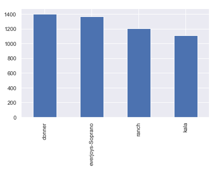

```python
# 按时间顺序统计发文数量，分析是否有周期性规律
df_reviews['date_d'] = pd.to_datetime(df_reviews['date_d'])
df_reviews['y_m'] = df_reviews['date_d'].astype('datetime64[M]')#提取日期年月
df_reviews.head()
```

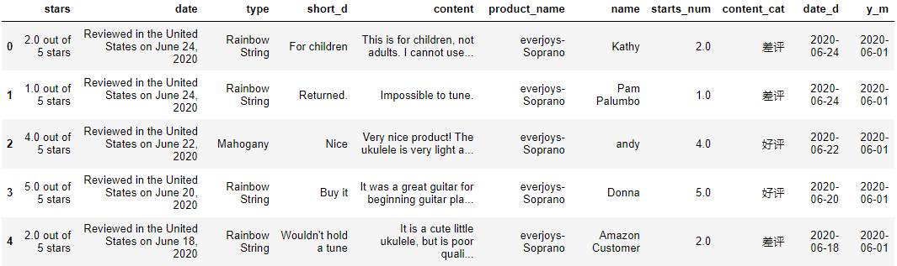

```python
plt.rcParams['font.family'] = ['sans-serif'] # 解决中文显示问题
plt.rcParams['font.sans-serif'] = ['SimHei']
# 不同产品  everjoys ranch kala donner 
# 构建结构化多绘图网格,不同子集上绘制同一图的多个实例, --> FacetGrid()
# FacetGrid 参数说明 data 绘图用到的数据   col 每一个小图 利用哪一列来截取数据  col_wrap 小图有几列  sharex是否共享x轴  sharey 是否共享Y轴  height图片高度 aspect 宽高比例
g = sns.FacetGrid(data = df_reviews,col = 'product_name',col_wrap = 2,sharex=False,sharey=False,height = 5, aspect= 1.2)
# g.map 绘制分面图中的小图    利用 sns.countplot 绘图  , 从df_reviews 利用 product_name分组  每组画 content_cat 不同类别的数量  order 指定柱子的顺序
g.map(sns.countplot,'content_cat',order=['positive','negative','neutral'])
```

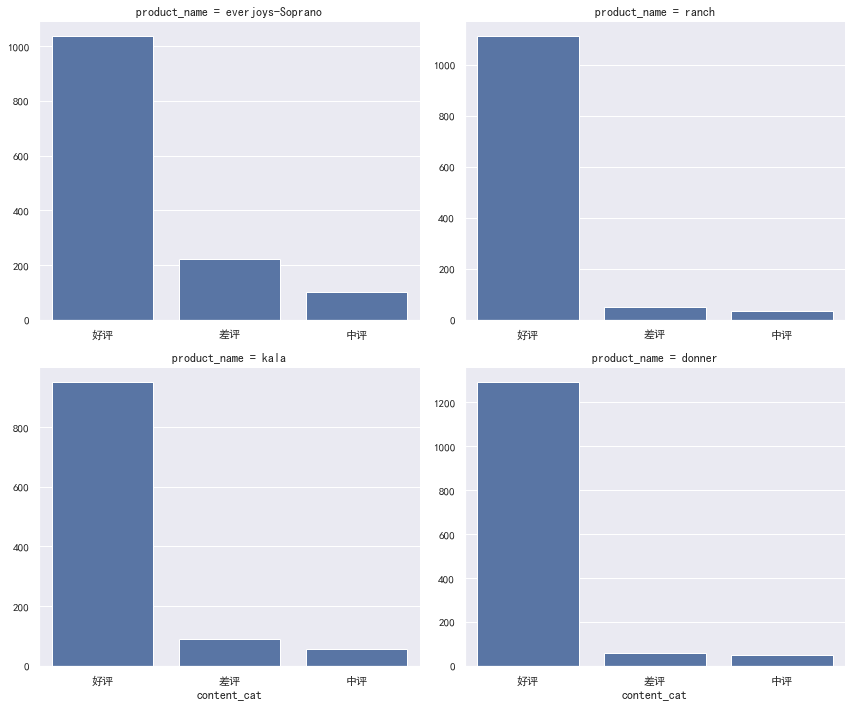

```python
# 每种产品的发文数量按月统计
df_content=df_reviews.groupby(['product_name','y_m'])['content'].count().reset_index()
g=sns.FacetGrid(data=df_content,col='product_name',col_wrap=2,sharey=False,sharex=False,height=4,aspect =2)
# 第一个参数传入的是 要调用哪个API 绘图,  后面几个参数传的是 调用 (plt.plot 的时候需要用到哪些参数, 具体的数据传入列名就行了
g.map(plt.plot,"y_m",'content',marker='1')#marker='1' 折线图每一个点会一条短线来表示
```


```python
# 好中差评的随时间分布
df_content=df_reviews.groupby(['product_name','y_m','content_cat'])['content'].count().reset_index()
g=sns.FacetGrid(data=df_content,col='product_name',hue='content_cat',col_wrap=2,sharey=False,sharex=False,height=4,aspect =2)
g.map(plt.plot,"y_m",'content',marker='.')#marker='.' 折线图每一个点会用一个点来表示
g.add_legend()# 添加图例
```

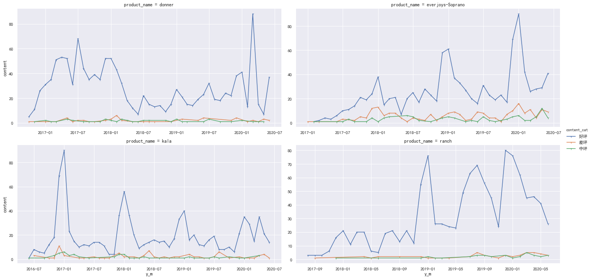

```python
# 同产品不同型号的分布
df_content=df_reviews.groupby(['product_name','y_m','type'])['content'].count().reset_index()
g=sns.FacetGrid(data=df_content,col='product_name',hue='type',col_wrap=2,sharey=False,sharex=False,height=4,aspect =2)
g.map(plt.plot,"y_m",'content',marker='.')
g.add_legend()
```

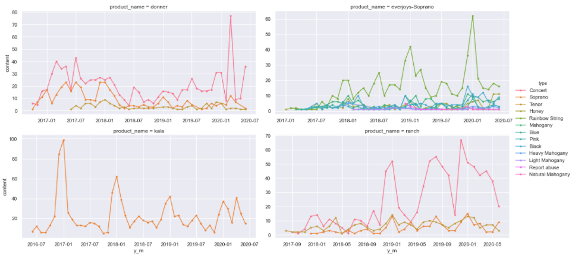

#### 4、文本挖掘

- 数据去重

```python
df_data = df_reviews.drop_duplicates(subset={"product_name","type","date_d","content_cat","content","stars_num","name"})
df_text=df_data['content']
df_text[0]
```

```
"This is for children, not adults. I cannot use the tuner, so I use one on my phone. It doesn't stay in tune longer than a couple minutes."
```

- 判断某款产品是好评还是差评

```python
sample_positive=df_data[(df_data.product_name=='everjoys-Soprano') & (df_data.content_cat=='好评')]
sample_negative=df_data[(df_data.product_name=='everjoys-Soprano') & (df_data.content_cat=='差评')]
len(sample_positive)
```

1039

```python
len(sample_negative)
```

223

- 还原常见缩写单词

```python
# 在用语料分析的第一步，用正则表达式对文本进行处理，
# 正则：由一系列普通与特殊字符组成的用于描述文本规则的表达式
# re的包，是一个有关正则匹配的
# re.sub(pattern,replacement,string) ##查找字符串中出现的所有模式，并做替换，输出替换后的结果字符串
# ? 前一个字符之多出现一次：<=1
# * 前一个字符至少不出现0次：>=0
# + 前一个字符至少出现一次：>=1
# ^ 标识字符串以后一个字符开始
# . 代表任意一个字符
# $ 标识字符串以前一个字符结束
# () 标识一个group,group(0)表示正则表达式的模式匹配结果，group(1)表示小括号内匹配的第一个群
# [] 中括号内的字符表示一个字符的取值范围
# {} 大括号内的数字表示前一个字符重复的次数
# \ 反斜线表示去除通配符的特殊意义，仅作为普通字符使用
# | 或者
def replace_abbreviations(text):
    new_text = text
    #则表达式过滤特殊符号用空格符占位，双引号、单引号、句点、逗号
    new_text = re.sub(r'[^a-zA-Z.,?! \']+',' ', text).strip().lower()
    # 还原常见缩写单词还原,i'm i'd he's
    new_text = re.sub(r"(it|he|she|that|this|there|here)(\'s)",r"\1 is", new_text,re.I)
    # (?<=pattern)xxx，就是捕获以pattern开头的内容xxx
    new_text = re.sub(r"(?<=[a-zA-Z])n\'t"," not", new_text) # not的缩写 aren't-- are not
    new_text = re.sub(r"(?<=[a-zA-Z])\'d"," would", new_text) # would的缩写i'd -->i would--> 'i' 'would'
    new_text = re.sub(r"(?<=[a-zA-Z])\'ll"," will", new_text) # will的缩写
    new_text = re.sub(r"(?<=[I|i])\'m"," am", new_text) # am的缩写
    new_text = re.sub(r"(?<=[a-zA-Z])\'re"," are", new_text) # are的缩写
    new_text = re.sub(r"(?<=[a-zA-Z])\'ve"," have", new_text) # have的缩写
    new_text = new_text.replace('\'', ' ').replace('.', '. ')
    return new_text
```

- 词形还原(Lemmatization)
  - 我们使用nltk 包中的morphy方法来做词形还原

>nltk：Natural Language Toolkit  是自然语言处理领域中很常用的Python开源库，nltk提供了一系列的方法帮助我们进行词性标注，词干提取，分词等nlp领域的常见操作,还提供了50多个语料库和词汇资源的接口

```python
def get_lemma(word):
    lemma=wn.morphy(word)
    if lemma is None:
        return word
    else:
        return lemma
```

- 去停用词

```python
#标点符号
punctuation = [",", ":", ";", ".", "!", "'", '"', "’", "?", "/", "-", "+", "&", "(", ")"]
stop_words=nltk.corpus.stopwords.words('english')+punctuation
```

- 我们将上述处理封装成方法
  - 缩写还原→词干提取,词形还原→去停用词

```python
# 封装成pipeline
def prepare_text(n):
    tx = replace_abbreviations(str(n)) # 缩写还原
    # 分词处理  英文分词 实际上就是用空格去split 
    tokens = nltk.word_tokenize(tx)
    # 词还原词形
    tokens = [get_lemma(token) for token in tokens]
    # 去停用词
    tokens = [ i for i in tokens if i not in stop_words] # 遍历每一个单词 如果在停用词表中的就去掉 不在停用词表中的返回
    return tokens
```

- 积极、消极评论分别处理

```python
clean_txt_positive=[prepare_text(s) for s in sample_positive['content']]
clean_txt_negative=[prepare_text(s) for s in sample_negative['content']]
```

- 查看原始文本

```python
sample_positive['content'][2]
```

'Very nice product! The ukulele is very light and the craftsmanship is great. Everything it came with was good as well. Needs lots of tuning in the beginning'

- 查看处理之后的文本

```python
clean_txt_positive[0]
```

```
['nice',
 'product',
 'ukulele',
 'light',
 'craftsmanship',
 'great',
 'everything',
 'come',
 'wa',
 'good',
 'well',
 'need',
 'lots',
 'tuning',
 'beginning']
```

- 统计词频

```python
Counter(clean_txt_positive[0]).most_common(2)
```

[('nice', 1), ('product', 1)]

#### 5、创建词云图

- 创建方法，统计单词总数，每条评论的词汇数量，词汇丰富度（去重后的词汇数量/总的词汇数量）

```python
#clean_text 所有的评论 经过处理之后的list   是一个二维列表 , 每一条评论都对应一个list  这个list里面保存的是这条评论经过处理之后的关键词
def get_words(clean_text):
    words_all = [] # 创建一个列表 用来保存所有评论的单词
    for words in clean_text:
        for word in words:
            words_all.append(word) # 遍历出每条评论的每一个单词, 放到列表里
    total_words = list(set(words_all)) #  统计一共出现了多少个不同的单词  对words_all去重, 转换成list
    all_words = Counter(words_all) # 统计每个单词出现了多少次
    content_mean = len(words_all)/len(clean_text)  # 平均每条评论有多少个关键词  总单词数量/ 一共有多少条评论
    words_cap =  len(total_words)/len(words_all) # 去重之后的词汇总数/去重之前的词汇总数
    return all_words,content_mean,total_words,words_cap
    
words_all_positive,content_mean_positive,words_cap_positive=get_words(clean_txt_positive)
words_all_negative,content_mean_negative,words_cap_negative=get_words(clean_txt_negative)
```

1832

959

- 查看每条评论的词汇数量和词汇丰富度

```python
content_mean_positive,words_cap_positive
```

(15.278152069297402, 0.11540884465163159)

```python
content_mean_negative,words_cap_negative
```

(19.6457399103139, 0.21889979456745035)

- 统计出现最多的单词的词频,准备绘制词云图

```python
positive_words_wordcloud=words_all_positive.most_common(100)# 取出前100个频率最高的单词
negative_words_wordcloud=words_all_negative.most_common(100)
positive_words_wordcloud
```

```
[('ukulele', 402),
 ('love', 390),
 ('great', 381),
 ('wa', 356),
 ('good', 252),
 ('play', 236),
 ('tune', 219),
 ('come', 201),
 ('get', 200),
 ('tuner', 192),
 ('beginner', 189),
 ('daughter', 184),
 ……
```

- 绘制好评词云图

```python
(WordCloud()
    .add(series_name="好评词云",
         data_pair=positive_words_wordcloud,  #传入绘制词云图的数据
         word_size_range=[16, 80])  #word_size_range 字号大小取值范围
    .set_global_opts(
        title_opts=opts.TitleOpts(
            title="好评词云", 
            title_textstyle_opts=opts.TextStyleOpts(font_size=23) # 设置标题字号
        ),
        tooltip_opts=opts.TooltipOpts(is_show=True),  # 设置为True 鼠标滑过文字会弹出提示框
    )
    .render_notebook()
)
```

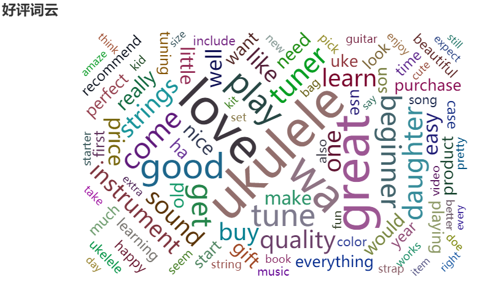

- 绘制差评词云图

```python
(WordCloud()
    .add(series_name="差评词云", data_pair=negative_words_wordcloud, word_size_range=[16, 80])
    .set_global_opts(
        title_opts=opts.TitleOpts(
            title="差评词云", title_textstyle_opts=opts.TextStyleOpts(font_size=23)
        ),
        tooltip_opts=opts.TooltipOpts(is_show=True),
    )
    .render_notebook()
)
```

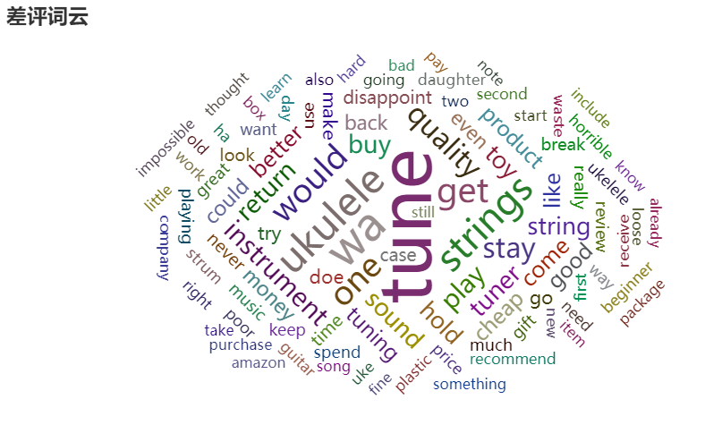


### 小结

- 评论文本挖掘
  - 挖掘用户喜好，挖掘竞品动态，提升自身产品竞争力
  - 发掘产品更新动向，及时的从用户处发现产品问题
- 英文文本处理的基本套路
  - 分词→缩写还原→词干提取,词形还原→去停用词
  - 用到的库nltk
- word2vec词向量
  - 用一组语料训练一个词向量模型，这个模型相当于一个N维(N需要手动指定)的语义空间，语料中的每一个单词都对应着一个词向量
  - 词向量之间的相似度可以作为语义相近的判断依据
  - gensim库可以帮助我们训练词向量模型
