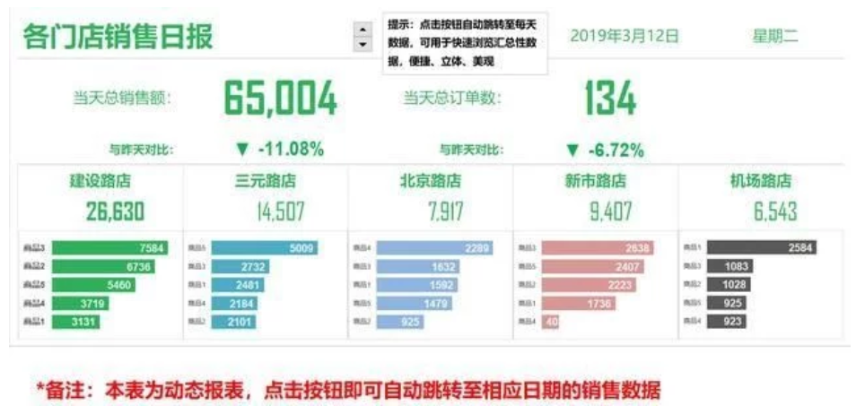
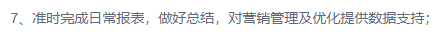
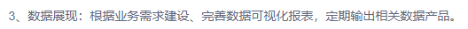
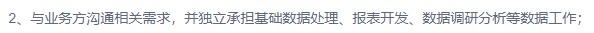
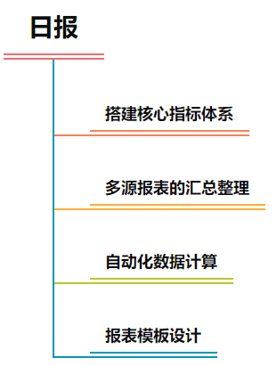

## 报表设计

### 学习目标

- 知道报表作用

- 掌握搭建日报的基本流程

- 应用SQL,EXCEL实现日报开发

  

### 一、报表简介

- 报表：数据分析的模板

  报表：将海量业务相关数据有效地组织展示出来，将有价值的信息（事物的现状、问题、原因、本质和规律）传递出去，辅助公司业务/战略部门做出决策。

- 业务相关有效数据：
  - 销售数据
  - 物流仓储数据
  - 广告流量数据
  - 生产研发数据
  - 用户行为数据
- 海量业务相关数据 → 构建指标体系→ 报表 → 挖掘商业机会/决策支持/风险预测预警

- 报表的类型很多:

  - 周期性报表：周期性报表，日常见到的日报、周报、月报
  - 利用Excel，BI工具等制作的可视化仪表板
  - 临时性的报表：活动销售报表

  

- 制作报表是数据分析师的必备技能
  - 在招聘网站上搜搜数据分析师，在岗位职责描述中，有关报表制作相关的要求几乎是标配
    - 
    - 
    - 
    - 
    - 

- 常用报表工具

  - Excel (+SQL)
  - Python
  - PowerBI
  - Tableau
  - FineBI、FineReport

  工具并不是要点，我们主要应该关注要展示那些数据，我们的报表能给报表的使用者带来那些价值

- 报表开发的要点：
  - 数据整合
  - 指标体系建设
  - 可视化（模板化）
    - 仪表板

### 二、项目介绍——日报

- 日报：统计企业每天运营产生的与KPI指标相关的数据，数据部门负责统计并在每天早晨以邮件形式发送至运营部门（统计昨日一天数据）。



- 日报搭建步骤
  - 第一步：搭建指标体系，先明确产品的类型，明确业务究竟是什么，目标是什么。梳理出业务流程，形成一个指标体系框架。不同业务类型的产品会有不同的指标体系框架。
  - 第二步：搭建完体系框架后，需要对指标体系进行拆分、确定我们需要的核心指标，然后从维度和度量角度，去计算
  - 第三步：指标体系方案敲定后，开始整理底层数据存储逻辑，明确每个字段要从哪里获取，每张表应该涵盖哪些指标哪些字段维度。可能遇到的问题
    - 1、缺少必要数据（没有埋点）
    - 2、有埋点但是数据未合理入库
    - 3、数据缺失、错误严重
  - 第四步： 指标体系可视化展示
    - 使用公司的数据产品或者第三方数据产品来将这些指标进行数据可视化
  - 第五步： 存档、追踪、落地和优化

### 三、方法论详解

- 明确当前业务所处阶段，比如想一下公司当下的核心目标是什么？是要冲营收，还是要提高利润

- 确定核心指标

  - 核心指标，就是业务方的核心关注点
  - 公司发展的核心KPI：GMV/利润
  - 与GMV关联比较紧密的有
    - 流量 转化率，流量成本 ACos
    - 市场 市场占有率
    - 物流  在售在途

- 确定核心指标之后，需要对核心指标进行拆解，拆解的目的是从不同的角度对业务进行更加详细完整的描述，常见拆解思路：

  - 人、货、场

    - 作为电商业务来讲，常见的数据指标都可以用人、货、场的方式罗列出来
    - 人：对外指用户或者流量，对内指运营人员
      - 流量相关，运营人员相关
    - 货：商品
      - 销售相关，商品相关
    - 场：平台，店铺，详情页，促销活动
      - 库存站点相关

  - 用户行为漏斗

    从买家的行为来看，购物流程大概分如下步骤

    

    从卖家的维度：站内搜索→ 自然流量或站内广告位展现→点击进入详情页→加入购物车

    如果是使用的三方平台，如亚马逊，淘宝等，我们只能获取平台整理的数据，如果是自建站、自有APP我们可以获取的数据维度更加丰富

  - GMV拆解

    

    

- 公司现阶段主要目标是盈利，那么日报的指标体系如下


- 指标体系确定后，要明确取数逻辑，包括数据保存在那张表中，报表中每个字段从哪里获取

  - 这个环节通常需要与数据团队配合，通过SQL实现
  - 数据表说明

  | **数据表**   | **说明**               | **主要字段**                   |
  | ------------ | ---------------------- | ------------------------------ |
  | ds_sales     | 每个链接每日销售情况   | 价格、销量、曝光、退货等       |
  | ds_url       | 每个链接的链接情况     | reviews，price，stars, 排名    |
  | ds_stock     | 每个链接的物流情况     | 在售、库存等信息               |
  | ds_sales_ad  | 每个链接的广告投放情况 | 展示量、点击量、广告出单情况等 |
  | ds_sales_all | 每日销售情况汇总       |                                |

  - 制作报表这里用到Excel链接MySQL

    

    - 在下面界面中配置链接

    

    - Data Source Name 自己起名字
    - TCP/IP Server 数据库在本机的话 填写localhost
    - User: root
    - Password  mysql密码
    - Database: 如果Server地址,用户名密码填写没有问题,可以在这里选择要用到的数据库

  - 

    打开Excel选择数据→获取数据→自其他源→从ODBC，会弹出下面的对话框，选择我们之前设置好的ODBC链接，点击高级选项，填写SQL语句点击确定

    

    - 点击确定后弹出下面对话框，填入用户名密码点击链接

    

- 查询结果


### 四、SQL计算指标

- 核心指标计算

```Mysql
select 
	date as 日期,
	sum(liulan) as 页面浏览次数, 
	sum(buyer) as 卖家访问次数,
	sum(on_sell) as 平均在售商品数, 
	sum(refund_ratio)/100 as 退款率,
	sum(sales_total) as 销量,
	sum(gmv_total) as 销售额
from ds_sales_all
group by date
order by date desc
limit 7
```

- 分品牌统计

```mysql
select update_day as 日期,brand as 品牌,sum(units_count) as 销量,sum(gmv) as 销售额
from ds_sales_detail
where update_day=(select max(update_day) from ds_sales_detail)
group by update_day,brand
```

- 分链接统计

```Mysql
select
		end_day, country, brand, asin, clicks,cost,impressions,gmv_ad,sales_ad,cost/clicks as cpc,clicks/impressions as ctr
from ds_sales_ad
-cost/clicks 计算了点一下花了多少钱
-clicks/impressions as ctr 点击/曝光计算了点击率 
```

- 网页信息

```mysql
select 
  country,
		insert_date,asin,sales_rank rank_big,rank_small,stars,price,reviews,daily_units
	from ds_sales_url
```

- 销售详情

```mysql
select detail.update_day,detail.country,detail.brand,detail.asin,detail.units_count,detail.gmv,t_sales.`最晚售出距今天数`,t_sales.`近7日销量`,t_sales.`近7日平均销量`,t_sales.`日均销量预估`,detail.profit
from ds_sales_detail detail
left join(
select 
    brand,country,asin,datediff('2020-12-31',max(update_day)) as '最晚售出距今天数',
    sum(case when DATEDIFF('2020-12-31',update_day)<=7 then units_count else 0 end)  as '近7日销量',
    round(sum(case when DATEDIFF('2020-12-31',update_day)<=7 then units_count else 0 end)/7,2) as '近7日平均销量',
    -- 加权平均预测
    round(
            (round(sum(case when DATEDIFF('2020-12-31',update_day)<=7 then units_count else 0 end)/7,2)*0.6 + 
            round(sum(case when DATEDIFF('2020-12-31',update_day)<=15 then units_count else 0 end)/15,2)*0.3+
            round(sum(case when DATEDIFF('2020-12-31',update_day)<=30 then units_count else 0 end)/30,2)*0.1),2) 
    as '日均销量预估'    
	from ds_sales_detail
	where units_count!=0
	group by brand,country,asin) t_sales
on detail.asin=t_sales.asin and detail.country=t_sales.country and detail.brand=t_sales.brand
where detail.update_day='2020-12-31'
order by country,brand,units_count desc
```

- 合并起来

```mysql
select distinct detail.update_day 日期,detail.country 国家, detail.brand 品牌, detail.asin 链接ASIN, detail.units_count+0 销量,detail.gmv+0 销售额,detail.`最晚售出距今天数`+0 最晚售出距今天数,detail.`近7日销量`+0 近7日销量,detail.`近7日平均销量`+0 近7日平均销量,detail.`日均销量预估`+0 日均销量预估,stock.in_stock+0 当前库存,round(stock.in_stock/detail.`日均销量预估`,0) 售完预计天数,ad.clicks+0 点击数,ad.cost+0 广告花费,ad.impressions+0 曝光量,ad.gmv_ad+0 广告带来销售额,ad.sales_ad+0 广告带来销量,ad.cpc+0 按点击收费CPC,ad.ctr+0 转化率CTR,url.rank_big+0 大类排名,url.rank_small+0 小类排名,url.reviews+0 评论数,url.price+0 价格,url.stars+0 星级
from 
(select detail1.update_day,detail1.country,detail1.brand,detail1.asin,detail1.units_count,detail1.gmv,t_sales.`最晚售出距今天数`,t_sales.`近7日销量`,t_sales.`近7日平均销量`,t_sales.`日均销量预估`,detail1.profit
from ds_sales_detail detail1
left join(
select 
    brand,country,asin,datediff('2020-12-31',max(update_day)) as '最晚售出距今天数',
    sum(case when DATEDIFF('2020-12-31',update_day)<=7 then units_count else 0 end)  as '近7日销量',
    round(sum(case when DATEDIFF('2020-12-31',update_day)<=7 then units_count else 0 end)/7,2) as '近7日平均销量',
    -- 加权平均预测
    round(
            (round(sum(case when DATEDIFF('2020-12-31',update_day)<=7 then units_count else 0 end)/7,2)*0.6 + 
            round(sum(case when DATEDIFF('2020-12-31',update_day)<=15 then units_count else 0 end)/15,2)*0.3+
            round(sum(case when DATEDIFF('2020-12-31',update_day)<=30 then units_count else 0 end)/30,2)*0.1),2) 
    as '日均销量预估'    
	from ds_sales_detail
	where units_count!=0
	group by brand,country,asin) t_sales
on detail1.asin=t_sales.asin and detail1.country=t_sales.country and detail1.brand=t_sales.brand
where detail1.update_day='2020-12-31') detail
left join 
ds_sales_stock stock
on detail.update_day=stock.update_day and detail.asin=stock.asin and detail.country=stock.country and detail.brand=stock.brand
left join (
	select
		end_day, country, brand, asin, clicks,cost,impressions,gmv_ad,sales_ad,cost/clicks as cpc,clicks/impressions as ctr
	from ds_sales_ad
) ad
on ad.end_day=detail.update_day and detail.asin=ad.asin and detail.country=ad.country and detail.brand=ad.brand
left join
(
	select 
    country,
		insert_date,asin,sales_rank rank_big,rank_small,stars,price,reviews,daily_units
	from ds_sales_url
)url
on detail.asin=url.asin and detail.update_day=url.insert_date and detail.country=url.country
where detail.update_day = (select max(update_day) from ds_sales_detail)
```

### 五、Excel展示结果

- 使用分别展示简报和每个商品的详细情况，实际上就是将SQL查询出来的结果，在Excel上稍微加工


- 添加了条件格式，将不同的部分用不同颜色区分


### 小结

- 日报设计主要涉及一下内容


- 搭建指标体系
  - 首先确定核心KPI
  - 通过核心KPI沿着不同维度向下拆解

- SQL提数，通过Excel展示
