## 游戏数据分析

### 学习目标

- 知道游戏行业关键数据指标
- 掌握ARPU， ARPPU等指标的计算方法


### 一、游戏行业关键数据指标

#### 1.1 运营数据

- 激活数据
  - 总激活码发放量、总激活量、总登录账号数
  - 激活率、激活登录率
    - 激活率 = 激活量 / 安装量
    - (激活码的)激活率 = 激活量 / 激活码发放量
    - (激活码的)激活且登录率 = 激活且登录量 / 激活码激活量

- **激活且登录率应用场景**

  - 激活且登录率是非常常用的转化率指标之一，广泛用于端游、手游。
  - 大多数游戏公司在游戏封测期间(不管是端游还是手游)为了限制用户数量，都会进行限量测试，对用户数量进行把控的主要方式就是发放激活码，激活码的激活且登录率反映实际进入游戏的用户数量，因此，监控该指标非常重要。
  - 当激活且登录率较低时，我们首先想到的是玩家在登录环节是否遇到了困难，主要排查的是网络、客户端问题，以及是否有服务器维护等，如果游戏登录环节没有异常，则该指标能说明玩家对该游戏的兴趣程度。当然，对比不同渠道的激活且登录的数据，也能侧面反映各渠道的用户质量。

  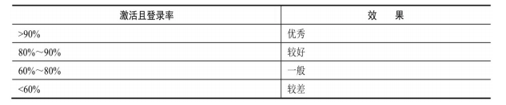

- 活跃数据

  - 新登录、活跃用户数

- 在线数据

  - ACU（Average concurrent users）平均同时在线玩家人数
  - PCU（Peak concurrent users）最高同时在线玩家人数
  - 平均在线时长
  - PCU峰值出现时间点

- 留存数据

  - 次日留存 ~ 7日留存

- 留存率和游戏质量关系

  -  游戏从封测开始，多数公司都会投入固定的内、外部宣传资源作为游戏的初期市场推广，以收集游戏的封测数据，这其中主要就是留存率

  - 无论是端游还是手游，都非常重视这一指标，留存率成为衡量产品质量的重要指标之一，用以判定游戏的基本品质，为后续的市场资源调配提供参考。

  -  游戏封测主要有两种形式，为发放激活码测试和不发放激活码测试，由于发放激活码测试针对的用户群体更偏向核心用户，一般来说，其留存率高于非激活码测试。

    - 限量发放激活码封测的游戏评级留存率标准

       因用户规模对留存率有一定影响，当测试用户过少时，可能不能反映游戏真实的留存率数据，因此为保证封测数据准确性，**封测周期要求7天**及以上，**新登录总人数在5000以上**，才能按相应标准评估游戏级别，如下表所示是某渠道对游戏限量发放激活码测试节点进行评级的留存标准。

      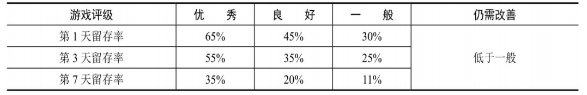

      - 不限量封测，不发放激活码的游戏评级留存率标准

         不限量封测时需要接入渠道，由渠道导入自然用户量，其用户导入量不能高于封测服务器最高承受的用户能力，当用户规模接近服务器上限时停止导入，因此从某种意义上讲也是限量的。同样考虑到用户规模对留存率的影响，为确保数据准确性，要求不限量封测的用户规模至少1万人。如下表所示是某渠道对游戏不限量封测节点进行评级的留存标准。

        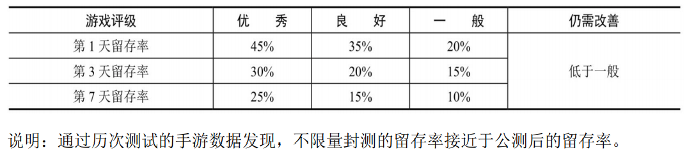

    

#### 1.2 游戏行为数据

- 职业分布数据
  - 举例： 不同种族人数排名： 人族， 精灵族
  - 最喜欢的职业Top3

- 最高角色等级分布
- 流失用户等级分布

#### 1.3 市场投放数据

- CPC CPA

#### 1.4 用户付费指标

- 付费率：也称付费转化率，指每日付费用户占活跃用户的比例，当付费用户的生命周期总价值有一定保证后，提升付费用户比例，就将成为提升公司营收的有效途径。其计算公式为：

  付费率=付费人数/活跃人数

  可以按照计算时间区间推广到周付费率,月付费率等.

  **关注问题:**

  - 反映游戏付费情况
  - 结合道具、付费点反映付费引导好坏
  - 评估消费活动效果
  - 评估渠道质量

- ARPPU：**ARPPU(Average Revenue per Paying User)**即平均每付费用户收入，它反映的是每个付费用户的平均付费额度，其计算公式为：

  ARPPU=付费金额/付费人数

- ARPU： **ARPU(Average Revenue Per User)**即每用户平均收入，ARPU注重的是一个时间段内运营商从每个用户处所得到的收入。其计算公式为：：

  ARPU=付费金额/活跃人数

   目前较好的手游每日ARPU超过5元；一般的手游ARPU在3～5元之间；ARPU低于3元则说明表现较差。

  **关注问题**

  - 反映游戏人均收入水平或者游戏盈利能力
  - 评估活动效果指标之一
  - 评估渠道质量指标之一

- 付费用户比例构成

  - 根据每个付费用户的付费总金额，对整个付费用户进行分类：
    - 大R: 大额付费（业内或称为鲸鱼用户）
    - 中R: 中额付费（业内或称为海豚用户）
    - 小R: 小额付费（业内或称为小鱼用户）
  - **关注问题：**
    - 反映游戏付费深度（也称测验游戏挖坑深度）
    - 通过不同付费用户的转换，优化付费引导
    - 通过研究大额付费用户行为，优化游戏体验

#### 1.5 转化率漏斗

- 游戏运营主要目标有4点：拉新、促活、留存、付费转化。

- 拉新就是通过渠道合作和广告营销等方式，获得新用户；留存是将获得的用户能够尽量持久地留在产品上；促活即“促进用户活跃”，让用户愿意更频繁、更开心的游戏；付费转化则包含促进用户充值和促进用 户消费。

- 游戏行业的拉新成本很高，要投入广告、投入时间，这些都是成本。如果用户还没有产生什么价值就流失了，那一定是亏了。相反，拉过来的用户，留存的时间越长，产生的价值也就越大，也才能弥补其他流失用户所产生的损失。因此，提高用户的留存时间，也是提高公司收入，为公司创造更多价值的重要一环。

- 我们可以在产品设计的每个可控环节当中进行埋点，并监控每个节点的漏斗转换，用于帮助发现产品设计中的问题。通过改善这些环节，可以获得更多的新增用户。

- 案例分析

  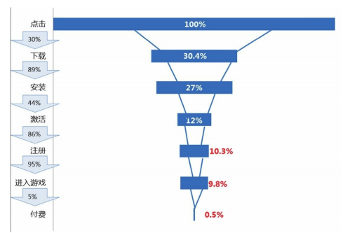

   上图是某一款手游在某个渠道上线第1天的数据：从点击广告进入游戏的转化率只有**9.8%**，付费转化率只有**0.5%**，也就是说**10万**个用户点击广告，最终**进入游戏**的用户只有**9800**人，最终**付费**的用户只有**500**人。通过上图我们可以看出主要有两个问题：

  - 点击广告后下载游戏的转化率低，只有30%，影响因素主要有：
    - 广告素材会影响到玩家下载游戏的意愿；
    - 包大小、联网环境、运营商会影响用户的下载成功率。
  - 下载后激活的转化率低，只有39%，影响因素主要有：
    - 程序bug影响客户端安装成功率；
    - 包大小、联网环境、运营商这些因素同样也会影响用户激活的成功率。

  除了优化产品自身的一些细节外，提高各个环节的转化率，对渠道各项转化率指标的长期监控，以及追踪不同渠道、媒体来源用户的后续质量(包括登录、活跃、留存、付费等)，能够帮助我们快速发现渠道异常、调整广告投放策略等。

### 二、野蛮时代游戏数据分析实战

#### 2.1 分析任务说明

- 本节针对野蛮时代游戏的用户及付费信息进行分析,部分数据如下:

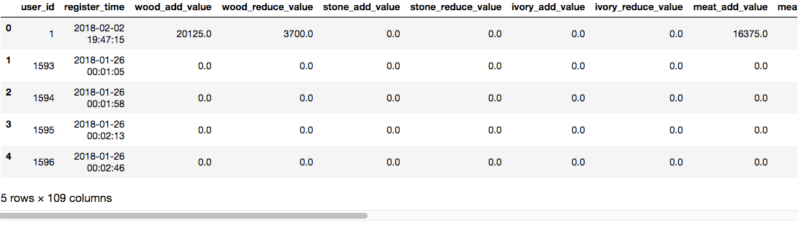

数据包含近229万条记录，109个字段，以下取较重要的字段进行说明。

```text
字段说明：  
        user_id：用户编码，用户唯一标识                  
        bd_stronghold_level：要塞等级，相当于游戏账号等级                  
        wood_reduce_value：木头消耗数量                    
        stone_reduce_value：石头消耗数量                    
        ivory_reduce_value：象牙消耗数量                    
        meat_reduce_value：肉消耗数量                    
        magic_reduce_value：魔法消耗数量                    
        general_acceleration_reduce_value：通用加速消耗数量                    
        building_acceleration_reduce_value：建筑加速消耗数量                    
        reaserch_acceleration_reduce_value：科研加速消耗数量                    
        training_acceleration_reduce_value：训练加速消耗数量                    
        treatment_acceleration_reduce_value：治疗加速消耗数量                   
        pvp_battle_count：玩家对玩家次数                    
        pve_battle_count：玩家对机器次数                    
        avg_online_minutes：日均在线时间                    
        pay_price: 消费金额                    
        pay_count：消费次数
```


我们将通过python的pandas包完成数据清洗和统计分析部分，使用matplotlib包进行数据可视化，以此来解决以下问题：

- 用户注册时间分布情况？
- 用户的付费情况（付费率，ARPU，ARPPU）？
- 各等级用户的付费情况？
- 消费用户的道具使用习惯？
- 消费玩家的游戏玩法是怎么样的？

#### 2.2 数据清洗

- 导入数据：

```python
import numpy as np
import pandas as pd
import pickle
from pylab import matplotlib as mpl
from matplotlib import pyplot as plt
import seaborn as sns
from datetime import datetime
import re
%matplotlib inline
mpl.rcParams['font.sans-serif'] = ['Simhei']
mpl.rcParams['axes.unicode_minus'] = False
df = pd.read_csv('data/tap_fun_train.csv')
#复制一份数据
df1=df
#检查是否有空值

print(df.isnull().any().any())
False
```

- 查找是否有缺失值，得到结果为False,即没有缺失值，说明数据还是很完整的：

```python
#查询数据条数
df1.shape[0]
# 2288007
#以user_id为维度，删除重复数据，并查看用户总数
df1 = df1.drop_duplicates(subset='user_id')
print('用户总数：',len(df1['user_id']))
# 用户总数： 2288007
```

去重后还有2288007条数据

#### 2.3 用户分析

- 我们首先看下用户的注册时间的分布情况

```python
reg_user=df1[['user_id','register_time']]
reg_user.head()
#首先将注册时间转化为天
reg_user.register_time=pd.to_datetime(reg_user.register_time,format="%Y/%m/%d")
reg_user.register_time=reg_user.register_time.apply(lambda x: datetime.strftime(x,"%Y-%m-%d"))
#计算每天注册人数
reg_user = reg_user.groupby(['register_time']).user_id.count()
#可视化
fig = plt.figure(figsize=(14, 10))
plt.plot(reg_user)

plt.xticks(rotation=90)
plt.title('用户注册分布图')
plt.show()
```

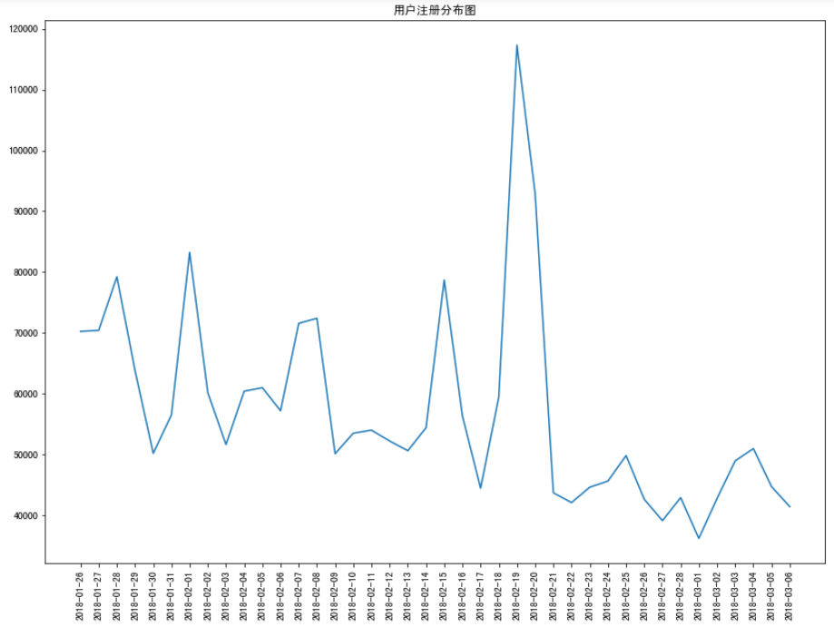

- 可以从图中很直观的看出
  - 从1月26日到3月6日期间，注册人数有不少高峰
  - 2月19日游戏的注册人数迎来一次大的高峰，分析可能是这段期间游戏内部发布了一系列活动，或者游戏对各个推广的渠道增加了曝光
  - 2月19日高峰过后，注册人数较之前没有明显的增长，反而相比之前下降了许多，因此并没有带给游戏更多的热度!

#### 2.4 付费分析（付费率，ARPU，ARPPU）

- 付费率=付费人数/活跃用户
  - 我们将每日游戏时长大于30分钟的玩家定义为活跃用户

```python
#活跃用户
act_user = df1[df1['avg_online_minutes']>=30]
#付费用户
pay_user = df1[df1['pay_price']>0]
#计算付费率
pay_rate = pay_user['user_id'].count() / act_user['user_id'].count()
print('付费率为%.2f' %(pay_rate))
#付费率为0.29
```

- ARPU:平均每用户收入

  ARPU =总付费金额/总活跃用户

```python
#计算ARPU
ARPU = pay_user['pay_price'].sum()/ act_user['user_id'].count()
print('ARPU为%.2f' %(ARPU))
#ARPU为8.55
```

- ARPPU:平均每付费用户收入

  ARPPU =总付费金额/总付费用户

```python
#计算ARPPU
ARPPU = pay_user['pay_price'].sum()/ pay_user['user_id'].count()
print('ARPPU为%.2f' %(ARPPU))
#ARPPU为29.52
```

- 目前较好的手游ARPU超过5元；一般的手游ARPU在3~5元之间；ARPU低于3元则说明表现较差。可见该手游的盈利能力较好。

#### 2.5 各等级用户的付费情况

```python
#根据不同要塞等级分类
df1_user= df1.groupby(['bd_stronghold_level']).user_id.count()
df1_user=df1[['user_id', 'bd_stronghold_level', 'pay_count', 'pay_price']]
#通过数据透视表汇总各等级人数分布，总付费次数， 总付费金额
table=pd.pivot_table(df1_user,index=['bd_stronghold_level'],values=['user_id','pay_count','pay_price'],aggfunc={'user_id':'count','pay_count':'sum','pay_price':'sum'})

user_pay = pd.DataFrame(table.to_records())

#计算各等级付费人数
user_count=df1_user[df1_user['pay_price']>0].groupby('bd_stronghold_level').user_id.count()
user_pay['user_count']=user_count
user_pay.head()
#计算等级付费转化率，等级人均付费次数，等级人均付费总额
user_pay['pay_rate']=user_pay.user_count/user_pay.user_id
user_pay['user_avgcount']=user_pay.pay_count/user_pay.user_count
user_pay['user_avgmoney']=user_pay.pay_price/user_pay.user_count
#修改列名
user_pay.columns = ['要塞等级', '付费次数', '付费总额', '达到人数', '付费人数', '付费转化率', '人均付费次数', '人均付费总额']
#调整列名
user_pay = user_pay[['要塞等级', '达到人数', '付费人数', '付费次数', '付费总额', '付费转化率', '人均付费次数', '人均付费总额']]
user_pay
```

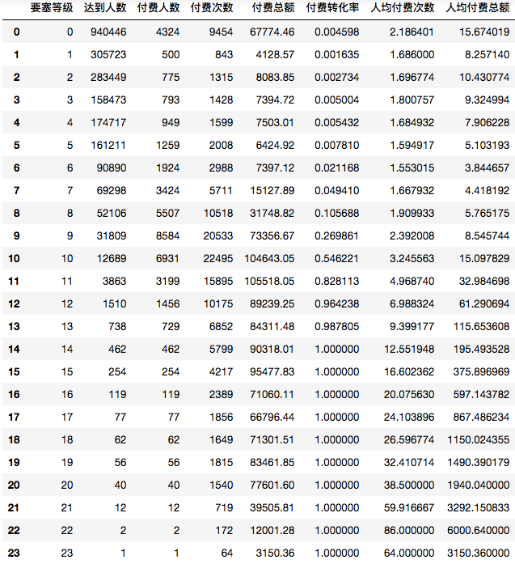

- 要塞等级和付费转化率的关系

```python
x=user_pay['要塞等级']
y=user_pay['付费转化率']
fig = plt.figure(figsize=(12,8))
plt.plot(x,y)
plt.xticks(x,range(0,len(x),1))
plt.grid(True)
plt.title('要塞等级和付费转化率的关系')
plt.show()
```

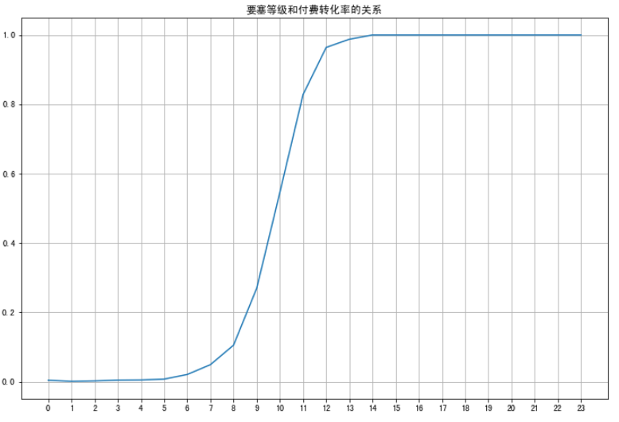

- 要塞等级和人均付费总额的关系

```python
x=user_pay['要塞等级']
y=user_pay['人均付费总额']
fig = plt.figure(figsize=(12,8))
plt.plot(x,y)
plt.xticks(x,range(0,len(x),1))
plt.grid(True)
plt.title('要塞等级和人均付费总额的关系')
plt.show()
```

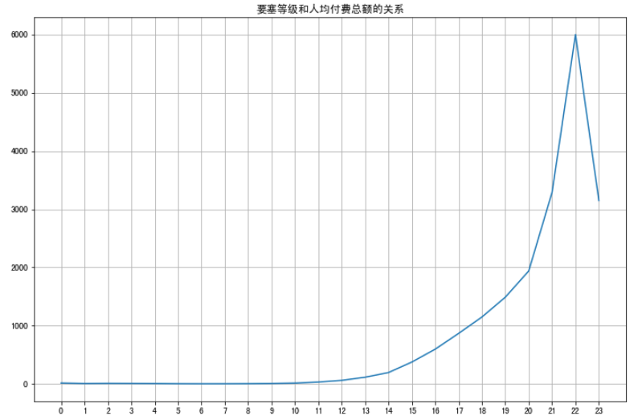

- 要塞等级和人均付费次数的关系

```python
x=user_pay['要塞等级']
y=user_pay['人均付费次数']
fig = plt.figure(figsize=(12,8))
plt.plot(x,y)
plt.xticks(x,range(0,len(x),1))
plt.grid(True)
plt.title('要塞等级和人均付费次数的关系')
plt.show()
```

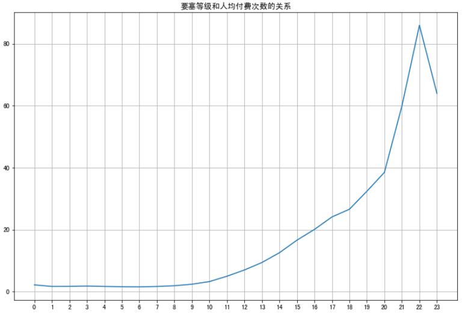

- 达到各个要塞等级的人数直方图

```python
x=user_pay['要塞等级']
y=user_pay['达到人数']
fig = plt.figure(figsize=(12,8))
plt.bar(x,y)
plt.xticks(x,range(0,len(x),1))
plt.title('要塞等级达到人数')
plt.show()
```

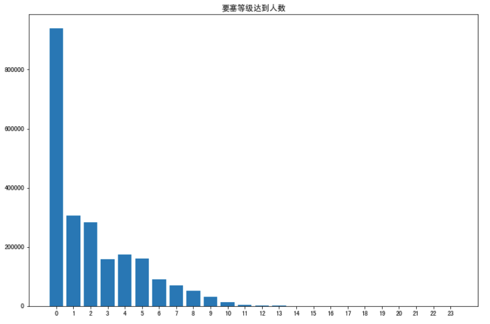

- 通过观察付费转化率和要塞等级的关系可以发现
  - 9级时付费转化率为26%
  - 10级时的付费转化率已经接近60%
  - 在14级之后的玩家， 付费转化率达100%。观察人均消费总额和人均消费次数可以发现，10级之后，两项指标也同时呈现显著的增长。

- 观察要塞等级达到人数的直方图可以发现，大量的用户集中在10以下，因此游戏的运营方向应该是如何是用户平滑的达到10级
- 可以通过进一步分析或者通过游戏内发放问卷调查的方式了解用户在10级以下时遇到的困难和问题，进一步优化游戏内容，增强引导用户提升要塞等级。

- 可以通过人均消费总额看出，在20级以后人均消费额的曲线出现了陡增，该阶段的用户应该已经了解了游戏的核心玩法，因此可以对该部分用户加强消费引导， 提升游戏的收入。

#### 2.6 消费玩家的道具使用情况

- 该游戏充值主要获得以下几种物品：资源类（木头、石头、象牙、肉、魔法等），加速券类（通用加速、建筑加速、科研加速、训练加速、治疗加速等）。

- 根据玩家充值金额大小， 将10级以上玩家分为高氪玩家（充值金额高于500元）和低氪玩家（充值金额低于500元大于0元），分别统计两种玩家的各类资源使用情况，最后绘图

```python
#对10级以上的玩家进行分类
sup_user=df1[(df1['pay_price']>=500)&(df1['bd_stronghold_level']>=10)]
nor_user=df1[(df1['pay_price']<500)&(df1['pay_price']>0)&(df1['bd_stronghold_level']>=10)]
```

**消费玩家资源类道具使用情况**

```python
#制作资源相关数据集
wood_avg = [sup_user['wood_reduce_value'].mean(), nor_user['wood_reduce_value'].mean()]
stone_avg = [sup_user['stone_reduce_value'].mean(), nor_user['stone_reduce_value'].mean()]
ivory_avg = [sup_user['ivory_reduce_value'].mean(), nor_user['ivory_reduce_value'].mean()]
meat_avg = [sup_user['meat_reduce_value'].mean(), nor_user['meat_reduce_value'].mean()]
magic_avg = [sup_user['magic_reduce_value'].mean(), nor_user['magic_reduce_value'].mean()]
data = {'高氪玩家':[wood_avg[0], stone_avg[0], ivory_avg[0], meat_avg[0], magic_avg[0]], 
        '低氪玩家':[wood_avg[1], stone_avg[1], ivory_avg[1], meat_avg[1], magic_avg[1]]}
resource = pd.DataFrame(data, index=['木头', '石头', '象牙', '肉', '魔法'])
#可视化
resource.plot(kind = 'bar', stacked=True, figsize=(14, 10),legend=True)

plt.title('玩家资源使用量')
plt.show()
```


- 高消费玩家和低消费对木头、石头、肉的消耗都较大，魔法的消耗都较小
- 而在象牙的消耗上，高消费玩家和低消费玩家的消耗差距较大。因为象牙资源在游戏中的用途相对高端一些，而木头和肉类是游戏发展过程中必需的资源。
- 高氪玩家在资源上的平均使用量要远远高于低氪玩家，象牙资源最能够体现出一个玩家在游戏上的消费水平。

**消费玩家加速券使用情况**

```python
#制作加速券相关数据集
genral_avg = [sup_user['general_acceleration_reduce_value'].mean(), nor_user['general_acceleration_reduce_value'].mean()]
building_avg = [sup_user['building_acceleration_reduce_value'].mean(), nor_user['building_acceleration_reduce_value'].mean()]
reaserch_avg = [sup_user['reaserch_acceleration_reduce_value'].mean(), nor_user['reaserch_acceleration_reduce_value'].mean()]
training_avg = [sup_user['training_acceleration_reduce_value'].mean(), nor_user['training_acceleration_reduce_value'].mean()]
treament_avg = [sup_user['treatment_acceleration_reduce_value'].mean(), nor_user['treatment_acceleration_reduce_value'].mean()]
data = {'高氪玩家':[genral_avg[0], building_avg[0], reaserch_avg[0], training_avg[0], treament_avg[0]], 
        '低氪玩家':[genral_avg[1], building_avg[1], reaserch_avg[1], training_avg[1], treament_avg[1]]}
acceleration = pd.DataFrame(data, index = ['通用', '建筑', '科研', '训练', '治疗'])
#可视化

acceleration.plot(kind = 'bar', stacked=True, figsize=(14, 10))
plt.title('玩家加速券使用量')
plt.show()
```

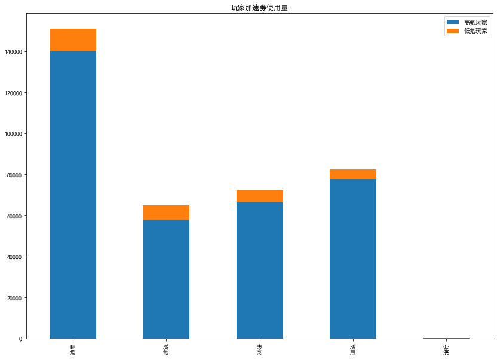

 两类玩家对对治疗加速券消耗都很小，对通用加速券的消耗差异较大，其他三种加速券消耗差别不大。通过体验游戏了解到加速券的使用，直接影响游戏进程的加快，因此高氪玩家更希望通过加快游戏进程增加游戏体验。

#### 2.7 消费玩家的游戏玩法分析

- 消费玩家在线时长情况

```python
avg_online_minutes = [sup_user['avg_online_minutes'].mean(), nor_user['avg_online_minutes'].mean()]
data = {'高氪玩家':[avg_online_minutes[0]], 
        '低氪玩家':[avg_online_minutes[1]]}
online_time=pd.DataFrame(data, index = ['平均在线时长'])
online_time.head()
```

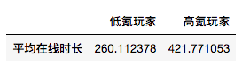


```python
#可视化
online_time.plot(kind = 'bar', figsize=(10,8))
plt.title('玩家在线情况')
plt.show()
```

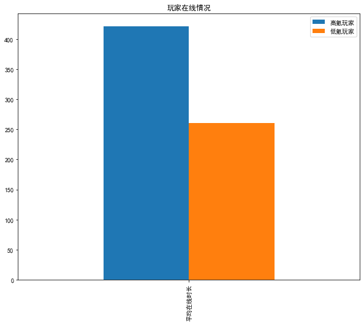

- 消费玩家pvp情况
  - PvP（player versus player），指玩家对战玩家，即玩家互相利用游戏资源攻击而形成的互动竞技。
  - PvE（玩家对战环境，player versus environment）。

```python
pvp_battle_avg = [sup_user['pvp_battle_count'].mean(), nor_user['pvp_battle_count'].mean()]
pvp_lanch_avg = [sup_user['pvp_lanch_count'].mean(), nor_user['pvp_lanch_count'].mean()]
pvp_win_avg = [sup_user['pvp_win_count'].mean(), nor_user['pvp_win_count'].mean()]
data = {'高氪玩家':[pvp_battle_avg[0], pvp_lanch_avg[0], pvp_win_avg[0]], 
        '低氪玩家':[pvp_battle_avg[1], pvp_lanch_avg[1], pvp_win_avg[1]]}
PVP = pd.DataFrame(data, index = ['PVP次数', '主动发起PVP次数', 'PVP胜利次数'])
PVP
```

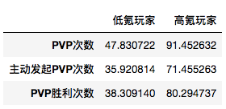

```python
#可视化
PVP.plot(kind = 'bar',  figsize=(10,8))
plt.title('玩家pvp情况')
plt.show()
```

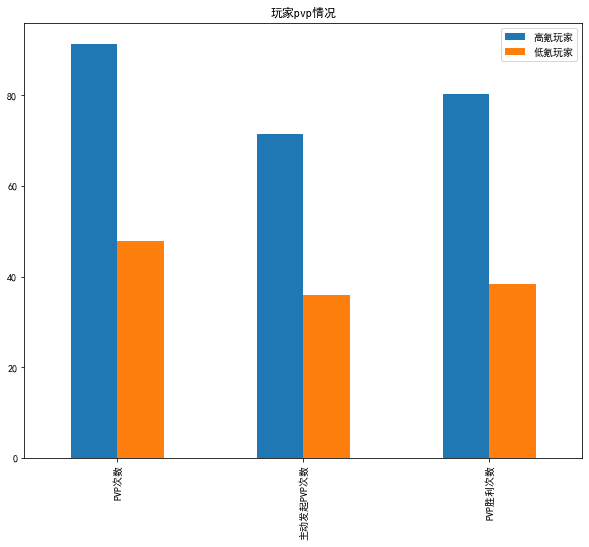

#### 2.8 消费玩家pve情况

```python
pve_battle_avg = [sup_user['pve_battle_count'].mean(), nor_user['pve_battle_count'].mean()]
pve_lanch_avg = [sup_user['pve_lanch_count'].mean(), nor_user['pve_lanch_count'].mean()]
pve_win_avg = [sup_user['pve_win_count'].mean(), nor_user['pve_win_count'].mean()]
data = {'高氪玩家':[pve_battle_avg[0], pve_lanch_avg[0], pve_win_avg[0]], 
        '低氪玩家':[pve_battle_avg[1], pve_lanch_avg[1], pve_win_avg[1]]}
PVE = pd.DataFrame(data, index = ['PVE次数', '主动发起PVE次数', 'PVE胜利次数'])

PVE
```

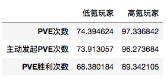

```python
#可视化

PVE.plot(kind = 'bar', figsize=(10,8))
plt.title('玩家pve情况')
plt.show()
```

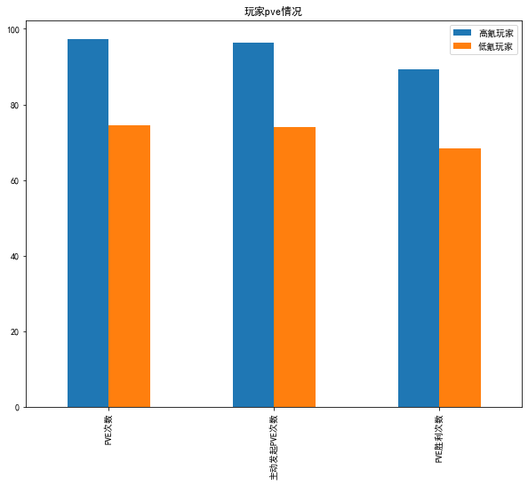

 可以看到高氪玩家的平均在线时长时低氪玩家的1.6左右，而高氪玩家的PVP的三项指标数值都在低氪玩家三项指标数值的2倍左右；pve的数值两者相差不大，但高氪玩家还时高于低氪玩家。

 总的来说高消费玩家更愿意投入时间在这款游戏上，它们热衷于pvp玩法，在pve的局数上也多于低消费玩家，因此游戏可以投入较多的精力在pvp的玩法改进上，吸引玩家更多的参与到pvp上，刺激玩家的消费，增加游戏的收入。

#### 2.9 分析结论

1.该游戏具有较大的用户基数，且新用户注册受游戏活动、游戏推广力度等因素影响较大。

2.该游戏的ARPU为8.55，说明该游戏的盈利能力较高。

3.对于游戏付费情况，两极分化情况十分严重，绝大多数玩家处于10级以内，且付费情况较差，而少数玩家在10级以上，且付费能力强(13级的用户付费转化率接近100%).因此对于如何让大多数玩家平滑过渡到10级，非常的重要。

4.消费习惯上，高消费玩家对象牙和通用加速券的需求远多于一般玩家。

5.在玩家行为上，高消费玩家投入游戏时间更多，它们更热衷于pvp玩法。