## 竞品异常监控

### 学习目标

- 知道什么是竞品分析，及其作用
- 掌握使用RFM模型进行竞品分析的方法
- 独立完成竞品分析案例


### 一、竞品异常监控介绍

#### 1、什么是竞品监控

- 竞品：就是跟我们的产品属于相同类别，能替代我们的产品，并且对我们的业务产生影响的产品。
- 竞品分析就是对竞品的情况时刻关注，及时发现竞品的异动，并分析对我们产品带来的影响从而辅助下一步的运营决策
- 长期以来，竞品分析主要是运营、市场部门工作的一部分或是由第三方服务商来完成，
- 运营人员在自身运营的过程中积累竞品信息，长久下去形成运营和产品人员脑中的“竞品库”。但是，长期来看，随着市场的变化、竞品的更迭、电商平台为了自身利益对数据开放权限下降，都为运营监控带来了严重的负担
- 虽然市面上有大量的数据化竞品分析服务商，但是它们的作用更多体现在信息的聚合而很少做到辅助决策。
- 在电商领域，产品是按照不同的种类，划分在不同的类目。由于在某平台/市场，需求相对固定，所以对于卖家尤其是中小卖家，从竞品身上去取长补短是十分必要的。

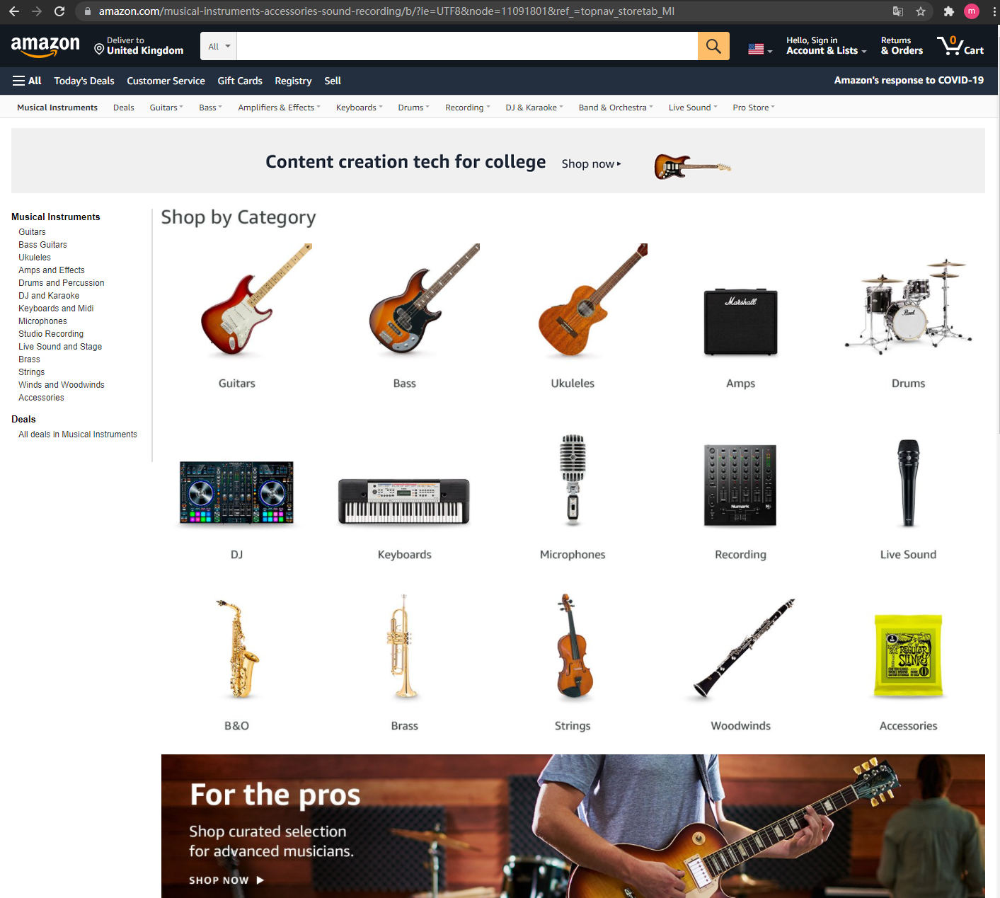

- 任何行业都需要竞品分析，但是在跨境电商领域略有区别，有如下几个特点
  - 互联网产品的长尾分布决定了头部产品才能有利润
  - 对于非热门品类，细分市场的头部变化可以很慢，也可以很快
  - 不同国家、地区同一类产品生命周期是不同的，即某国/某平台的头部产品在另一平台/国家，就不是主要竞品。

#### 2、为什么要持续竞品监控

- 选品阶段  通过竞品表现可以取长补短
- 运营阶段  对自己产品在整个平台所处的位置有清晰认识，便于及时调整运营策略
- 产品升级  发现机会


- 竞品监控涉及到的部门
  - 运营部门：提出需求，包括定义竞品，以及竞品的监控维度
  - 数据分析：具体实施，在竞品分析决策过程中，提供相关数据，以及分析结论，提供给运营部门做决策

### 二、 项目介绍

#### 1、 项目需求

- 国内某跨境电商公司打算运营尤克里里产品，一个类目不大且没有形成完全竞争的产品类别


- 为了能够有好的销量，运营人员决定对头部产品进行追踪、调研

  - 运营对竞品的识别，主要是从热销榜来，热销榜每隔两小时就会变动一次，榜单排名变化快
  - 但是由于该类目相对小众，头部变化快，类目运营需要快速的迭代和行动；而且该产品在多个站点运营，运营人员每日重复性工作；
    收集的有用信息无法有效的保存，竞品历史情况全靠记忆

  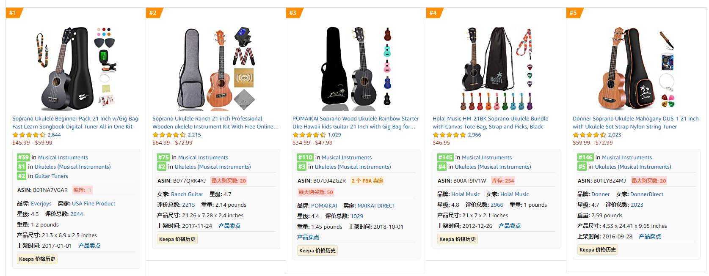

- 运营部门的需求：
  - 能够帮助检测有效竞品
  - 能够分站点、分产品及时反馈
  - 能够帮助运营提供识别出有关信息

- 需求拆解：
  - 选择竞品：在亚马逊平台上，主要考虑的是同类目下直接竞品，针对上榜的top100，都需要关注，但是，运营需要的是“最值得关注的”一些
  - 竞品异常监控，如何定义异常：主要是通过竞品的排名在一定的时间内变化的情况，特别是top10
  - 实时监控：按天将异常产品提供给运营，并将数据存档，方便历史回溯

#### 2、方法论介绍

- RFM模型
  - 我们之前使用RFM模型对用户进行分群
  - RFM是衡量客户价值的重要模型之一

- RFM模型回顾

  - R-Recency   最近一次消费   ： 产品记忆强度，复购周期
  - F-Frequency   消费频率：忠诚度，产品熟悉程度，购买习惯
  - M-Monetary    消费金额： 消费能力，产品、品牌认可度

  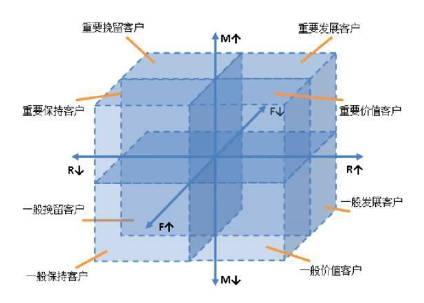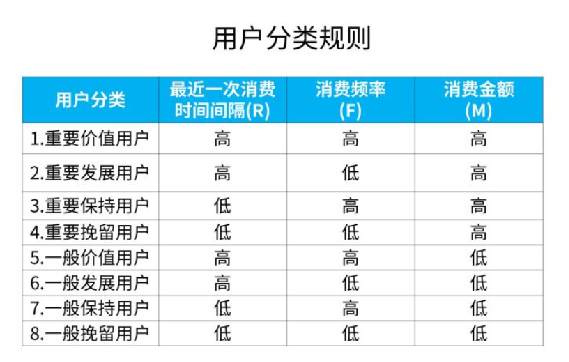


- 如何在竞品检测中使用RFM模型
  - R-Recency   最近一次进入top榜单
  - F-Frequency   进入top榜单次数
  - M-top10    高排名榜单次数/近3天高排名榜单次数

- 针对距离观察日三个月内，将竞品状态分为以下几种类型：重点关注、重点调研、重点保持、一般调研、一般关注、暂不关注；将竞品分为老品，新品两类

| 竞品分类         | 最近一次进入top榜单 | 进入top榜单次数 | **高排名榜单次数** | 近3天高排名榜单次数 | **策略建议**                     |
| ---------------- | ------------------- | --------------- | ------------------ | ------------------- | -------------------------------- |
| **持续关注竞品** | **高**              | **高**          | **高**             | **高**              | **心中有数，最重要竞品**         |
| **重点调研老品** | **高**              | **高**          | **低**             | **高**              | **老品要发力，需运营关注**       |
| **重点调研新品** | **高**              | **低**          | **高**             | **高**              | **需要运营重点研究**             |
| **重点保持老品** | **高**              | **高**          | **高**             | **低**              | **近期排名下降**                 |
| 一般调研新品     | 高/低               | 低              | 低                 | 高                  | 新品期产品，数据监控             |
| 一般调研老品     | 低                  | 高              | 高                 | 低                  | 过了新品期后运营乏力，可数据监控 |
| 一般关注老品     | 高/低               | 高              | 低                 | 低                  | 竞争力相对较弱产品               |
| 暂不关注产品     | 其它情况            |                 |                    |                     |                                  |

- 具体实际业务中，如何定义打分的范围，要根据具体的业务来灵活定，没有统一的标准。

| 按照运营需求打分 | 最近一次上榜-R | 上榜次数-F | 进入top10榜单次数-M1 | 近3天进入top10次数-M2 |
| ---------------- | -------------- | ---------- | -------------------- | --------------------- |
| 1                | 80天以上       | 小于20次   | 小于5次              | 1次                   |
| 2                | 30-80天        | 20-40次    | 5-20次               | 2次                   |
| 3                | 15-30天        | 40-60次    | 20-60次              | 3次                   |
| 4                | 3-15天         | 60-80次    | 60-80次              |                       |
| 5                | 3天以内        | 85次以上   | 85次以上             |                       |

- 具体实施步骤
  - ① 计算每个产品的R、F、M值，其中，时间跨度，M的衡量根据实际情况，本例中，将M拆分成近3个月和近3天，考虑下为什么？
  - ② 给R、F、M值打分  是按照指标的价值，而不是数值大小，具体的分数值及划分区间，根据实际情况来
  - ③ 计算价值的平均值以及总分数：Score=F × w1+R × w2+M1× w3+M2 × w4
  - ④ 竞品分类和异常竞品提取
  - ⑤ 结果发送运营

### 三、 代码实现

#### 1、导包加载数据

```python
import pandas as pd
import datetime as dt
import warnings
warnings.filterwarnings("ignore")

import os
import numpy as np
import matplotlib.pyplot as plt
import seaborn as sns
%matplotlib inline
plt.rcParams['font.serif'] = ['SimHei']
plt.rcParams['font.sans-serif'] = ['SimHei']
plt.rcParams['axes.unicode_minus']=False
sns.set_style('ticks', {'font.sans-serif':['simhei','Droid Sans Fallback']})
```

- 加载数据

```python
df_competitive=pd.read_csv('data/Competitive_product.csv')
del df_competitive['Unnamed: 0']
df_competitive.head()
```

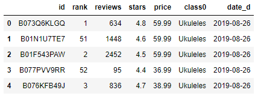

- 查看产品数量

```python
len(df_competitive.id.drop_duplicates())
```

827

- 查看不同日期数量

```python
df_competitive.date_d.drop_duplicates()
```

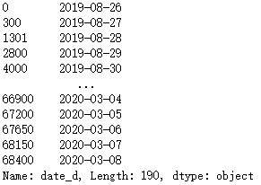

- 查看不同产品在不同日期中的数据条目数

```python
df_competitive.groupby(['id','date_d'])['id'].value_counts()
```

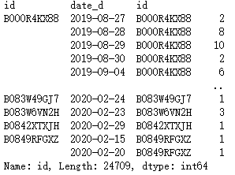

- 我们的数据会每天采集多次，所以每天每件商品上榜次数不唯一，这里取排名最高的一次

```python
df_competitive_rfm=df_competitive[['id','rank','date_d']].groupby(['id','date_d'],as_index=False).agg({'rank':'min'})

df_competitive_rfm.columns=['id','date_d','rank_min']
df_competitive_rfm['date_d'] = pd.to_datetime(df_competitive_rfm.date_d)
df_competitive_rfm.head()
```

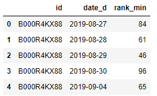

#### 2、数据清洗

- 判断是否进入Top10，进入Top10作为价值高低的判定依据

```python
df_competitive_rfm['isTop10']=df_competitive_rfm['rank_min'].apply(lambda x:1 if x<=10 else 0)
df_competitive_rfm['isTop10'].value_counts()
```

```
0    22568
1     2141
Name: isTop10, dtype: int64
```

```python
df_competitive_rfm[df_competitive_rfm['rank_min']>10]
```

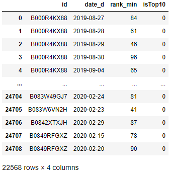

- 筛选最近90天的数据来进行RFM打分，数据集中最后的日期是2020年3月8日，我们以这一天为基准

```python
#计算时间差
df_competitive_rfm['Datediff']=(pd.to_datetime('2020-03-08')-df_competitive_rfm['date_d']).dt.days
# 近三个月
df_competitive_rfm_90=df_competitive_rfm[df_competitive_rfm.Datediff<=90]
df_competitive_rfm_90
```

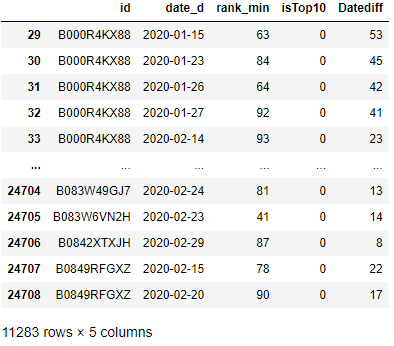

#### 3、计算RFM

- RFM指标计算方法
  - R-Recency 最后一次出现在热销榜距离当前时间的天数
  - F-Frequecy 上榜频次
  - M1-上榜top10的次数
  - M2-近3天进入top10位次
- Recency 最后一次top排名距离现在是什么时候

```python
r_origin = df_competitive_rfm_90.groupby(by=['id'])['Datediff']
r_origin = r_origin.agg([('R-最近一次上榜','min')])
r_origin
```

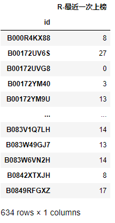

- 查看r这个维度的原始数据分布情况

```python
r_origin.describe()
```

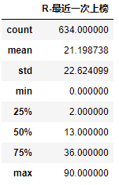

- 计算F的原始数据，Frequency 有多少次出现在热销榜上

```python
f_origin = df_competitive_rfm_90.groupby(by=['id'])['rank_min']
f_origin = f_origin.agg([('F-上热榜次数','count')])
f_origin.describe()
```

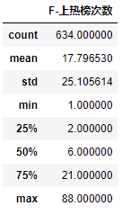

- M1 上TOP10榜单次数，进入top10 打1，没有进入标记为0

```python
m1_origin = df_competitive_rfm_90.groupby(by=['id'])['isTop10']
m1_origin = m1_origin.agg([('M1-进入top10次数',sum)])
m1_origin.sort_values('M1-进入top10次数')
```

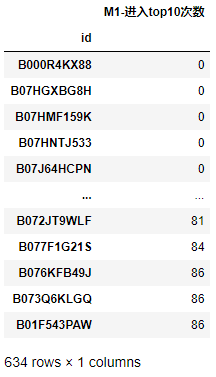

- M2 近三天上top10次数，体现近期

```python
temp=df_competitive_rfm_90[df_rfm_90.Datediff<=2]
m2_origin = temp.groupby(by=['id'])['isTop10']
m2_origin = m2_origin.agg([('M2-近3天进入top10次数',sum)])
m2_origin.sort_values('M2-近3天进入top10次数')
```

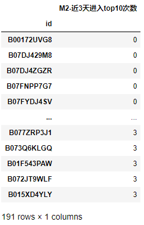

- 将RFM的原始数据合并起来

```python
rfm = r_origin.join(f_origin).join(m1_origin).join(m2_origin)
rfm=rfm_origin.fillna(0)
rfm.head()
```

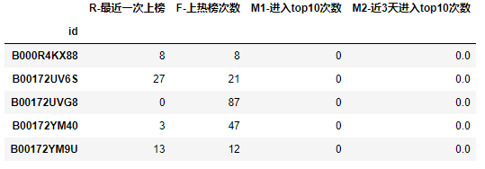

- 绘制小提琴图查看分布情况

```python
plt.figure(figsize=(10,10))
plt.subplot(221)
sns.violinplot(rfm['R-最近一次上榜'])

plt.subplot(222)
sns.violinplot(rfm['F-上热榜次数'])

plt.subplot(223)
sns.violinplot(rfm['M2-近3天进入top10次数'])

plt.subplot(224)
sns.violinplot(rfm['M1-进入top10次数'])


plt.show()
```

#### 4、 RFM打分

| 按照运营需求打分 | 最近一次上榜-R | 上榜次数-F | 进入top10榜单次数-M1 | 近3天进入top10次数-M2 |
| ---------------- | -------------- | ---------- | -------------------- | --------------------- |
| 1                | 80天以上       | 小于20次   | 小于5次              | 1次                   |
| 2                | 30-80天        | 20-40次    | 5-20次               | 2次                   |
| 3                | 15-30天        | 40-60次    | 20-60次              | 3次                   |
| 4                | 3-15天         | 60-80次    | 60-80次              |                       |
| 5                | 3天以内        | 85次以上   | 80次以上             |                       |

- 通过pd.cut方法，将用户分层并打上标签，上面小提琴图可以看到是偏态分布，也就是我们常说的长尾分布，所以取均值/分位数来分层无法分出5份，这时候我们通常是与运营协商制定规则

```python
# R
bins = [0,3,15,30,85,1000]
labels =  np.arange(5,0,-1)
rfm['R'] = pd.cut(rfm['R-最近一次上榜'], bins=bins, labels=labels, include_lowest=True).astype(float)

# F
bins = [0,20,40,60,80,1000]
labels =  np.arange(1,6)
rfm['F'] = pd.cut(rfm['F-上热榜次数'], bins=bins, labels=labels, include_lowest=True).astype(float)

# M1
bins = [0,5,20,60,80,1000]
labels =  np.arange(1,6)
rfm['M1'] = pd.cut(rfm['M1-进入top10次数'], bins=bins, labels=labels, include_lowest=True).astype(float)

# M2
bins = [0,1,2,3,100]
labels =  np.arange(0,4)
rfm['M2'] = pd.cut(rfm['M2-近3天进入top10次数'], bins=bins, labels=labels, include_lowest=True).astype(float)

rfm.head()
```

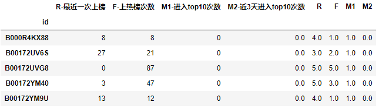

- 查看分布情况

```python
rfm.describe()
```

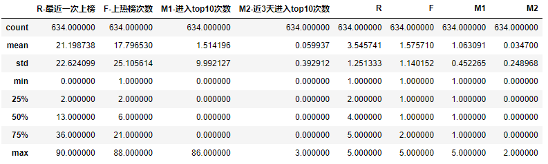

- 然后我们对不同指标下，高于/低于平均值的，进一步二分

```python
rfm['R_value']=rfm['R'].apply(lambda x:'高' if x> rfm['R'].mean() else '低')
rfm['F_value']=rfm['F'].apply(lambda x:'高' if x> rfm['F'].mean() else '低')
rfm['M1_value']=rfm['M1'].apply(lambda x:'高' if x> rfm['M1'].mean() else '低')
rfm['M2_value']=rfm['M2'].apply(lambda x:'高' if x> rfm['M2'].mean() else '低')
rfm['rfm_value']=rfm['R_value']+rfm['F_value']+rfm['M1_value']+rfm['M2_value']

rfm
```

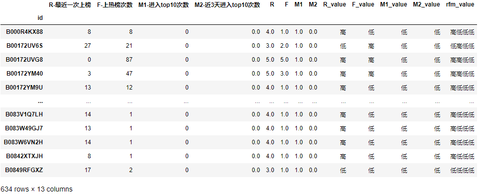

- 将不同的类别，打上不同的标签，不同的标签，就是不同的产品类型，也就是不同的对待策略

```python
# 分层规则
rfm2cat={
    '高高高高':'持续关注竞品',
    '高高低高':'重点调研老品',
    '高低高高':'重点调研新品',
    '高高高低':'重点保持老品',
    '低低低高':'一般调研新品',
    '高低低高':'一般调研新品',
    '低高高低':'一半调研老品',
    '高高低低':'一般关注老品',
    '低高低低':'一般关注老品',
}
```

```python
rfm['Label_of_Product']=rfm['rfm_value'].map(rfm2cat)
rfm
```

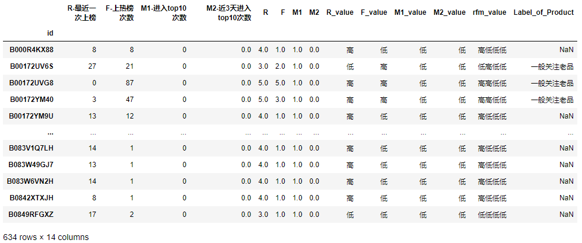

- 按照标签分类，查看每类商品的数量

```python
rfm['Label_of_Product']=rfm['Label_of_Product'].fillna('暂不关注产品')
rfm['Label_of_Product'].value_counts()
```

```
暂不关注产品    469
一般关注老品    149
持续关注竞品     11
重点保持老品      3
一般调研新品      1
重点调研老品      1
Name: Label_of_Product, dtype: int64
```

- 加权计算RFM得分，并查看分数分布

```python
rfm['Total_score'] = rfm['R']*0.2 + rfm['F']*0.1 + rfm['M1']*0.2+rfm['M2']*0.5
rfm['update_day']='2020-03-08'
#查看分数分布
plt.figure(figsize=(8,5))
sns.distplot(rfm.Total_score)
```

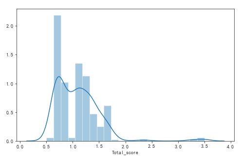

- 绘制散点图

```python
plt.figure(figsize=(8,5))
# stripplot-->分类散点图
sns.stripplot(rfm.Label_of_Product,rfm.Total_score)
```

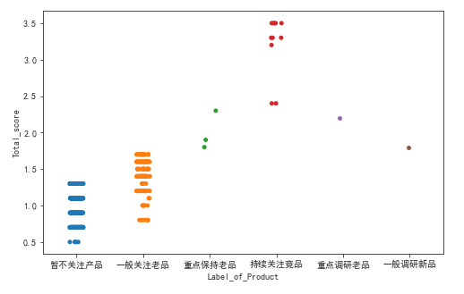

#### 5、KMeans聚类

- 之前我们是利用RFM每一个单项得分的均值，进行RFM高低划分的，现在我们再使用Kmeans聚类进行进一步探索

```python
from sklearn.cluster import KMeans
# 准备训练模型用到的数据
rfm_kmeans=rfm[['R','F','M1','M2']]
kmeans = KMeans(n_clusters=6).fit(rfm_kmeans)
rfm['cluster'] = kmeans.labels_
rfm['cluster']
```

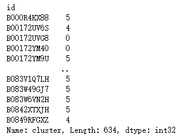

- 查看每组商品数量

```python
rfm['cluster'].value_counts()
```

```python
1    200
5    130
2    118
4     89
0     87
3     10
Name: cluster, dtype: int64
```

- 绘制散点图，查看分数与聚类结果之间的关系

```python
plt.figure(figsize=(8,5))
sns.stripplot(rfm.cluster,rfm.Total_score)
```

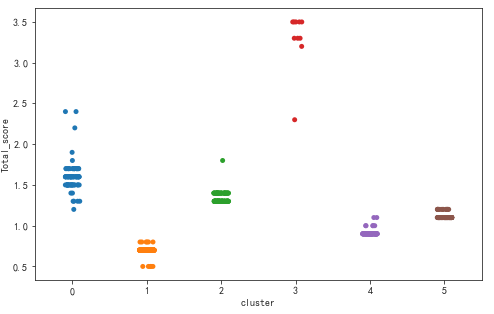

- 对比两种分群结果

```python
rfm[rfm['cluster']==3]['Label_of_Product'].value_counts()
```

```
持续关注竞品    9
重点保持老品    1
Name: Label_of_Product, dtype: int64
```

```python
rfm[rfm['cluster']==0]['Label_of_Product'].value_counts()
```

```
一般关注老品    82
重点保持老品     2
持续关注竞品     2
重点调研老品     1
Name: Label_of_Product, dtype: int64
```

- 查看整体最终结果

```python
rfm.head()
```

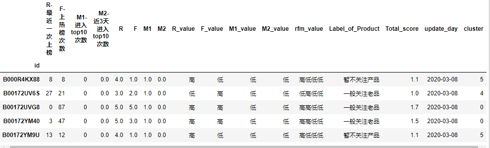

### 四、结论

- 通过上面的分析，我们得出了如下结果，将结果交付给运营人员，可以让运营人员快速识别主要竞品，提高运营人员的工作效率
- 我们可以定期运行脚本，输出结果，及时发现竞品变化

| **id**         | **R_value** | **F_value** | **M1_value** | **M2_value** | **Label_of_Product** |
| -------------- | ----------- | ----------- | ------------ | ------------ | -------------------- |
| B01F543PAW     | 高          | 高          | 高           | 高           | 持续关注竞品         |
| B072JT9WLF     | 高          | 高          | 高           | 高           | 持续关注竞品         |
| B073Q6KLGQ     | 高          | 高          | 高           | 高           | 持续关注竞品         |
| B076KFB49J     | 高          | 高          | 高           | 高           | 持续关注竞品         |
| B077F1G21S     | 高          | 高          | 高           | 高           | 持续关注竞品         |
| B015XD4YLY     | 高          | 高          | 高           | 高           | 持续关注竞品         |
| B01MTZ4JHE     | 高          | 高          | 高           | 高           | 持续关注竞品         |
| B077ZRP3J1     | 高          | 高          | 高           | 高           | 持续关注竞品         |
| B01M1L6OSX     | 高          | 高          | 高           | 高           | 持续关注竞品         |
| B01NA7VGAR     | 高          | 高          | 高           | 高           | 持续关注竞品         |
| B073J6H78D     | 高          | 高          | 高           | 高           | 持续关注竞品         |
| **B001LU1SFO** | **高**      | **高**      | **高**       | **低**       | **重点保持老品**     |
| **B073Q5PC7X** | **高**      | **高**      | **低**       | **高**       | **重点调研老品**     |
| **B077QRK4YJ** | **高**      | **高**      | **高**       | **低**       | **重点保持老品**     |
| **B077DN5Y9K** | **高**      | **高**      | **高**       | **低**       | **重点保持老品**     |
| **B07QNPKD8K** | **高**      | **低**      | **低**       | **高**       | **一般调研新品**     |

### 小结

- 竞品分析/监控
  - 通过持续关注经营同类产品的竞争对手在市场上的表现来发现市场机会和自身问题
  - 数据分析在竞品分析/监控中可以为运营提供有利支撑
- 我们可以通过监控竞品的销量排行,销量,评论数量,价格，评分等关键指标通过RFM方法为竞品分层
- 通过KMeans聚类也可以为竞品分层
