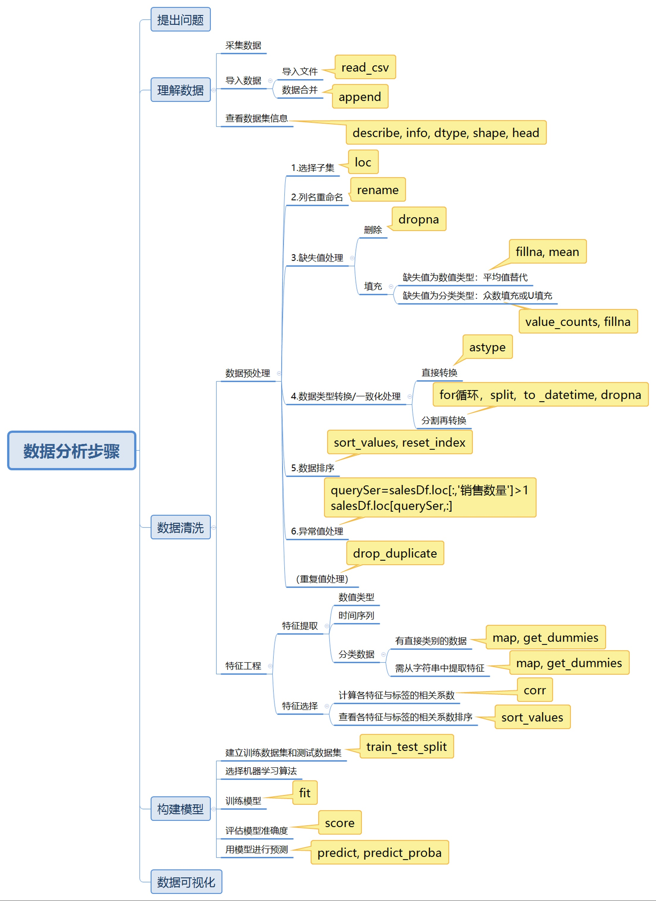
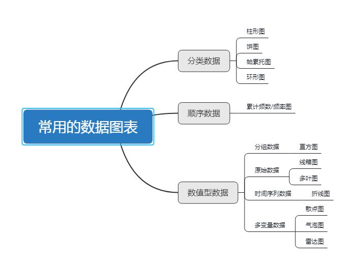
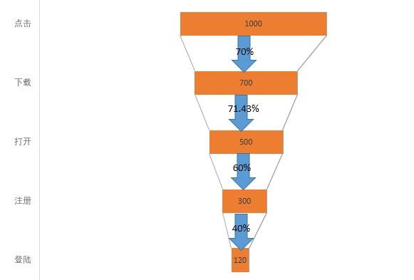

### 数据化运营小结

#### 1.1 数据分析的6个步骤

#### 1.2.数据分析的价值

**1）**通过数据驱动业务，产生落地的解决方案，提高产品运营效率，提升产品健康度，有助于企业减少成本，增加收入。

**2）**而在游戏行业中，主要包括：

- 对高价值用户进行画像，分析其行为和偏好，制定有针对性的营销策略。
- 建立高价值用户的流失预警模型，挽留预流失用户，帮助提升游戏用户活跃度和收入
- 稽核用户质量，提早发现异常用户，避免造成损失。
- 分析用户流失的原因、流失用户行为特征，提出版本修正建议，让用户更好地体验游戏，配合运营活动减少用户流失并提升收入。
- 通过文本挖掘，分析用户反馈与舆情数据，解决产品问题和分析竞品数据。
- 监控各位置的转化效率、价值，进行资源位合理安排和定价。
- 监控广告投放效果，有助于市场人员及时发现问题，优化素材内容和形式，使其投放效果最大化
- 为企业管理层提供企业整体运营情况数据，设立预警指示并监控其是否异动，快速定位指标异动原因。
- 获取并分析同行企业产品的主要指标数据及其与本企业产品的对比。
- 获取行业市场规模，畅销游戏类型、IP和题材等数据。
- 通过游戏测试数据，评估产品质量，帮助产品定位
- 帮助开发人员发现问题，通过崩溃数据、用户不正常行为等因素定位bug及其原因

#### 1.3.好的分析报告应具备的要点

1) 要有一个层次分明、架构清晰的**框架**

2) 要有一个明确的**结论**，分析结论要准确精炼

- 每个分析结论最好能在一行以内描述清楚
- 多个分析结论可以编号描述
- 一篇报告的分析报告结论不宜过多

**结论一定要基于紧密严谨的数据分析推导过程，不要有猜测性的结论**

3) 要考虑到阅读者的专业背景、职业特点

4) 尽量图表化，便于人们直观理解问题和结论

5) 要有逻辑性，通常要遵照“发现和提出问题→分析问题→解决问题”的流程开展分析

6) 一切分析都应基于准确可靠的数据

7) 一定要有解决方案和建议方案，分析的目的不仅是发现问题，更重要的是要能解决问题

8) 不要害怕或回避“不良结论”，分析报告不是一个粉饰太平的工具

#### 1.4.图表制作的要求

- 漏斗图也是常用图表之一，适用于业务流程比较规范、周期 长、环节多的流程分析，通过漏斗各环节业务数据的比较，能够直观地 发现和说明问题所在。在游戏分析中，通常用于转化率比较，它不仅能 展示用户从进入到付费的最终转化率，还可以展示每个步骤的转化率。

### 