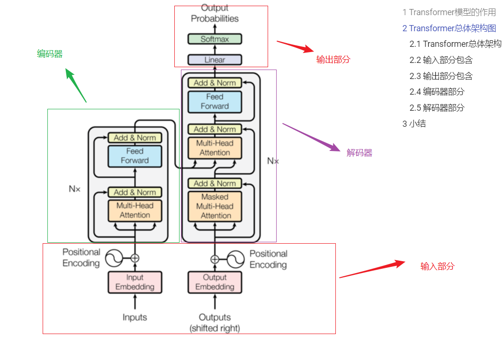
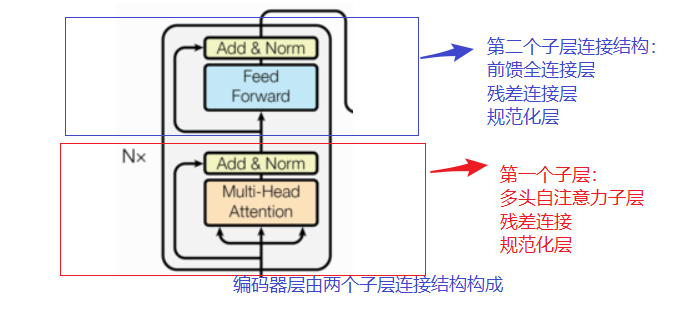
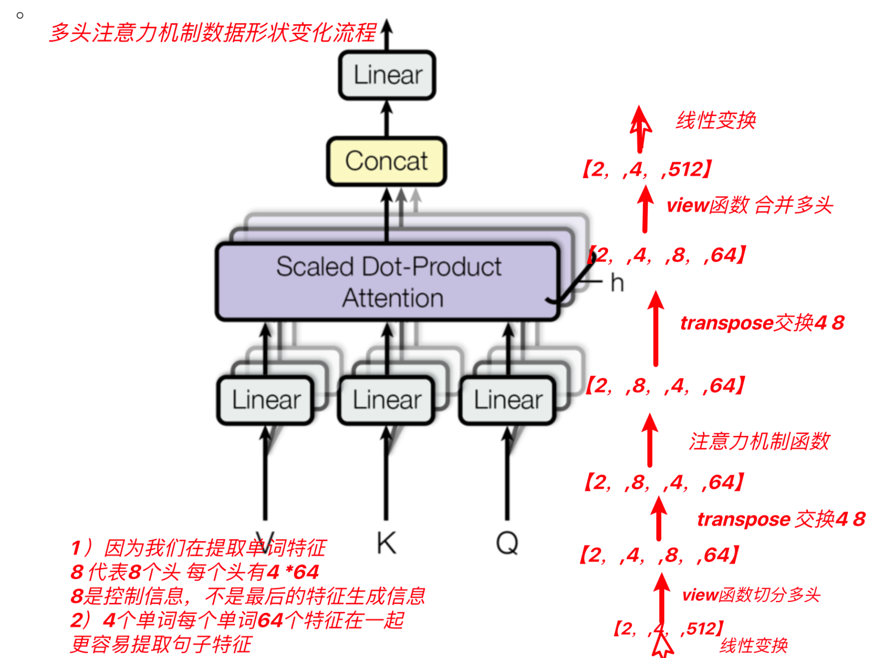
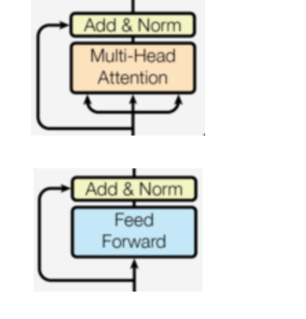

# Transformer模型

### 1 Transformer背景

模型被提出时间：

```properties
2017年提出，2018年google发表了BERT模型，使得Transformer架构流行起来，BERT在许多NLP任务上，取得了Soat的成就。
```

模型优势：

```properties
1、能够实现并行计算，提高模型训练效率
2、更好的特征提取能力
```

### 2 Transformer的模型架构

架构图展示：



#### 2.1 整体架构

主要组成部分

```properties
1、输入部分
2、编码器部分
3、解码器部分
4、输出部分
```

#### 2.2 输入部分

```properties
word Embeddding + Positional Encoding
词嵌入层+位置编码器层
```

#### 2.3 输出部分

```properties
1、Linear层
2、softmax层
```

#### 2.4 编码器部分

结构图：



组成部分：

```properties
1、N个编码器层堆叠而成
2、每个编码器有两个子层连接结构构成
3、第一个子层连接结构：多头自注意力层+规范化层+残差连接层
4、第二个子层连接结构：前馈全连接层+规范化层+残差连接层
```

#### 2.5 解码器部分

结构图：


组成部分：

```properties
1、N个解码器堆叠而成
2、每个解码器有三个子层连接结构构成
3、第一个子层连接结构：多头自注意力层+规范化层+残差连接层
4、第二个子层连接结构：多头注意力层+规范化层+残差连接层
5、第三个子层连接结构：前馈全连接层+规范化层+残差连接层
```

## 一、 输入部分

文本嵌入层作用:word_embedding

```properties
将文本词汇进行张量（向量）表示
```

#### 3.1 文本词嵌入的代码实现

注意：为什么embedding之后要乘以根号下d_model
- 原因1：为了防止position encoding的信息覆盖我们的word embedding，所以进行一个数值增大
- 原因2：符合标准正态分布

代码实现：

```python
# Embeddings类 实现思路分析
# 1 init函数 (self, d_model, vocab)
    # 设置类属性 定义词嵌入层 self.lut层
# 2 forward(x)函数
    # self.lut(x) * math.sqrt(self.d_model)
class Embeddings(nn.Module):
    def __init__(self, d_model, vocab):
        # 参数d_model 每个词汇的特征尺寸 词嵌入维度
        # 参数vocab   词汇表大小
        super(Embeddings, self).__init__()
        self.d_model = d_model
        self.vocab = vocab

        # 定义词嵌入层
        self.lut = nn.Embedding(self.vocab, self.d_model)

    def forward(self, x):
        # 将x传给self.lut并与根号下self.d_model相乘作为结果返回
        # x经过词嵌入后 增大x的值, 词嵌入后的embedding_vector+位置编码信息,值量纲差差不多
        return self.lut(x) * math.sqrt(self.d_model)

```

#### 3.2 位置编码器的代码实现

作用:

```properties
Transformer编码器或解码器中缺乏位置信息，因此加入位置编码器，将词汇的位置可能代表的不同特征信息和word_embedding进行融合，以此来弥补位置信息的缺失。
```

位置编码器实现方式：三角函数来实现的，sin\cos函数

为什么使用三角函数来进行位置编码：

```properties
1、保证同一词汇随着所在位置不同它对应位置嵌入向量会发生变化
2、正弦波和余弦波的值域范围都是1到-1这又很好的控制了嵌入数值的大小, 有助于梯度的快速计算
```

代码实现：

```python
class PositionalEncoding(nn.Module):
    def __init__(self, d_model, dropout, max_len=5000):
        # 参数d_model 词嵌入维度 eg: 512个特征
        # 参数max_len 单词token个数 eg: 60个单词
        super(PositionalEncoding, self).__init__()

        # 定义dropout层
        self.dropout = nn.Dropout(p=dropout)

        # 思路：位置编码矩阵 + 特征矩阵 相当于给特征增加了位置信息
        # 定义位置编码矩阵PE eg pe[60, 512], 位置编码矩阵和特征矩阵形状是一样的
        pe = torch.zeros(max_len, d_model)

        # 定义位置列-矩阵position  数据形状[max_len,1] eg: [0,1,2,3,4...60]^T
        position = torch.arange(0, max_len).unsqueeze(1)
        # print('position--->', position.shape, position)

        # 定义变化矩阵div_term [1,256]
        # torch.arange(start=1, end=512, 2)结果并不包含end。在start和end之间做一个等差数组 [0, 2, 4, 6 ... 510]
        div_term = torch.exp(torch.arange(0, d_model, 2) * -(math.log(10000.0) / d_model))

        # 位置列-矩阵 @ 变化矩阵 做矩阵运算 [60*1]@ [1*256] ==> 60 *256
        # 矩阵相乘也就是行列对应位置相乘再相加，其含义，给每一个列属性（列特征）增加位置编码信息
        my_matmulres = position * div_term
        # print('my_matmulres--->', my_matmulres.shape, my_matmulres)

        # 给位置编码矩阵奇数列，赋值sin曲线特征
        pe[:, 0::2] = torch.sin(my_matmulres)
        # 给位置编码矩阵偶数列，赋值cos曲线特征
        pe[:, 1::2] = torch.cos(my_matmulres)

        # 形状变化 [60,512]-->[1,60,512]
        pe = pe.unsqueeze(0)

        # 把pe位置编码矩阵 注册成模型的持久缓冲区buffer; 模型保存再加载时，可以根模型参数一样，一同被加载
        # 什么是buffer: 对模型效果有帮助的，但是却不是模型结构中超参数或者参数，不参与模型训练
        self.register_buffer('pe', pe)

    def forward(self, x):
        # 注意：输入的x形状2*4*512  pe是1*60*512 形状 如何进行相加
        # 只需按照x的单词个数 给特征增加位置信息
        x = x + Variable( self.pe[:,:x.size()[1]], requires_grad=False)
        return self.dropout(x)

```
## 二、编码部分

### 2.1 编码部分组成

```properties
由N个编码器层组成
1、每个编码器层由两个子层连接结构
2、第一个子层连接结构：多头自注意力机制层+残差连接层+规范化层
3、第二个子层连接结构：前馈全连接层+残差连接层+规范层
```

### 2.2 掩码张量

作用：

```properties
掩码：掩就是遮掩、码就是张量。掩码本身需要一个掩码张量，掩码张量的作用是对另一个张量进行数据信息的掩盖。一般掩码张量是由0和1两种数字组成，至于是0对应位置或是1对应位置进行掩码，可以自己设定
掩码分类：
PADDING MASK: 句子补齐的PAD,去除影响
SETENCES MASK:解码器端，防止未来信息被提前利用
```

实现方式：

```properties
# 返回下三角矩阵 torch.from_numpy(1 - my_mask )
def subsequent_mask(size):
    # 产生上三角矩阵 产生一个方阵
    subsequent_mask = np.triu(m = np.ones((1, size, size)), k=1).astype('uint8')
    # 返回下三角矩阵
    return torch.from_numpy(1 - subsequent_mask)
```

## 三、注意力机制

### 3.1 计算规则:

```properties
自注意力机制，规则：Q乘以K的转置，然后除以根号下D_K，然后再进行Softmax，最后和V进行张量矩阵相乘
```

### 3.2 注意力计算

代码实现

```properties
def attention(query, key, value, mask=None, dropout=None):
    # query, key, value：代表注意力的三个输入张量
    # mask：代表掩码张量
    # dropout：传入的dropout实例化对象

    # 1 求查询张量特征尺寸大小
    d_k = query.size()[-1]

    # 2 求查询张量q的权重分布socres  q@k^T /math.sqrt(d_k)
    # [2,4,512] @ [2,512,4] --->[2,4,4]
    scores =  torch.matmul(query, key.transpose(-2, -1) ) / math.sqrt(d_k)

   # 3 是否对权重分布scores 进行 masked_fill
    if mask is not None:
        # 根据mask矩阵0的位置 对sorces矩阵对应位置进行掩码
        scores = scores.masked_fill(mask == 0, -1e9)

    # 4 求查询张量q的权重分布 softmax
    p_attn = F.softmax(scores, dim=-1)

    # 5 是否对p_attn进行dropout
    if dropout is not None:
        p_attn = dropout(p_attn)

    # 返回 查询张量q的注意力结果表示 bmm-matmul运算, 注意力查询张量q的权重分布p_attn
    # [2,4,4]*[2,4,512] --->[2,4,512]
    return torch.matmul(p_attn, value), p_attn
```

### 3.3 多头注意力机制：

概念：

```properties
将模型分为多个头, 可以形成多个子空间, 让模型去关注不同方面的信息, 最后再将各个方面的信息综合起来得到更好的效果.
```

架构图：



代码实现：

```properties
# 深度copy模型 输入模型对象和copy的个数 存储到模型列表中
def clones(module, N):
    return nn.ModuleList([copy.deepcopy(module) for _ in range(N)])

class MultiHeadedAttention(nn.Module):

    def __init__(self, head, embedding_dim, dropout=0.1):

        super(MultiHeadedAttention, self).__init__()
        # 确认数据特征能否被被整除 eg 特征尺寸256 % 头数8
        assert embedding_dim % head == 0
        # 计算每个头特征尺寸 特征尺寸256 // 头数8 = 64
        self.d_k = embedding_dim // head
        # 多少头数
        self.head = head
        # 四个线性层
        self.linears = clones(nn.Linear(embedding_dim, embedding_dim), 4)
        # 注意力权重分布
        self.attn = None
        # dropout层
        self.dropout = nn.Dropout(p = dropout)

    def forward(self, query, key, value, mask=None):

        # 若使用掩码，则掩码增加一个维度[8,4,4] -->[1,8,4,4]
        if mask is not None:
            mask = mask.unsqueeze(0)

        # 求数据多少行 eg:[2,4,512] 则batch_size=2
        batch_size = query.size()[0]

        # 数据形状变化[2,4,512] ---> [2,4,8,64] ---> [2,8,4,64]
        # 4代表4个单词 8代表8个头 让句子长度4和句子特征64靠在一起 更有利捕捉句子特征
        query, key, value = [model(x).view(batch_size, -1, self.head, self.d_k).transpose(1,2) for model, x in zip(self.linears, (query, key, value) ) ]

        # myoutptlist_data = []
        # for model, x in zip(self.linears, (query, key, value)):
        #     print('x--->', x.shape) # [2,4,512]
        #     myoutput = model(x)
        #     print('myoutput--->',  myoutput.shape)  # [2,4,512]
        #     # [2,4,512] --> [2,4,8,64] --> [2,8,4,64]
        #     tmpmyoutput = myoutput.view(batch_size, -1,  self.head, self.d_k).transpose(1, 2)
        #     myoutptlist_data.append( tmpmyoutput )
        # mylen = len(myoutptlist_data)   # mylen:3
        # query = myoutptlist_data[0]     # [2,8,4,64]
        # key = myoutptlist_data[1]       # [2,8,4,64]
        # value = myoutptlist_data[2]     # [2,8,4,64]

        # 注意力结果表示x形状 [2,8,4,64] 注意力权重attn形状：[2,8,4,4]
        # attention([2,8,4,64],[2,8,4,64],[2,8,4,64],[1,8,4,4]) ==> x[2,8,4,64], self.attn[2,8,4,4]]
        x, self.attn = attention(query, key, value, mask=mask, dropout=self.dropout)

        # 数据形状变化 [2,8,4,64] ---> [2,4,8,64] ---> [2,4,512]
        x = x.transpose(1,2).contiguous().view(batch_size, -1, self.head*self.d_k)

        # 返回最后变化后的结果 [2,4,512]---> [2,4,512]
        return self.linears[-1](x)
```

------

## 四、前馈全连接层

概念：

```properties
两个全连接层
```

作用：

```properties
增强模型的拟合能力
```

代码实现：

```properties
class PositionwiseFeedForward(nn.Module):
    def __init__(self,  d_model, d_ff, dropout=0.1):
        # d_model  第1个线性层输入维度
        # d_ff     第2个线性层输出维度
        super(PositionwiseFeedForward, self).__init__()
        # 定义线性层w1 w2 dropout
        self.w1 = nn.Linear(d_model, d_ff)
        self.w2 = nn.Linear(d_ff, d_model)
        self.dropout = nn.Dropout(p= dropout)

    def forward(self, x):
        # 数据依次经过第1个线性层 relu激活层 dropout层，然后是第2个线性层
        return  self.w2(self.dropout(F.relu(self.w1(x))))
```

## 五、规范化层

作用：

```properties
随着网络深度的增加，模型参数会出现过大或过小的情况，进而可能影响模型的收敛，因此进行规范化，将参数规范致某个特征范围内，辅助模型快速收敛。
```

代码实现:

```properties
class LayerNorm(nn.Module):

    def __init__(self, features, eps=1e-6):
        # 参数features 待规范化的数据
        # 参数 eps=1e-6 防止分母为零

        super(LayerNorm, self).__init__()

        # 定义a2 规范化层的系数 y=kx+b中的k
        self.a2 = nn.Parameter(torch.ones(features))

        # 定义b2 规范化层的系数 y=kx+b中的b
        self.b2 = nn.Parameter(torch.zeros(features))

        self.eps = eps

    def forward(self, x):

        # 对数据求均值 保持形状不变
        # [2,4,512] -> [2,4,1]
        mean = x.mean(-1,keepdims=True)

        # 对数据求方差 保持形状不变
        # [2,4,512] -> [2,4,1]
        std = x.std(-1, keepdims=True)

        # 对数据进行标准化变换 反向传播可学习参数a2 b2
        # 注意 * 表示对应位置相乘 不是矩阵运算
        y = self.a2 * (x-mean)/(std + self.eps) + self.b2
        return  y
```

------

## 六、子层连接结构

结构图：



代码实现：

```properties
class SublayerConnection(nn.Module):
    def __init__(self, size, dropout=0.1):
        # 参数size 词嵌入维度尺寸大小
        # 参数dropout 置零比率

        super(SublayerConnection, self).__init__()
        # 定义norm层
        self.norm = LayerNorm(size)
        # 定义dropout
        self.dropout = nn.Dropout(dropout)

    def forward(self, x, sublayer):
        # 参数x 代表数据
        # sublayer 函数入口地址 子层函数(前馈全连接层 或者 注意力机制层函数的入口地址)
        # 方式1 # 数据self.norm() -> sublayer()->self.dropout() + x
        myres = x + self.dropout(sublayer(self.norm(x)))
        # 方式2 # 数据sublayer() -> self.norm() ->self.dropout() + x
        # myres = x + self.dropout(self.norm(sublayer(x)))
        return myres
```

------

## 七、编码器层

结构图：


作用：

```properties
, 每个编码器层完成一次对输入的特征提取过程, 即编码过程.
```

代码实现：

```properties

class EncoderLayer(nn.Module):
    def __init__(self, size, self_atten, feed_forward, dropout):

        super(EncoderLayer, self).__init__()
        # 实例化多头注意力层对象
        self.self_attn = self_atten

        # 前馈全连接层对象feed_forward
        self.feed_forward = feed_forward

        # size词嵌入维度512
        self.size = size

        # clones两个子层连接结构 self.sublayer = clones(SublayerConnection(size,dropout),2)
        self.sublayer = clones(SublayerConnection(size, dropout) ,2)

    def forward(self, x, mask):

        # 数据经过第1个子层连接结构
        # 参数x：传入的数据  参数lambda x... : 子函数入口地址
        x = self.sublayer[0](x, lambda x:self.self_attn(x, x, x, mask))

        # 数据经过第2个子层连接结构
        # 参数x：传入的数据  self.feed_forward子函数入口地址
        x = self.sublayer[1](x, self.feed_forward)
        return  x
```

## 八、编码器


代码实现：

```properties

class Encoder(nn.Module):
    def __init__(self, layer, N):
        # 参数layer 1个编码器层
        # 参数 编码器层的个数

        super(Encoder, self).__init__()

        # 实例化多个编码器层对象
        self.layers = clones(layer, N)

        # 实例化规范化层
        self.norm = LayerNorm(layer.size)

    def forward(self, x, mask):
        # 数据经过N个层 x = layer(x, mask)
        for layer in self.layers:
            x = layer(x, mask)

        #  返回规范化后的数据 return self.norm(x)
        return self.norm(x)
```

