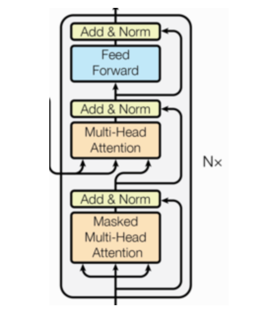

# Day11_Transformer模型架构

------

## 九、解码器部分

结构图：



组成部分：

```properties
1、N个解码器层堆叠而成
2、每个解码器层由三个子层连接结构组成
3、第一个子层连接结构：多头自注意力（masked）层+ 规范化层+残差连接
4、第二个子层连接结构：多头注意力层+ 规范化层+残差连接
5、第三个子层连接结构：前馈全连接层+ 规范化层+残差连接
```

## 十、解码器层

作用：

```properties
作为解码器的组成单元, 每个解码器层根据给定的输入向目标方向进行特征提取操作
```

代码实现：

```properties
class DecoderLayer(nn.Module):
    def __init__(self, size, self_attn, src_attn, feed_forward, dropout):
        super(DecoderLayer, self).__init__()
        # 词嵌入维度尺寸大小
        self.size = size
        # 自注意力机制层对象 q=k=v
        self.self_attn = self_attn
        # 一遍注意力机制对象 q!=k=v
        self.src_attn = src_attn
        # 前馈全连接层对象
        self.feed_forward = feed_forward
        # clones3子层连接结构
        self.sublayer = clones(SublayerConnection(size, dropout), 3)

    def forward(self, x, memory, source_mask, target_mask):
        m = memory
        # 数据经过子层连接结构1
        x = self.sublayer[0](x, lambda x:self.self_attn(x, x, x, target_mask))
        # 数据经过子层连接结构2
        x = self.sublayer[1](x, lambda x:self.src_attn (x, m, m, source_mask))
        # 数据经过子层连接结构3
        x = self.sublayer[2](x, self.feed_forward)
        return  x
```

## 十一、解码器

作用：

```properties
根据编码器的结果以及上一次预测的结果, 对下一次可能出现的'值'进行特征表示
```

代码实现：

```properties

class Decoder(nn.Module):

    def __init__(self, layer, N):
        # 参数layer 解码器层对象
        # 参数N 解码器层对象的个数

        super(Decoder, self).__init__()

        # clones N个解码器层
        self.layers = clones(layer, N)

        # 定义规范化层
        self.norm = LayerNorm(layer.size)

    def forward(self, x, memory, source_mask, target_mask):

        # 数据以此经过各个子层
        for layer in self.layers:
            x = layer(x, memory, source_mask, target_mask)

        # 数据最后经过规范化层
        return self.norm(x)
```

## 十二、输出部分

```pro
作用：通过线性变化得到指定维度的输出
```

代码

```properties
class Generator(nn.Module):
    def __init__(self, d_model, vocab_size):
        # 参数d_model 线性层输入特征尺寸大小
        # 参数vocab_size 线层输出尺寸大小
        super(Generator, self).__init__()
        # 定义线性层
        self.project = nn.Linear(d_model, vocab_size)

    def forward(self, x):
        # 数据经过线性层 最后一个维度归一化 log方式
        x = F.log_softmax(self.project(x), dim=-1)
        return x
```


## 十三、Transformer模型搭建

完整的编码器-解码器结构：


### 1、编码器-解码器结构的代码：

```properties
# 使用EncoderDecoder类来实现编码器-解码器结构
class EncoderDecoder(nn.Module):
    def __init__(self, encoder, decoder, source_embed, target_embed, generator):
        """初始化函数中有5个参数, 分别是编码器对象, 解码器对象, 
           源数据嵌入函数, 目标数据嵌入函数,  以及输出部分的类别生成器对象
        """
        super(EncoderDecoder, self).__init__()
        # 将参数传入到类中
        self.encoder = encoder
        self.decoder = decoder
        self.src_embed = source_embed
        self.tgt_embed = target_embed
        self.generator = generator

    def forward(self, source, target, source_mask, target_mask):
        """在forward函数中，有四个参数, source代表源数据, target代表目标数据, 
           source_mask和target_mask代表对应的掩码张量"""

        # 在函数中, 将source, source_mask传入编码函数, 得到结果后,
        # 与source_mask，target，和target_mask一同传给解码函数
        return self.generator(self.decode(self.encode(source, source_mask), 
                                          source_mask, target, target_mask))

    def encode(self, source, source_mask):
        """编码函数, 以source和source_mask为参数"""
        # 使用src_embed对source做处理, 然后和source_mask一起传给self.encoder
        return self.encoder(self.src_embed(source), source_mask)

    def decode(self, memory, source_mask, target, target_mask):
        """解码函数, 以memory即编码器的输出, source_mask, target, target_mask为参数"""
        # 使用tgt_embed对target做处理, 然后和source_mask, target_mask, memory一起传给self.decoder
        return self.decoder(self.tgt_embed(target), memory, source_mask, target_mask)
```

### 2、Tansformer模型构建代码：

```properties
def make_model(source_vocab, target_vocab, N=6, 
               d_model=512, d_ff=2048, head=8, dropout=0.1):
    c = copy.deepcopy
    # 实例化多头注意力层对象
    attn = MultiHeadedAttention(head=8, embedding_dim= 512, dropout=dropout)

    # 实例化前馈全连接对象ff
    ff = PositionwiseFeedForward(d_model=d_model, d_ff=d_ff, dropout=dropout)

    # 实例化 位置编码器对象position
    position = PositionalEncoding(d_model=d_model, dropout=dropout)

    # 构建 EncoderDecoder对象
    model = EncoderDecoder(
        # 编码器对象
        Encoder( EncoderLayer(d_model, c(attn), c(ff), dropout), N),
        # 解码器对象
        Decoder(DecoderLayer(d_model, c(attn), c(attn), c(ff),dropout), N),
        # 词嵌入层 位置编码器层容器
        nn.Sequential(Embeddings(d_model, source_vocab), c(position)),
        # 词嵌入层 位置编码器层容器
        nn.Sequential(Embeddings(d_model, target_vocab), c(position)),
        # 输出层对象
        Generator(d_model, target_vocab))

    for p in model.parameters():
        if p.dim() > 1:
            nn.init.xavier_uniform_(p)

    return model
```

```properties
 nn.Sequential（）理解
 import torch
import torch.nn as nn

class My_Model(nn.Module):
    # def __init__(self, vocab_size, d_model, output_size=10):
    #     super().__init__()
    #     self.embed = nn.Embedding(vocab_size, d_model)
    #     self.linear1 = nn.Linear(d_model, 8)
    #     self.linear2 = nn.Linear(8, output_size)

    def __init__(self, vocab_size, d_model, output_size=10):
        super().__init__()
        self.sqeuen = nn.Sequential( nn.Embedding(vocab_size, d_model),
                                     nn.Linear(d_model, 8),
                                     nn.Linear(8, output_size))


    # def forward(self, x):
    #     x = self.embed(x)
    #     x = self.linear1(x)
    #     x = self.linear2(x)
    #     return x

    def forward(self, x):
        x = self.sqeuen(x)
        return x


if __name__ == '__main__':
    x = torch.tensor([[1,2,3],[4,5,6]], dtype=torch.long)
    my_model = My_Model(20, 4)
    result = my_model(x)
    print(result)
    print(result.shape)
```

