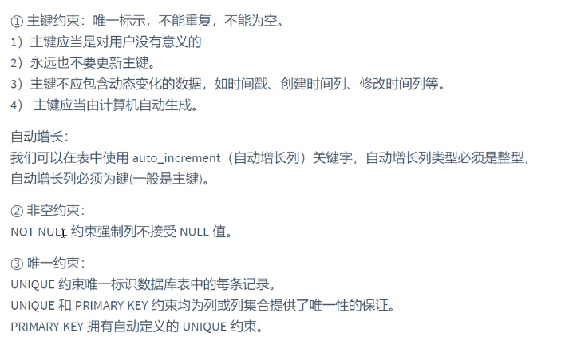
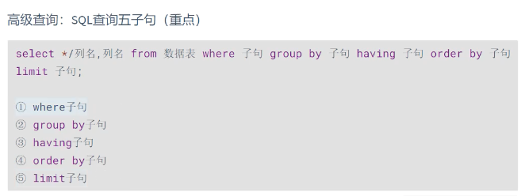
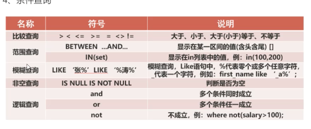
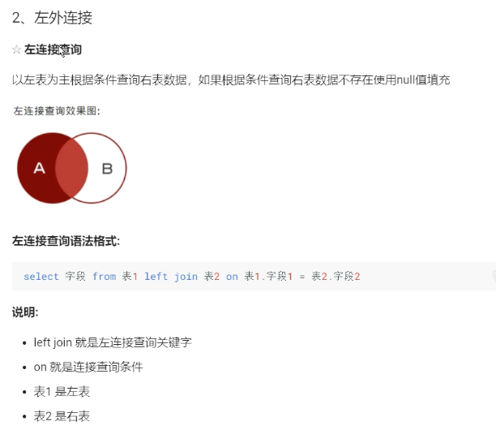
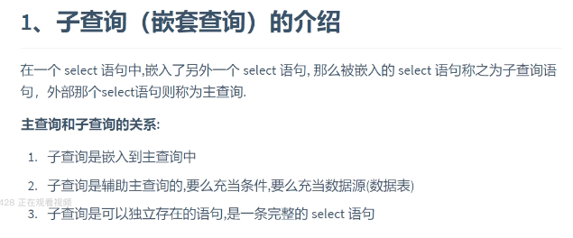
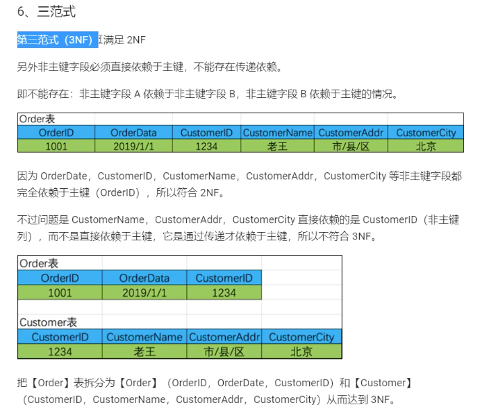

## 1、SQL语句

## 2、MySQL
### 2.1、MySQL基本结构

### 2.2、MySQL数据类型

## 3、MySQL约束

### 3.1、主键约束

### 3.2、唯一约束

### 3.3、非空约束

### 3.4、默认值约束

### 3.5、外键约束

### 3.6、总结

## 4、MySQL中DQL语句

### 4.1、WHERE查询条件类型

### 4.2、GROUP BY聚合查询

## 5、MySQL多表查询
### 5.1、交叉连接

### 5.2、内连接

### 5.3、外连接

### 5.4、子查询

## 6、数据库三大范式（数据库设计）
### 6.1、第一范式

### 6.2、第二范式

### 6.3、第三范式

