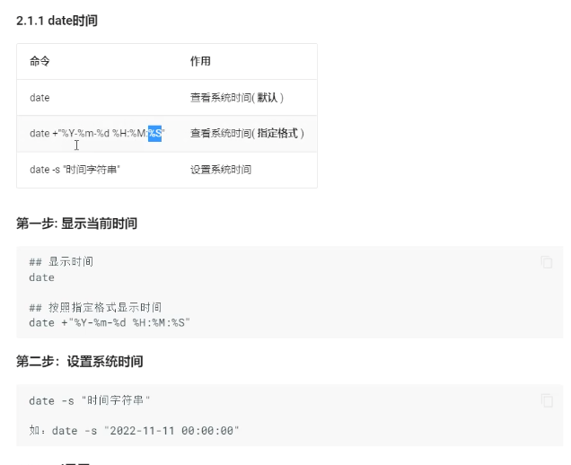
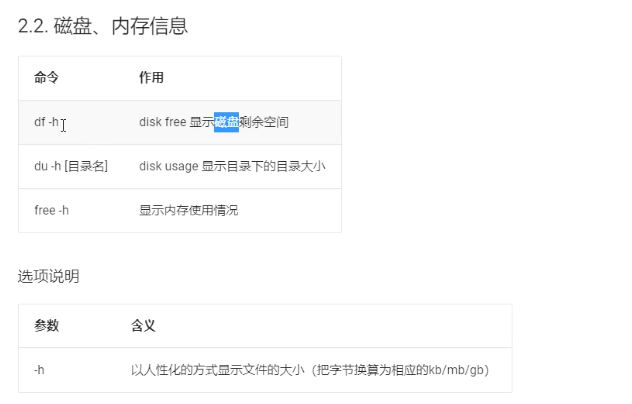
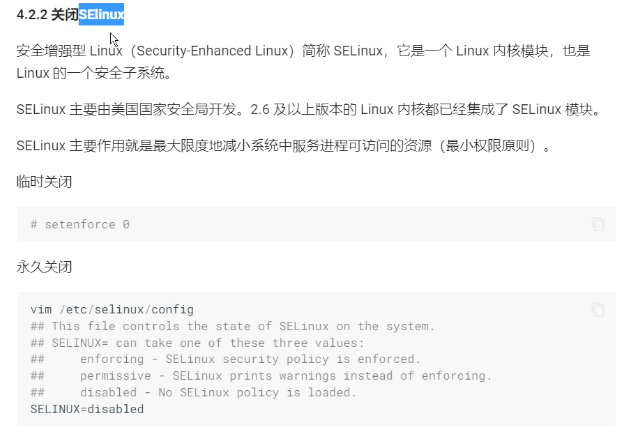
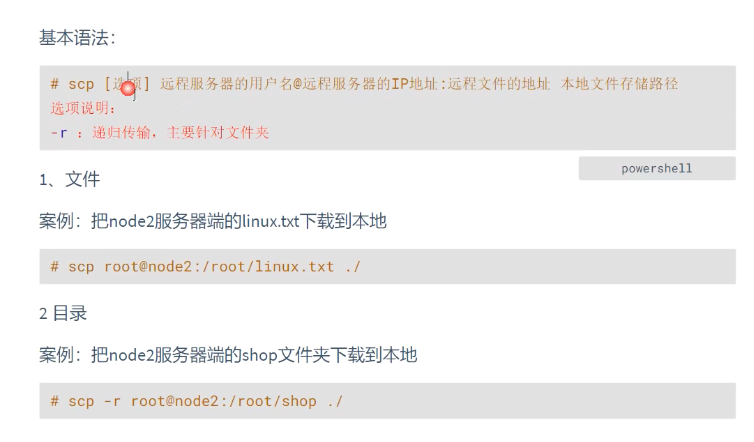
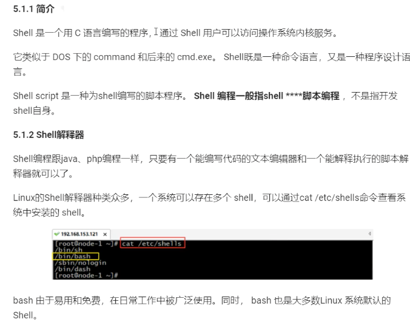

# Linux基本知识
## 1、Linux基本概念
## 2、Windows中使用VNWare软件安装Linux虚拟机

## 3、Linux目录结构
### 3.1、Linux与Windows操作系统目录区别

### 3.2、Linux文件目录结构

## 4、Linux常见命令
> [命令] --help 查看命令详情

## 5、Linux权限

### 5.1、Linux权限

### 5.2、Linux用户组

### 5.3、Linux修改文件权限
#### 5.2.1、字母形式

#### 5.2.2、数字形式

### 5.4、Linux系统信息

### 5.5、Linux软件安装
### 5.5.1、rpm软件包管理（离线）

### 5.5.2、yum软件包管理（在线）

### 5.6、Linux集群

### 5.6.1、Linux集群配置、防火墙关、SSH免密

### 5.6.2、Linux中NTP时间同步

### 5.6.3、Linux远程文件SCP

### 6、Shell编程

